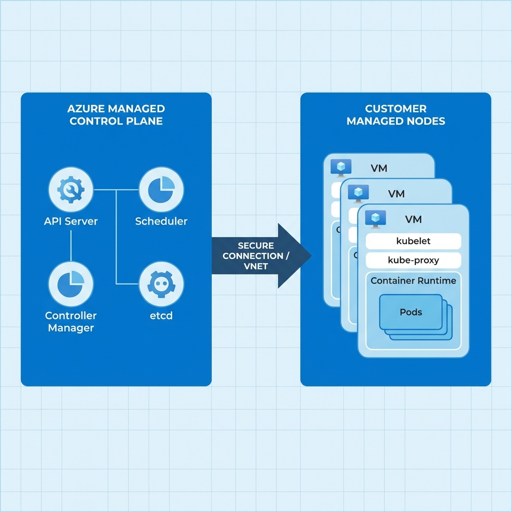
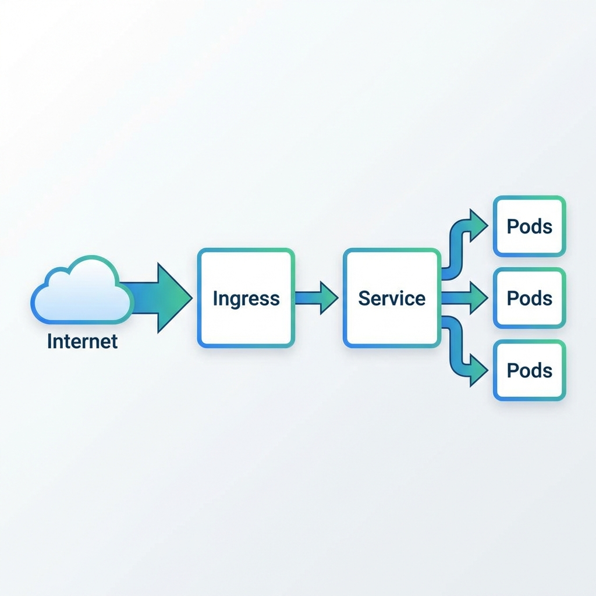

안녕하세요! 오늘은 Azure Cloud의 Kubernetes 서비스인 **AKS(Azure Kubernetes Service)**를 처음 접하시는 분들을 위해, 필수적인 기초 용어들을 정리해드리고자 합니다.

클라우드 네이티브 환경을 구축하다 보면 낯선 용어들이 많이 등장하여 당황스러울 때가 많습니다. 특히 AKS를 구성할 때 자주 마주치게 되는 핵심 용어들과, 함께 자주 사용되는 데이터베이스 용어까지 포함하여 알기 쉽게 풀어서 설명해 드리겠습니다.

<!-- truncate -->

---

## 1. Kubernetes (쿠버네티스 / K8s)

- **사전적 정의**: 컨테이너화된 애플리케이션의 배포, 확장 및 관리를 자동화하는 오픈 소스 시스템입니다.
- **쉽게 이해하기**: 수많은 컨테이너(프로그램이 실행되는 격리된 환경)들을 지휘하고 관리하는 '지휘자' 혹은 '선장'입니다. 컨테이너들이 죽지 않고 잘 돌아가도록 감시하고, 필요하면 수를 늘리거나 줄여주는 역할을 합니다.
- **언제 사용하나요?**: 하나의 서비스가 아닌, 수십~수백 개의 컨테이너로 이루어진 복잡한 애플리케이션을 안정적으로 운영해야 할 때 사용합니다.
- **실제 사용 예시**: "우리 쇼핑몰 웹사이트 접속자가 폭주해서 서버가 다운될 것 같아요. 쿠버네티스가 자동으로 서버(컨테이너) 개수를 늘려서 트래픽을 분산시켜 주도록 설정합시다."

## 2. Container (컨테이너)

- **사전적 정의**: 소프트웨어를 실행하는 데 필요한 코드, 런타임, 시스템 도구, 시스템 라이브러리 등 모든 것을 포함하는 경량의 독립형 실행 패키지입니다.
- **쉽게 이해하기**: "내 컴퓨터에서는 잘 되는데?"라는 말을 없애주는 **마법의 밀봉 상자**입니다. 애플리케이션과 그 실행 환경을 하나의 '상자(컨테이너)'에 포장해서, 어떤 컴퓨터로 옮겨도 똑같이 실행되게 만듭니다. 화물선에 싣는 규격화된 컨테이너 박스처럼, 안에 무엇이 들었든 크레인(쿠버네티스)으로 쉽게 옮길 수 있습니다.
- **언제 사용하나요?**: 개발 환경과 배포 환경이 달라서 오류가 나는 것을 막고, 서버 자원을 효율적으로 격리해서 쓰고 싶을 때 사용합니다.
- **실제 사용 예시**: "로컬에서 개발한 코드를 컨테이너 이미지로 구워주세요(Build). 그러면 운영 서버 환경이 달라도 문제없이 똑같이 돌아갈 겁니다."

## 3. AKS (Azure Kubernetes Service)

- **사전적 정의**: Microsoft Azure에서 제공하는 완전 관리형 Kubernetes 서비스입니다.
- **쉽게 이해하기**: 쿠버네티스는 직접 설치하고 관리하기가 매우 어렵습니다. AKS는 Azure가 "복잡한 관리 영역(컨트롤 플레인)은 우리가 맡을 테니, 당신은 앱 개발과 **노드(일꾼)** 관리에만 집중하세요"라고 빌려주는 **임대형 쿠버네티스 서비스**입니다.
- **언제 사용하나요?**: Azure 클라우드 환경에서 쿠버네티스를 손쉽게 구축하고, 보안 패치나 업데이트 같은 유지보수 부담을 줄이고 싶을 때 사용합니다.
- **실제 사용 예시**: "직접 서버실에 쿠버네티스를 설치하려니 너무 복잡하네요. Azure 포털에서 클릭 몇 번으로 AKS 클러스터를 생성해서 바로 개발을 시작합시다."

## 4. Node (노드) & Node Pool (노드 풀)

- **사전적 정의**: 클러스터 내의 작업자 머신(Worker Machine)으로, 가상 머신(VM) 또는 물리적 머신입니다. 노드 풀은 동일한 구성을 가진 노드들의 그룹입니다.
- **쉽게 이해하기**: 실제 일을 처리하는 **일꾼 컴퓨터**입니다. 위의 그림에서 큰 파란 상자에 해당합니다. AKS에서는 Azure의 가상 컴퓨터(VM) 하나하나가 '노드'가 됩니다. '노드 풀'은 같은 사양을 가진 일꾼들의 팀(Team)이라고 보시면 됩니다.
- **언제 사용하나요?**: 애플리케이션이 실행될 컴퓨팅 자원(CPU, 메모리)이 필요할 때 사용됩니다. 성능이 더 필요하면 노드를 추가합니다.
- **실제 사용 예시**: "AI 분석 기능을 돌려야 해서 고사양 GPU가 필요해요. GPU가 장착된 VM들로 새로운 'GPU 노드 풀'을 만들어서 AI 작업만 거기서 처리하게 합시다."

## 5. Pod (파드)

- **사전적 정의**: 쿠버네티스에서 생성하고 관리할 수 있는 배포의 가장 작은 단위이며, 하나 이상의 컨테이너 그룹입니다.
- **쉽게 이해하기**: 우리가 만든 애플리케이션이, 컨테이너라는 옷을 입고 실제 노드(컴퓨터) 위에 올라가서 실행될 때의 **가장 작은 단위**입니다. 그림에서 노드 안에 들어있는 둥근 사각형들이 파드입니다. 완두콩 껍질(Pod) 안에 콩(Container)이 들어있는 모습을 상상해 보세요.
- **언제 사용하나요?**: 실제 웹 서버나 프로그램 인스턴스를 띄울 때 "파드를 생성한다"고 표현합니다.
- **실제 사용 예시**: "로그인 서버 파드(Pod)가 자꾸 오류를 뿜네요. 로그를 확인해보고 파드를 재시작해야겠습니다."

## 6. ACR (Azure Container Registry)

- **사전적 정의**: 오픈 소스 Docker Registry 2.0을 기반으로 하는 관리형 프라이빗 레지스트리 서비스입니다.
- **쉽게 이해하기**: 우리가 만든 프로그램의 **이미지(실행 파일과 환경을 얼려놓은 것)를 보관하는 비공개 창고**입니다. AKS는 이 창고에서 이미지를 가져와서(Pull) 파드를 실행합니다.
- **언제 사용하나요?**: 개발자가 만든 애플리케이션을 배포하기 전에 안전하게 저장해 두는 공간이 필요할 때 사용합니다.
- **실제 사용 예시**: "개발이 완료되었으니 도커 이미지를 빌드해서 ACR에 업로드(Push)해 주세요. 그럼 AKS가 자동으로 새 버전을 가져가서 배포할 겁니다."

## 7. Service (서비스) & Ingress (인그레스)

- **사전적 정의**: 파드 집합에서 실행 중인 애플리케이션을 네트워크 서비스로 노출하는 추상화 방법입니다. (Ingress는 클러스터 외부에서 내부로 접근하는 규칙을 관리합니다.)
- **쉽게 이해하기**: 파드는 수시로 생기고 사라지며 주소(IP)가 바뀝니다. **서비스**는 파드들에게 **고정된 대표 전화번호**를 부여하는 것이고, **인그레스**는 외부 손님(인터넷 사용자)이 우리 가게(서비스)로 잘 찾아올 수 있게 안내하는 **안내 데스크**나 **대문** 역할을 합니다.
- **언제 사용하나요?**: 내부의 파드끼리 통신하거나(Service), 외부 사용자가 웹 브라우저를 통해 접속해야 할 때(Ingress) 사용합니다.
- **실제 사용 예시**: "사용자들이 `game.example.com`으로 접속하면 게임 서버 서비스로 연결되도록 인그레스 규칙을 설정했습니다."

## 8. PostgreSQL (포스트그레에스큐엘)

- **사전적 정의**: 확장성 및 표준 준수를 강조하는 객체-관계형 데이터베이스 관리 시스템(ORDBMS)입니다.
- **쉽게 이해하기**: (왼쪽 그림) 엑셀 표처럼 행과 열이 딱딱 맞아떨어지는 **정형화된 데이터**를 저장하는 데 아주 강력하고 안정적인 저장소입니다. 매우 꼼꼼하고 규칙을 잘 지키는 도서관 사서 같습니다.
- **언제 사용하나요?**: 회원 정보, 결제 내역, 주문 정보 등 데이터의 정확성과 관계가 중요한 정보를 저장할 때 주로 사용합니다. Azure에서는 'Azure Database for PostgreSQL'이라는 관리형 서비스로 널리 쓰입니다.
- **실제 사용 예시**: "우리 서비스의 사용자 회원가입 정보와 주문 내역은 데이터 무결성이 중요하니까 PostgreSQL에 저장해서 관리합시다."

## 9. MongoDB (몽고디비)

- **사전적 정의**: 크로스 플랫폼 도큐먼트 지향 데이터베이스 시스템으로, NoSQL 데이터베이스입니다.
- **쉽게 이해하기**: (오른쪽 그림) 데이터를 정해진 표 형식이 아니라, 자유로운 **문서(Document, JSON과 유사)** 형태로 저장하는 유연한 저장소입니다. 데이터를 서류 봉투에 담아 툭 던져넣듯 자유롭게 저장할 수 있습니다.
- **언제 사용하나요?**: 게임 로그, 댓글, 센서 데이터처럼 구조가 자주 바뀌거나 비정형 데이터를 빠르게 쌓아야 할 때 유용합니다. Azure Cosmos DB가 MongoDB API를 지원합니다.
- **실제 사용 예시**: "사용자마다 설정하는 옵션이 제각각이라 고정된 테이블 로 만들기 어렵네요. 이런 유동적인 설정값들은 MongoDB에 문서 형태로 저장하는 게 효율적이겠어요."

---

다음으로, 실제로 AKS를 구현해 보는 실습을 진행하겠습니다.
