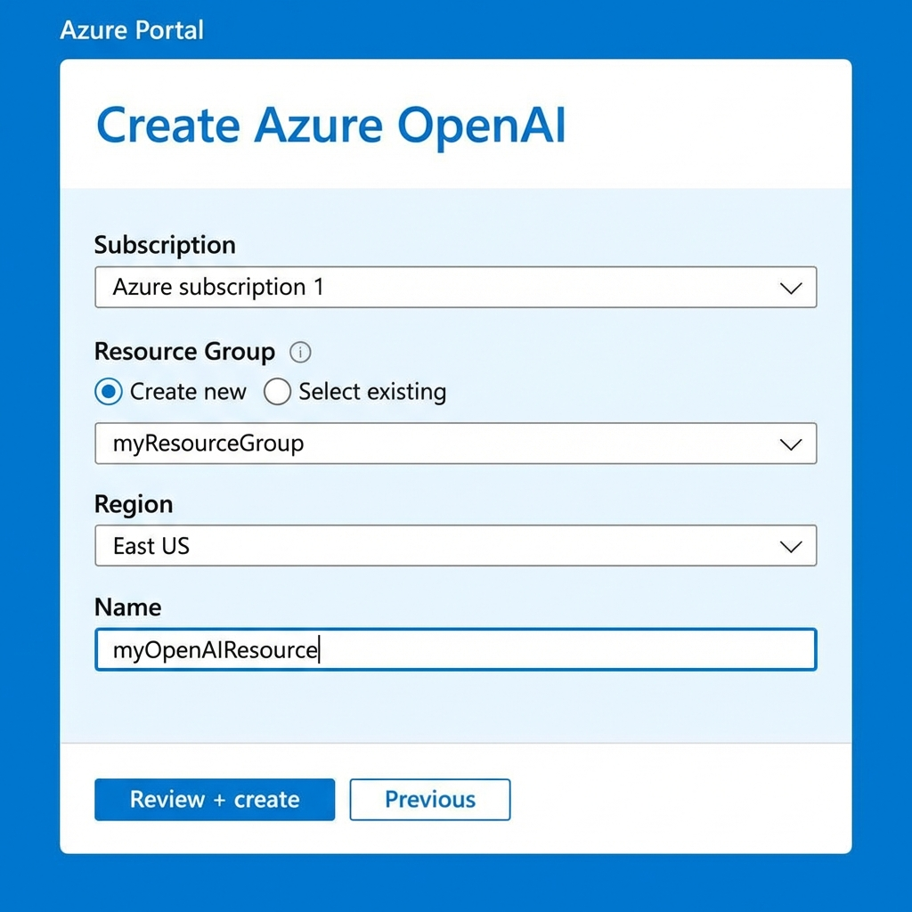
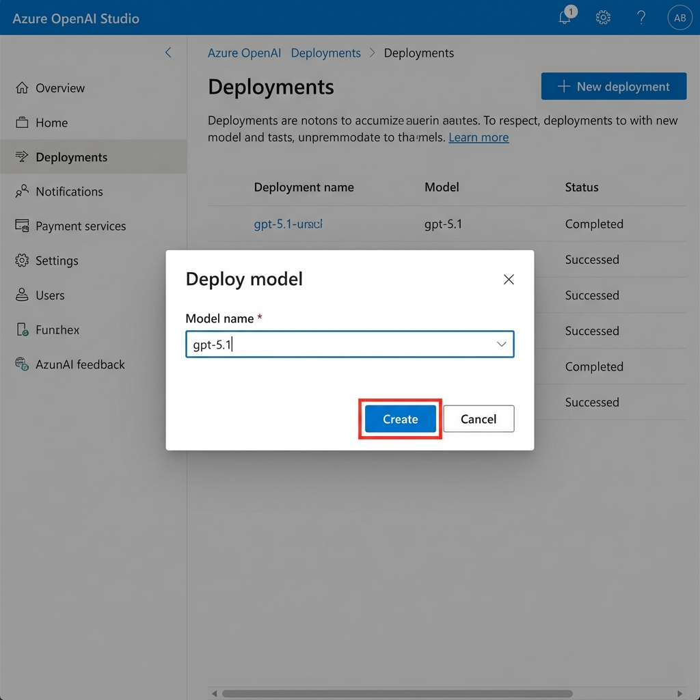
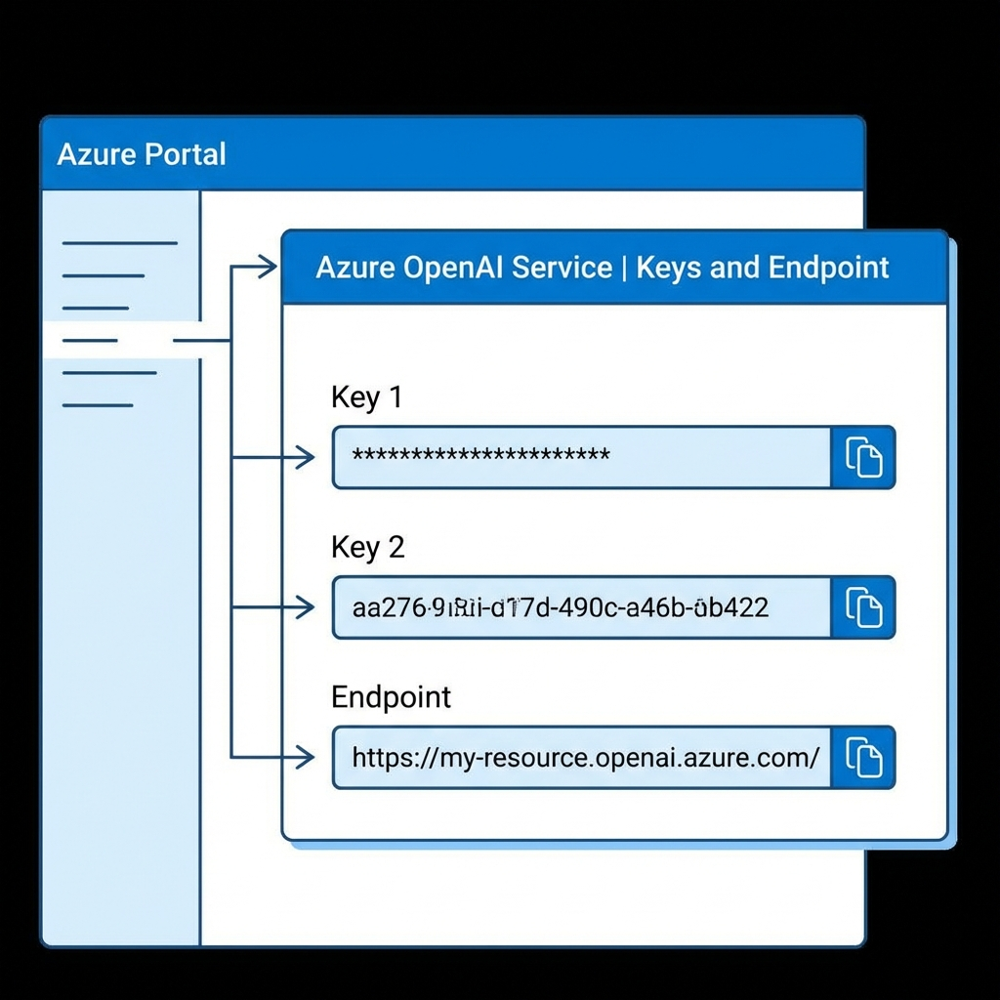

import Tabs from '@theme/Tabs';
import TabItem from '@theme/TabItem';

안녕하세요! 오늘은 **Azure OpenAI Service**를 통해 ChatGPT (GPT-5.1) API를 발급받고 사용하는 방법을 알아보겠습니다.

OpenAI사의 API를 직접 사용할 수도 있지만, 많은 기업과 개발자들이 **보안**, **규정 준수**, **SLA(서비스 수준 계약)** 등의 이유로 Azure OpenAI를 선택하고 있습니다. Azure의 강력한 인프라 위에서 안전하게 나만의 AI 서비스를 구축해 봅시다.

<!-- truncate -->


---

## 1. Azure OpenAI 리소스 만들기

가장 먼저 Azure Portal에서 OpenAI 서비스를 사용할 수 있는 리소스(자원)를 생성해야 합니다.



1. **Azure Portal** (portal.azure.com)에 로그인합니다.
2. 검색창에 **Azure OpenAI**를 검색하여 선택합니다.
3. **[만들기]** 버튼을 클릭합니다.
4. **기본 사항** 탭에서 정보를 입력합니다:
   - **구독**: 사용 가능한 Azure 구독을 선택합니다.
   - **리소스 그룹**: 기존 그룹을 선택하거나 새로 만듭니다 (예: `rg-ai-lab`).
   - **지역**: `East US` 등 OpenAI 모델이 지원되는 리전을 선택합니다. (GPT-5.1은 현재 일부 리전에서만 가능할 수 있습니다)
   - **이름**: 고유한 이름을 입력합니다 (예: `my-aoai-lab`).
   - **가격 책정 계층**: `Standard S0`을 선택합니다.
5. **[다음]**을 계속 눌러 검토 후 **[만들기]**를 클릭하여 배포를 완료합니다.

---

## 2. 모델 배포하기 (Azure OpenAI Studio)

리소스를 만들었다고 끝이 아닙니다! Azure OpenAI에서는 내가 사용할 모델(GPT-4, GPT-5.1 등)을 구체적으로 **배포(Deployment)** 해야만 API로 호출할 수 있습니다.



1. 리소스 생성이 완료되면 **[Azure OpenAI Studio로 이동]** 버튼을 클릭하거나, `oai.azure.com`에 접속합니다.
2. 왼쪽 메뉴에서 **[배포(Deployments)]** 를 클릭합니다.
3. **[+ 새 배포 만들기]** 를 클릭합니다.
4. **모델 선택**: `gpt-5.1` (또는 원하는 모델)을 선택합니다.
5. **배포 이름**: API 호출 시 사용할 이름입니다. 모델명과 똑같이 `gpt-5.1`로 짓는 것을 추천합니다.
6. **[만들기]** 버튼을 누릅니다.

---

## 3. API 키 및 엔드포인트 확인

이제 API를 호출할 때 필요한 **비밀 열쇠(Key)** 와 **주소(Endpoint)** 를 확인해 봅시다.



1. 다시 Azure Portal의 OpenAI 리소스 화면으로 돌아옵니다.
2. 왼쪽 메뉴의 **[리소스 관리] > [키 및 엔드포인트]** 를 클릭합니다.
3. **KEY 1** (또는 KEY 2) 값을 복사합니다. 이것이 여러분의 `API-KEY`입니다. 절대 외부에 노출되지 않도록 주의하세요!
4. **엔드포인트** 주소를 복사합니다. (형식: `https://{리소스이름}.openai.azure.com/`)

---

## 4. API 테스트 (Python)

발급받은 키로 실제 GPT-5.1과 대화를 나눠볼까요? Python 코드를 통해 간단히 테스트해 볼 수 있습니다.

먼저 라이브러리를 설치합니다:
```bash
pip install openai
```

그리고 아래 코드를 작성하여 실행해 봅니다.

<Tabs>
  <TabItem value="python" label="Python" default>

```python title="test_aoai.py"
import os
from openai import AzureOpenAI

# 환경 변수 설정 (또는 직접 문자열 입력)
endpoint = "https://my-aoai-lab.openai.azure.com/" # 복사한 엔드포인트
key = "xxxxxxxxxxxxxxxxxxxxxxxxxxxxxxxx" # 복사한 KEY 1

client = AzureOpenAI(
    azure_endpoint=endpoint,
    api_key=key,
    api_version="2026-01-01-preview" # 최신 API 버전 확인 필요
)

response = client.chat.completions.create(
    model="gpt-5.1", # Azure OpenAI Studio에서 설정한 '배포 이름'
    messages=[
        {"role": "system", "content": "You are a helpful AI assistant."},
        {"role": "user", "content": "Azure OpenAI의 장점을 한 문장으로 설명해줘."}
    ]
)

print(response.choices[0].message.content)
```

</TabItem>
  <TabItem value="curl" label="Curl (Terminal)">

```bash
curl "https://my-aoai-lab.openai.azure.com/openai/deployments/gpt-5.1/chat/completions?api-version=2026-01-01-preview" \
  -H "Content-Type: application/json" \
  -H "api-key: xxxxxxxxxxxxxxxxxxxxxxxxxxxxxxxx" \
  -d '{
  "messages": [{"role": "user", "content": "Hello!"}],
  "max_tokens": 50
}'
```

</TabItem>
</Tabs>

### 💡 주의사항
- `model` 파라미터에는 모델명(ex: gpt-4)이 아니라, **2단계에서 설정한 '배포 이름'** 을 넣어야 합니다. 이 부분이 Azure OpenAI 입문자들이 가장 많이 헷갈리는 포인트입니다.
- `api_version`은 Azure OpenAI 공식 문서에서 최신 버전을 확인하여 사용하는 것이 좋습니다.

---

## 마치며

이제 여러분은 Azure의 강력한 보안 환경 속에서 동작하는 나만의 AI API를 갖게 되었습니다. 이 API를 활용하여 사내 챗봇, 자동 번역기, 문서 분석 도구 등 무궁무진한 애플리케이션을 만들어 보세요!

다음 시간에는 이 API를 활용하여 실제 **간단한 웹 챗봇**을 만들어 보는 실습을 진행하겠습니다. 기대해 주세요!
