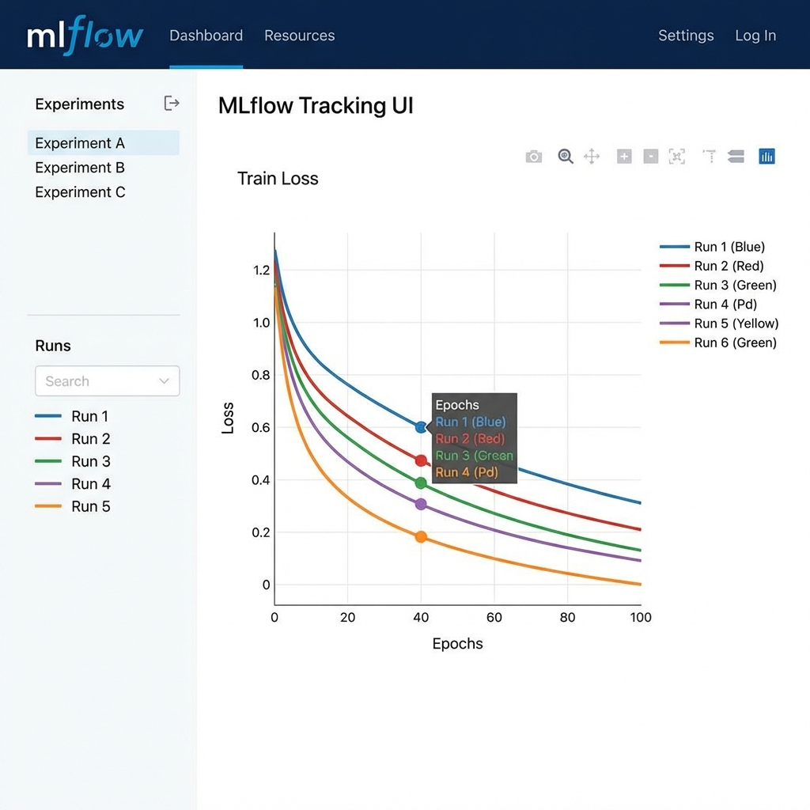

import Tabs from '@theme/Tabs';
import TabItem from '@theme/TabItem';

> **요약:** 분석가들이 개별 로컬 Python 코드로 수행하던 LLM 파인튜닝 작업을 **Prefect**로 워크플로우화하여 자동화하고, **MLflow**로 실험 이력을 체계적으로 관리하여 팀의 생산성을 극대화하는 전략을 제안합니다.

---

## 1. 들어가며: 왜 지금 워크플로우 도구인가?

### 😢 우리의 슬픈 현실 (Before)
가상의 시나리오를 하나 생각해 봅시다. 여러분은 사내 FAQ 챗봇을 만들기 위해 **Llama-3 모델을 파인튜닝**하는 임무를 맡았습니다.

* "지난주에 성능 제일 좋았던 모델, 러닝 레이트(Learning Rate)를 2e-5로 줬던가? 3e-5였나?" (이력 실종)
* "새벽에 10시간짜리 학습 돌려놓고 잤는데, 메모리 에러로 1시간 만에 멈춰버렸네..." (모니터링 및 재실행 부재)
* "김 연구원님 코드는 제 컴퓨터에서 안 돌아가요." (재현성 부족)

이 문제를 해결하기 위해 **워크플로우 오케스트레이션(Prefect)**과 **실험 추적(MLflow)**의 도입은 선택이 아닌 필수입니다.

---

## 2. Prefect와 MLflow란?

* **Prefect**: 현대적인 워크플로우 오케스트레이터입니다. "누가, 언제, 어떻게" 코드를 실행했는지 관리하며, 실패 시 **자동 재시도(Retry)** 기능이 핵심입니다.
* **MLflow**: 머신러닝 실험 추적 도구입니다. "무엇을 실험했고, 어떤 결과(Loss, Accuracy)가 나왔는지" 영구히 기억합니다.

이 둘을 합치면 다음과 같은 이상적인 아키텍처가 완성됩니다.


1. **Data Source**: 클라우드 저장소(S3, Azure Blob Storage)나 로컬 폴더에 학습 데이터가 준비되면
2. **Prefect Flow**: 자동으로 파이프라인이 시작되어 GPU 환경(로컬/클라우드)에 학습을 지시하고
3. **MLflow & Registry**: 학습 중 발생하는 모든 로그와 결과 모델을 저장소에 기록합니다.

---

## 3. Prefect 핵심 데코레이터 (Concepts)

Prefect를 사용하기 위해 알아야 할 것은 딱 두 가지, **`@flow`**와 **`@task`** 데코레이터뿐입니다.

### 🔹 1. @flow (흐름)
워크플로우의 **진입점(Entrypoint)**이자 컨테이너입니다.
파이썬 함수 위에 `@flow`만 붙이면, 해당 함수는 상태(State) 모니터링이 가능한 워크플로우로 변신합니다.
- **역할**: 전체 로직의 순서를 정의하고, 하위 Task들을 호출합니다.
- **주요 옵션**:
    - `name`: 대시보드에 표시될 파이프라인 이름 정의
    - `log_prints=True`: `print()` 함수 출력을 자동으로 로그로 수집
    - `retries`: 흐름 자체가 실패했을 때 재시도 횟수

### 🔹 2. @task (작업)
워크플로우 안에서 실행되는 **최소 작업 단위**입니다.
복잡한 로직을 잘게 쪼개어 Task로 만들면, 특정 부분만 실패했을 때 그 부분만 재실행할 수 있습니다.
- **역할**: 실제 연산, 데이터 로드, 학습 등을 수행합니다.
- **주요 옵션**:
    - `retries`: 작업 실패 시 재시도 횟수 (예: GPU Out of Memory, 네트워크 오류 시 유용)
    - `retry_delay_seconds`: 재시도 전 대기 시간
    - `cache_expiration`: 결과 캐싱 만료 시간 (예: "데이터 로드는 하루에 한 번만 해")

> **[참고]** 더 자세한 옵션은 [Prefect 공식 문서(Concepts)](https://docs.prefect.io/v3/concepts)를 참고하세요.

---

## 4. 실전 가이드: 환경 설정부터 코드까지

### 4.1 환경 설정 (Setup)

먼저 필요한 라이브러리를 설치하고 서버를 실행해야 합니다.

<Tabs>
  <TabItem value="install" label="1. 설치(Install)" default>

```bash
# Python 패키지 설치
pip install prefect mlflow
```

</TabItem>
  <TabItem value="server" label="2. 서버 실행(Server)">

```bash
# Prefect 서버 시작 (로컬 대시보드)
prefect server start

# MLflow 서버 시작 (별도 터미널)
mlflow ui
```

</TabItem>
</Tabs>

### 4.2 파이썬 코드 구현

기존 파이썬 학습 코드에 `@task`와 `@flow` 데코레이터만 붙이면 됩니다.

```python title="finetune_flow.py"
import mlflow
import time
import random
from prefect import flow, task
from datetime import timedelta

# [Tip] 캐싱을 적용하여 데이터 로드가 실패해도 재시도하거나, 이미 로드했다면 건너뜁니다.
@task(cache_expiration=timedelta(days=1))
def load_dataset(data_path: str):
    print(f"데이터셋 로드 중: {data_path}")
    time.sleep(1) # 로딩 시뮬레이션
    return {"data_id": "corpus_v1", "size": 10000}

# [핵심] GPU 오류 등으로 실패 시 60초 뒤 최대 3회 재시도하도록 설정
@task(retries=3, retry_delay_seconds=60) 
def train_model(dataset, params):
    print("모델 파인튜닝 시작...")
    
    # MLflow 실험 이름 설정
    mlflow.set_experiment("Llama3-Finetuning-Experiment")
    
    with mlflow.start_run():
        # 하이퍼파라미터 기록
        mlflow.log_params(params)
        
        loss = 2.5
        for epoch in range(params["epochs"]):
            # (가상의 학습 로직)
            loss = loss * 0.85 + random.uniform(0, 0.05) 
            print(f"Epoch {epoch+1}/{params['epochs']}: Loss {loss:.4f}")
            
            # [핵심] 지표 실시간 기록 -> MLflow 그래프로 그려짐
            mlflow.log_metric("train_loss", loss, step=epoch)
        
        # 모델 저장
        print(f"학습 완료. Final Loss: {loss:.4f}")
        
    return loss

# 전체 흐름 정의
@flow(name="Llama-3 Finetuning Pipeline")
def finetuning_workflow(epochs: int = 5):
    data = load_dataset("./data/faq_corpus.json")
    
    params = {
        "epochs": epochs,
        "learning_rate": 2e-5,
        "model": "meta-llama/Meta-Llama-3-8B"
    }
    
    final_loss = train_model(data, params)
    
    if final_loss < 0.5:
        print("모델 성능 우수! 배포 프로세스 시작")

if __name__ == "__main__":
    finetuning_workflow(epochs=10)
```

:::tip MLflow 실험 이름 관리
`mlflow.set_experiment()`로 프로젝트별로 실험 이름을 구분해 주는 것이 좋습니다. 그렇지 않으면 모든 실험이 `Default`에 쌓여 나중에 찾기 힘들어집니다.
:::

---

## 5. 결과 확인: 이렇게 바뀝니다

### Prefect 대시보드 (안정성 확보)
새벽에 학습이 실패했나요? Prefect 대시보드 내 실패한 Flow Run 상세 페이지 우측 상단에 있는 **재시도(Retry)** 버튼을 클릭하여 재실행할 수 있습니다.

> **💡 왜 처음부터 다시 안 해도 될까요?** <br/>
> 앞서 코드에 설정한 캐싱(`cache_expiration`) 덕분입니다!
> Prefect는 성공한 Task의 결과(Result)를 저장해 두기 때문에, 재실행 시 **이미 성공한 '데이터 로드' 단계는 건너뛰고 실패한 '학습' 단계부터 즉시 재개**됩니다. 이것이 바로 Prefect가 자랑하는 **[Result Persistence(결과 영속성)](https://docs.prefect.io/v3/concepts/results)**와 **[Caching(캐싱)](https://docs.prefect.io/v3/concepts/tasks/#caching)** 메커니즘입니다.


### MLflow 트래킹 (인사이트 확보)
러닝 레이트를 바꿨을 때 Loss가 어떻게 변했는지, 그래프로 한눈에 비교할 수 있습니다.



---

## 6. 맺음말

Prefect와 MLflow의 조합은 **"분석가의 자유를 해치지 않으면서 엔지니어링의 규율을 도입"**하는 가장 현명한 방법입니다.

지금 바로 기존 코드에 `@flow` 데코레이터를 붙여보세요. 단순 반복 작업이었던 파인튜닝 업무가 우리 팀의 소중한 **자산**으로 바뀌는 시작점이 될 것입니다.
