**OpenClaw**는 다양한 AI 모델을 하나의 인터페이스로 통합하여 사용할 수 있는 **오픈소스 AI 비서 플랫폼**입니다. Claude, GPT, Gemini 같은 상용 모델은 물론, Ollama를 통한 로컬 LLM까지 연결할 수 있어서 **나만의 AI 비서**를 구축하기에 안성맞춤이죠.

이번 글에서는 **윈도우 PC에서 Hyper-V를 이용해 우분투 가상 머신(VM)을 만들고**, 그 위에 OpenClaw를 설치하여 AI 모델을 연동하는 전 과정을 다뤄봅니다. 추가로 **Discord, Telegram, LINE** 같은 메신저 채널도 연결해 봅니다.

<!--truncate-->

## 1. 왜 VM에 설치하나요? (Why VM?)

OpenClaw는 **Windows, macOS, Linux** 모두 지원하지만, 공식 문서에서도 **WSL2 또는 Linux 환경**을 적극 권장합니다. 그 이유를 살펴봅시다.

### 1.1 Linux 환경을 권장하는 이유

| 이유 | 상세 설명 |
| :--- | :--- |
| **런타임 호환성** | OpenClaw의 CLI와 Gateway는 Unix 기반으로 설계되어 Node.js, pnpm 등 필수 도구와 확장 스킬이 Linux/macOS에서 원활하게 동작합니다. Windows 네이티브에서는 파일 경로 방식(`\` vs `/`)이나 패키지 권한 문제로 호환성 오류가 발생할 수 있습니다. |
| **네이티브의 불안정성** | 공식 문서에 따르면 네이티브 Windows 환경은 아직 충분히 테스트되지 않았으며(**untested**), 예상치 못한 문제가 발생할 가능성이 높다고 명시되어 있습니다. |
| **백그라운드 서비스 지원** | Gateway를 지속적으로 운영하려면 **데몬(백그라운드 서비스)** 으로 실행해야 합니다. Linux는 `systemd`, macOS는 `launchd`를 통한 데몬 설치가 원활하지만, Windows는 **Scheduled Task** 방식이라 상대적으로 불편합니다. |

> **Note**: WSL2만으로도 충분하지만, 이 글에서는 **별도 VM**을 사용합니다.

### 1.2 VM을 별도로 만드는 이유

그렇다면 **WSL2가 있는데 왜 굳이 VM을 따로 만드나요?** 좋은 질문입니다!

| 관점 | VM 사용의 이점 |
| :--- | :--- |
| **데이터 분리** | AI 비서가 접근하는 데이터를 호스트 PC와 완전히 격리할 수 있습니다 |
| **보안** | OpenClaw에 강력한 권한을 부여하더라도 VM 내부로 영향 범위가 제한됩니다 |
| **테스트 용이** | 스냅샷을 찍어두면 설정을 망쳐도 순식간에 복원할 수 있습니다 |
| **추가 비용 없음** | 별도 물리 PC를 구매하지 않아도 Hyper-V만으로 충분합니다 |

### 1.3 가상 머신(VM) 환경 선택: 우분투 vs 윈도우

VM을 만들 때 두 가지 매력적인 선택지가 있습니다.

| 방식 | 설명 | 장점 |
| :--- | :--- | :--- |
| **네이티브 우분투 VM** | VM에 Ubuntu 환경을 직접 설치 | 가장 직관적이고 가벼운 환경, 리눅스 서버 운영 방식과 동일 |
| **윈도우 VM + WSL2** | VM 안에 Windows를 설치 → **중첩 가상화**로 WSL2 구동 | 친숙한 Windows GUI를 유지하면서 백그라운드에서 강력한 WSL2 리눅스 환경 활용 |

> **💡 매력적인 선택지: 윈도우 VM에서 중첩 가상화(Nested Virtualization)로 WSL2 사용하기**
>
> 과거에는 VM 안에서 또 다른 가상 머신(WSL2)을 구동하는 것이 제한적이거나 비효율적이었습니다. 하지만 **Hyper-V의 중첩 가상화 기능**을 활용하면, 윈도우 VM 안에서도 WSL2를 빠르고 안정적으로 구동할 수 있습니다. 이를 통해 친숙한 윈도우 환경을 유지하면서도 완벽한 리눅스 개발 환경을 누릴 수 있습니다! (단, 2세대 VM 및 하드웨어 가상화 지원 CPU 필요)
>
> 📎 [Microsoft 공식 문서 — WSL2 가상 머신 사용 및 중첩 가상화](https://learn.microsoft.com/ko-kr/windows/wsl/faq#가상-머신에서-wsl-2를-실행할-수-있나요)

이번 실습에서는 **1) 네이티브 우분투 VM 구축**과 **2) 윈도우 VM에서 WSL2 구축** 두 가지 방법을 모두 준비했습니다. 원하는 방식을 선택해 진행해 보세요!

> **참고**: [OpenClaw 공식 설치 문서](https://docs.openclaw.ai/install)

---

## 2. Hyper-V 활성화 (Enable Hyper-V)

Hyper-V는 Windows 10/11 **Pro, Enterprise, Education** 에디션에서 사용할 수 있습니다.

> **Warning**: Windows **Home** 에디션에서는 기본적으로 Hyper-V를 지원하지 않습니다. 비공식적인 우회 방법이 존재하지만, 공식 지원이 아니므로 문제가 발생할 수 있습니다.

### 2.1 BIOS에서 가상화 기능 확인

1. PC를 재부팅하고 BIOS/UEFI 설정에 진입합니다 (보통 `F2`, `Del`, `F10` 키).
2. **Intel VT-x** (Intel CPU) 또는 **SVM Mode / AMD-V** (AMD CPU) 옵션을 **Enabled**로 설정합니다.
3. 저장 후 재부팅합니다.

> **Tip**: 작업 관리자 → 성능 → CPU 탭에서 **"가상화: 사용"** 이 표시되면 이미 활성화된 상태입니다.

### 2.2 Windows 기능에서 Hyper-V 활성화

1. **시작 메뉴** → `"Windows 기능 켜기 또는 끄기"` 검색하여 실행합니다.
2. 목록에서 **Hyper-V** 항목을 체크합니다. (하위 항목 모두 선택)
3. **확인**을 누르고, 설치가 완료되면 **PC를 재부팅**합니다.

또는 **PowerShell(관리자 권한)** 에서 한 줄로 활성화할 수도 있습니다.

```powershell
# PowerShell 관리자 모드에서 실행
Enable-WindowsOptionalFeature -Online -FeatureName Microsoft-Hyper-V -All
```

#### 🔍 활성화 확인

재부팅 후, 시작 메뉴에서 **"Hyper-V 관리자"** 가 검색되면 성공입니다.

> 📎 [참고: Hyper-V 활성화 상세 가이드 (wikidocs)](https://wikidocs.net/192752)

---

## 3. 가상 머신 환경 구성 (VM Setup)

이제 Hyper-V 관리자를 사용하여 VM을 만듭니다. 본인의 선호에 따라 **네이티브 우분투 VM** 또는 **윈도우 VM + WSL2** 중 하나를 선택하세요.

---

### [경로 A] 3.1 네이티브 우분투 VM 생성

리눅스 서버 환경을 직접 다루고 싶다면 이 방식을 추천합니다.

#### A.1 Ubuntu ISO 다운로드

[Ubuntu 공식 다운로드 페이지](https://ubuntu.com/download/desktop)에서 **Ubuntu 24.04 LTS (Desktop)** ISO 파일을 다운로드합니다.

> **Tip**: 서버용으로만 사용할 예정이라면 **Ubuntu Server** ISO를 받아도 됩니다. 이 글에서는 GUI가 포함된 **Desktop** 버전으로 진행합니다.

#### A.2 가상 머신 만들기

**Hyper-V 관리자**를 열고 아래 순서대로 진행합니다.

**① 새 가상 머신 만들기**

오른쪽 패널 → **새로 만들기** → **가상 컴퓨터**를 클릭합니다.

**② 이름 및 저장 위치 지정**

| 항목 | 설정 값 | 설명 |
| :--- | :--- | :--- |
| **이름** | `Ubuntu-OpenClaw` | 원하는 이름 입력 |
| **저장 위치** | 기본값 또는 원하는 경로 | 충분한 디스크 공간이 있는 드라이브 권장 |

**③ 세대 선택**

**2세대**를 선택합니다.

> **Important**: 2세대 VM은 **UEFI 펌웨어, 보안 부팅, 더 빠른 부팅** 등 최신 기능을 지원합니다. Ubuntu 14.04 이상에서 호환됩니다. **한 번 선택하면 변경할 수 없으니** 반드시 2세대를 선택하세요.

**④ 메모리 할당**

| 항목 | 권장 설정 값 |
| :--- | :--- |
| **시작 메모리** | `4096` MB (4GB) 이상 |
| **동적 메모리 사용** | ✅ 체크 |

> **Tip**: OpenClaw 자체는 가볍지만, Ubuntu Desktop + Node.js 구동을 위해 **최소 4GB** 이상을 할당하는 것이 좋습니다. 호스트 PC 메모리가 16GB 이상이라면 **8GB**를 할당하면 더 쾌적합니다.

**⑤ 네트워크 구성**

**Default Switch**를 선택합니다. 이 가상 스위치는 호스트 PC의 인터넷 연결을 VM과 자동으로 공유합니다.

> **❓ Default Switch란?**
>
> Hyper-V가 기본 제공하는 **NAT 기반 가상 네트워크 스위치**입니다. 별도 설정 없이도 VM에서 인터넷에 접근할 수 있으며, 호스트 PC와 동일한 네트워크를 사용합니다. 개발/테스트 환경에서는 이것만으로 충분합니다.

**⑥ 가상 하드 디스크 만들기**

| 항목 | 권장 값 |
| :--- | :--- |
| **디스크 크기** | `50` GB 이상 |

> **Note**: Ubuntu 24.04 LTS 최소 요구사항은 25GB이지만, OpenClaw와 Node.js 패키지, 모델 캐시 등을 고려하여 **50GB 이상**을 권장합니다. VHDX 파일은 **동적 확장**이 기본이므로 물리 디스크를 즉시 50GB 차지하지는 않습니다.

**⑦ 설치 옵션**

**"부팅 가능 이미지 파일에서 운영 체제 설치"** 를 선택하고, 다운로드한 **Ubuntu ISO 파일**을 지정합니다.

#### A.3 VM 설정 조정 (부팅 전 필수!)

VM을 만든 직후, **시작하기 전에** 설정을 조정해야 합니다. VM을 우클릭 → **설정**을 클릭합니다.

**① 보안 부팅 템플릿 변경 (핵심!)**

| 메뉴 | 설정 |
| :--- | :--- |
| **보안** → 보안 부팅 사용 | ✅ 체크 유지 |
| **템플릿** | `Microsoft UEFI 인증 기관` 으로 변경 |

> **Warning**: 기본값인 `Microsoft Windows`로 두면 Ubuntu ISO가 부팅되지 않고 **"No bootable device"** 오류가 발생합니다. **반드시** `Microsoft UEFI 인증 기관(Microsoft UEFI Certificate Authority)`으로 변경하세요.

**② 프로세서(CPU) 설정**

| 항목 | 권장 값 |
| :--- | :--- |
| **가상 프로세서 수** | `2` 이상 (가능하면 `4`) |

**③ 체크 포인트 설정 (선택 사항)**

자동 체크포인트가 불필요하다면 **"자동 체크포인트 사용"** 을 해제합니다. 디스크 공간 절약에 도움이 됩니다.

#### A.4 Ubuntu 설치

1. VM을 시작하고 **연결** 을 클릭합니다.
2. GRUB 메뉴에서 **"Try or Install Ubuntu"** 를 선택합니다.
3. Ubuntu 설치 마법사를 따라 진행합니다:
   - **언어**: 한국어 또는 English
   - **설치 유형**: 기본 설치 (Normal Installation)
   - **디스크 설정**: "디스크를 지우고 Ubuntu 설치" 선택 (VM이므로 안전합니다)
   - **사용자 계정**: 사용자 이름과 비밀번호를 설정합니다
4. 설치가 완료되면 **재부팅**합니다.

#### 🔍 설치 검증

재부팅 후 Ubuntu 데스크톱이 정상적으로 뜨면 성공입니다. 터미널을 열어 인터넷 연결을 확인합니다.

```bash
# 인터넷 연결 확인
ping -c 3 google.com
```

> **Tip**: Hyper-V Ubuntu VM에서 화면 해상도가 낮게 나타날 수 있습니다. 이 경우 `/etc/default/grub` 파일에서 `GRUB_CMDLINE_LINUX_DEFAULT` 값에 `video=hyperv_fb:1920x1080`을 추가한 뒤 `sudo update-grub && sudo reboot`을 실행하면 됩니다.
> 
> 📎 [참고: Hyper-V Ubuntu 설치 가이드 (wikidocs)](https://wikidocs.net/192761)

---

### [경로 B] 3.2 윈도우 VM 생성 및 WSL2 구성

친숙한 Windows GUI 작업 환경이 필요하다면 이 방식을 선택하세요.

#### B.1 Windows VM 만들기

Hyper-V 관리자에서 우측 **"새로 만들기" → "가상 컴퓨터"** 를 클릭하여 다음과 같은 설정으로 Windows 11(또는 10) VM을 생성합니다.

| 설정 단계 | 권장 값 | 설명 |
| :--- | :--- | :--- |
| **이름 지정** | `Windows-WSL-OpenClaw` | 알아보기 쉬운 이름 입력 |
| **세대 지정** | **2세대** | 최신 윈도우 OS 구동 권장 사항 |
| **메모리 할당** | `8192` MB (8GB) 이상 | Windows 백그라운드에서 WSL2 구동 지연 없도록 권장 (동적 메모리 ✅) |
| **네트워킹 구성** | `Default Switch` | 자동 인터넷 연결 스위치 선택 |
| **가상 하드 디스크** | `80` GB 이상 | 윈도우 OS 자체 용량 + WSL 리소스 보장(기본 할당 50GB는 부족할 수 있음) |
| **설치 옵션** | 다운로드한 Windows ISO 파일 지정 | "부팅 가능 이미지 파일에서 운영 체제 설치" |

> **Important**: 앞선 과정과 다르게, OS가 Windows이므로 가상 머신을 켠 뒤 설정 화면에서 사용할 `보안 부팅 템플릿`은 기본값인 `Microsoft Windows` 그대로 두시면 됩니다. 또한 Windows 11 설치 시, 호환성 검사 통과를 위해 보안 탭에서 **"신뢰할 수 있는 플랫폼 모듈(TPM) 사용"** 옵션을 체크해두시기 바랍니다.

#### B.2 중첩 가상화(Nested Virtualization) 활성화 (★★★★★)

이 단계가 **가장 중요합니다!** VM 안에 또 다른 가상 머신인 WSL2 구동 환경을 구성하기 위해서는, **VM이 꺼진 상태에서** 호스트 PC의 PowerShell을 통해 중첩 가상화 설정을 적용해야 합니다.

1. 생성한 윈도우 VM이 완전히 **종료(꺼짐)** 상태인지 확인합니다.
2. **호스트 PC(로컬 PC)** 에서 시작 메뉴를 열고 **PowerShell**을 **관리자 권한**으로 실행합니다.
3. 다음 명령어를 입력하여 중첩 가상화를 허용합니다.

```powershell
# 호스트 PC의 관리자 PowerShell에서 실행
# "<VM명>" 부분을 Hyper-V에 표시된 VM 이름으로 변경하세요.
Set-VMProcessor -VMName "Windows11-WSL-OpenClaw" -ExposeVirtualizationExtensions $true
```

이렇게 하면, 호스트 CPU의 하드웨어 가상화 기능이 VM 내부까지 온전히 전달됩니다.

#### B.3 VM의 Windows 내부에서 WSL2 설치

1. 윈도우 VM의 전원을 켜고 접속합니다.
2. 윈도우 설치 과정을 완료하고 바탕화면에 진입합니다.
3. **VM 안의 Windows**에서 시작 메뉴를 열고 **명령 프롬프트(cmd) 또는 PowerShell**을 **관리자 권한**으로 실행합니다.
4. 아래 명령어로 WSL과 우분투를 기본 설치합니다.

```powershell
# VM 내부 Windows의 관리자 명령 프롬프트에서 실행
wsl --install Ubuntu
```

필요한 가상화 플랫폼 컴포넌트와 우분투 이미지가 자동으로 다운로드 및 설치됩니다. 모두 완료되면 **VM을 다시 시작**해 달라는 메시지가 표시됩니다. 다시 시작 후 Powershell 에서 아래 명령을 입력합니다.
```powershell
wsl
```

이후 사용자 이름과 비밀번호를 설정하면 우분투 셀(Bash)이 정상적으로 실행됩니다.

> 📎 [Microsoft 공식 문서 — WSL 설치](https://learn.microsoft.com/ko-kr/windows/wsl/install)

---

## 4. 우분투 환경에 OpenClaw 설치 (Install OpenClaw)

여기서부터는 네이티브 우분투나 WSL2 우분투나 진행 과정이 **동일**합니다! 해당 터미널(또는 쉘)을 열고 다음 과정을 진행해 주세요.

### 4.1 사전 준비: Node.js, Git 설치

OpenClaw는 **Node.js 22 이상**이 필요합니다.

> **Note**: OpenClaw 설치 스크립트가 Node.js가 없으면 자동으로 설치해주기도 하지만, 미리 설치해 두면 더 안정적입니다.

```bash
# 시스템 패키지 업데이트
sudo apt update && sudo apt upgrade -y

# Git 설치
sudo apt install -y git curl

# Node.js 22 LTS 설치 (NodeSource 공식 리포지토리)
curl -fsSL https://deb.nodesource.com/setup_22.x | sudo -E bash -
sudo apt install -y nodejs
```

#### 🔍 설치 확인

```bash
node -v
npm -v
git --version
```

**[기대 결과]**

```
v22.x.x
10.x.x
git version 2.x.x
```

> **Important**: Node.js 버전이 **22 미만**이면 OpenClaw이 정상 동작하지 않습니다. `node -v`로 반드시 확인하세요.

### 4.2 OpenClaw 설치 및 Onboarding

공식 문서에서 제공하는 **설치 스크립트**를 사용합니다. 가장 간단한 방법입니다.

```bash
# 공식 설치 스크립트 실행 (Linux / WSL2 / macOS 공용)
curl -fsSL https://openclaw.ai/install.sh | bash
```


이 스크립트는 자동으로 다음을 수행합니다:
1. OpenClaw CLI를 **글로벌 npm 패키지**로 설치
2. **Onboarding 마법사** 실행 (초기 설정)
3. **Gateway 데몬** 설치 및 시작

<details>
<summary>🔽 <strong>(클릭) npm을 사용한 수동 설치 방법</strong></summary>

스크립트 대신 npm으로 직접 설치할 수도 있습니다.

```bash
# npm 글로벌 설치
npm install -g openclaw@latest

# Onboarding 및 데몬 설치
openclaw onboard --install-daemon
```

pnpm 사용자라면:
```bash
pnpm add -g openclaw@latest
pnpm approve-builds -g   # openclaw, node-llama-cpp, sharp 등 빌드 승인
openclaw onboard --install-daemon
```

> 📎 [OpenClaw 공식 설치 문서](https://docs.openclaw.ai/install)

</details>


설치가 완료되면, 아래와 같이 Onboarding 마법사가 실행됩니다.

> **Tip**: 설치만 하고 Onboarding은 나중에 하고 싶다면 `--no-onboard` 옵션을 추가하세요.
> ```bash
> curl -fsSL https://openclaw.ai/install.sh | bash -s -- --no-onboard
> ```
>추후 Onboarding을 진행하고 싶다면 5번부터 진행하시면 됩니다.


#### 🔍 설치 확인

```bash
# OpenClaw CLI 확인
openclaw --version

# 상태 확인
openclaw status
```

> **트러블슈팅: `openclaw` 명령어를 찾을 수 없는 경우**
>
> npm 글로벌 설치 경로가 `$PATH`에 포함되지 않았을 수 있습니다. 아래 명령어로 진단하세요.
> ```bash
> node -v          # Node.js 정상 확인
> npm prefix -g    # 글로벌 패키지 경로 확인
> echo "$PATH"     # PATH에 위 경로의 bin이 포함되어 있는지 확인
> ```
> PATH에 없다면 `~/.bashrc`에 추가합니다:
> ```bash
> echo 'export PATH="$(npm prefix -g)/bin:$PATH"' >> ~/.bashrc
> source ~/.bashrc
> ```

### 4.3 업데이트 및 삭제 (Update & Uninstall)

설치 후 관리에 필요한 핵심 명령어를 정리합니다.

#### 📌 업데이트

가장 간단한 방법은 **설치 스크립트를 다시 실행**하는 것입니다.

```bash
# 권장: 설치 스크립트 재실행 (업그레이드)
curl -fsSL https://openclaw.ai/install.sh | bash
```

<details>
<summary>🔽 <strong>(클릭) 기타 업데이트 방법</strong></summary>

```bash
# npm 글로벌 설치 업데이트
npm i -g openclaw@latest

# 또는 openclaw CLI로 업데이트
openclaw update

# 업데이트 후 필수: 상태 체크
openclaw doctor

# Gateway 재시작
openclaw gateway restart
```

> **Tip**: `openclaw doctor`는 설정 마이그레이션, 보안 정책 확인, Gateway 헬스체크를 수행합니다. **업데이트 후 반드시 실행**하세요.

</details>

#### 📌 삭제

```bash
# 간편 삭제 (CLI가 설치된 상태)
openclaw uninstall
```

<details>
<summary>🔽 <strong>(클릭) 수동 삭제 절차 (상세)</strong></summary>

CLI가 동작하지 않거나 완전한 삭제가 필요한 경우:

```bash
# 1. Gateway 정지
openclaw gateway stop

# 2. Gateway 서비스 제거 (systemd)
openclaw gateway uninstall

# 3. 상태/설정 파일 삭제
rm -rf "${OPENCLAW_STATE_DIR:-$HOME/.openclaw}"

# 4. 워크스페이스 삭제 (선택 — 에이전트 파일 제거)
rm -rf ~/.openclaw/workspace

# 5. CLI 패키지 제거
npm rm -g openclaw
# 또는 pnpm remove -g openclaw
```

**Linux(systemd) 수동 서비스 제거:**
```bash
systemctl --user disable --now openclaw-gateway.service
rm -f ~/.config/systemd/user/openclaw-gateway.service
systemctl --user daemon-reload
```

</details>

> 📎 [OpenClaw 업데이트 가이드](https://docs.openclaw.ai/install/updating) · [OpenClaw 삭제 가이드](https://docs.openclaw.ai/install/uninstall)

---

## 5. OpenClaw 초기 설정 (Onboarding)

설치 스크립트에서 Onboarding을 건너뛰었거나, 다시 설정하고 싶다면 아래 명령어로 시작합니다.

```bash
openclaw onboard
```

Onboarding 마법사가 대화형으로 진행되며, 핵심 설정 항목은 다음과 같습니다.

### 5.1 Onboarding 모드 활성화 및 설정

마법사가 대화형으로 진행되며, 핵심 설정 단계는 다음과 같습니다. 캡처된 이미지를 따라 차례대로 진행해 보세요.

**1단계: Safety 확인**
"강력하고 위험할 수 있음을 이해합니다"라는 문구에 `Yes`를 입력합니다.

**2단계: Onboarding mode 선택**
빠른 구성을 위해 상태에서 엔터를 눌러 `QuickStart` 모드(기본값)를 선택합니다.
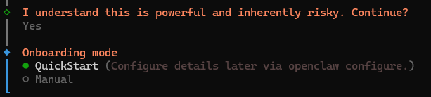

**3단계: Model/auth provider 선택 (핵심!)**
Google Gemini, OpenAI 등 주력으로 사용할 AI 모델 제공자를 선택합니다.
아래 5.2에서 무료API / Custom API / Local Serving LLM 사용에 대해 자세히 설명합니다.
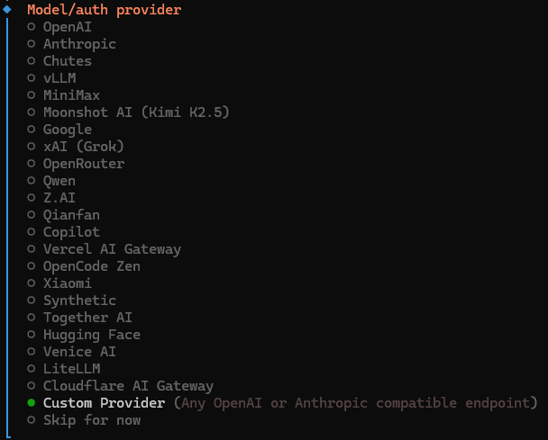

> **💡 Custom API (LM Studio, vLLM 등) 연동을 원한다면?**
>
> 위 이미지처럼 화살표 방향키를 눌러 `Custom API Endpoint (advanced)`를 선택하고 엔터를 누르세요. 그러면 다음과 같은 추가 설정 창이 나타납니다.
> 
> ① **Endpoint URL 입력**: 로컬에 띄운 서버 API 주소 입력 (최종적으로 `/v1` 포함)
> 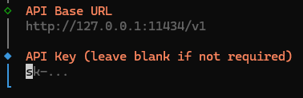
> ② **Compatibility 모델 선택**: 사용하는 API 서버 호환성 선택 (LM Studio의 경우 보통 `OpenAI Provider` 호환)
> 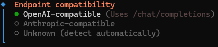
> ③ **Endpoint ID 지정**: 향후 설정에서 관리할 구분자 입력 (예: `LMStudio`)
> 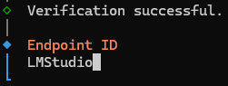
> *이렇게 설정하면 로컬 환경(LM Studio, vLLM 등)을 OpenClaw 기본 모델에 완벽히 매핑할 수 있습니다.*

**4단계: (선택) API Key 및 커스텀 모델 선택**
Google, OpenAI 등을 선택했다면 발급받은 API Key를, Custom API를 선택했다면 사용하려는 기본 모델명을 입력합니다.

**5단계: Channel(채널) 연동 선택**
Discord, Telegram, LINE 등 메신저 채널을 연동할 수 있습니다. 지금 당장 설정하지 않으려면 방향키로 `Skip for now`를 선택하고 넘어가도 괜찮습니다. (채널 연동은 글 *6번 목차*에서 따로 상세히 다룹니다)
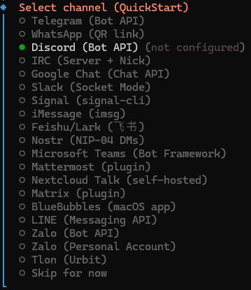

**6단계: Skills 설정**
다양한 외부 서비스와 연동하기 위한 'Skills' 설치 여부를 묻습니다. `Configure skills now?` 항목에서 `recommended(권장)`인 **Yes** 상태를 유지한 채 엔터를 누릅니다. 그러면 여러 스킬들의 의존성을 설치할지 묻는 화면이 나타납니다.
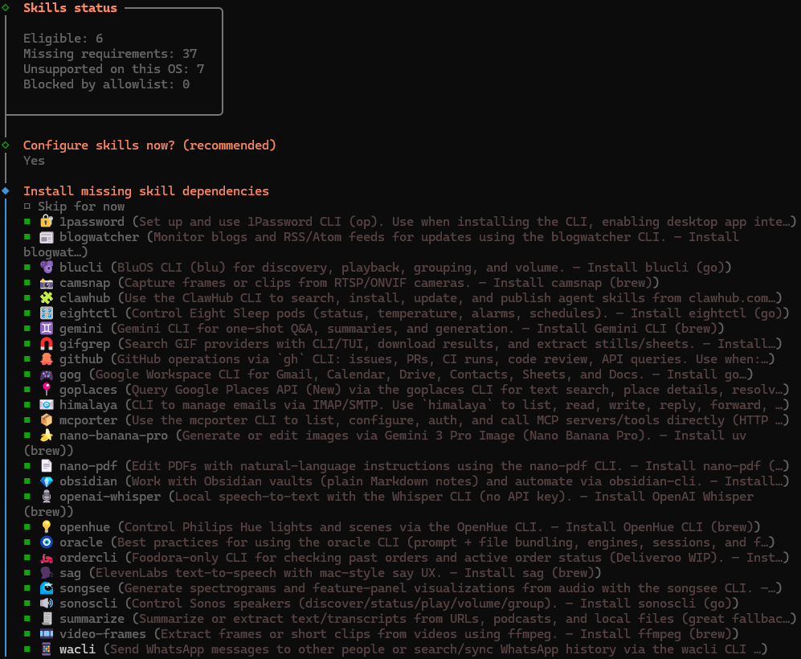

스페이스바(Space)를 사용해 원하는 스킬을 선택하고 엔터를 누르면 됩니다.

> **Tip**: 당장 모든 스킬 의존성을 설치할 필요는 없습니다. 최상단의 `Skip for now`에 체크(Space)를 하고 엔터를 누르면 지금은 건너뛰고 추후 필요할 때 설치할 수 있습니다.

<details>
<summary>🔽 <strong>(클릭) 캡처된 Skills 목록 및 상세 설명</strong></summary>

**Skills란 무엇인가요?**
OpenClaw에서 Tools(권한)가 단순한 '동작(예: 파일 읽기, API 호출)'이라면, Skills는 AI 비서에게 특정 애플리케이션이나 서비스를 능숙하게 다루는 **방법(노하우)**을 가르쳐주는 확장 기능입니다. 

화면에 나타난 수많은 스킬들은 **ClawHub**라는 퍼블릭 레지스트리를 통해 자동으로 다운로드되며, 이미지에 나온 각 스킬은 다음과 같은 기능들을 제공합니다:

| 스킬 이름 | 기능 설명 |
| :--- | :--- |
| **`1password`** | 1Password 볼트에 접근하여 비밀번호 및 보안 키 검색 |
| **`blogwatcher`** | 블로그 및 RSS/Atom 피드 업데이트 모니터링 |
| **`blucli`** | BluOS 기기(스피커 등)의 검색, 재생, 볼륨 제어 |
| **`camsnap`** | RTSP/ONVIF 네트워크 카메라에서 프레임/클립 캡처 |
| **`clawhub`** | 스킬 레지스트리에서 새로운 스킬 검색, 설치, 관리 |
| **`eightctl`** | Eight Sleep 스마트 매트리스 제어 (온도, 알람 등) |
| **`gemini`** | 구글 Gemini 모델을 이용한 단발성 Q&A 및 요약 생성 |
| **`gifgrep`** | GIF 플랫폼에서 애니메이션 이미지 검색 및 다운로드 |
| **`github`** | GitHub 저장소 관리 (이슈, PR, 커밋, API 조회 등) |
| **`gog`** | Google Workspace 연동 (Gmail, 일정, 문서, 드라이브 등) |
| **`goplaces`** | Google Places API를 통한 장소 검색 및 상세 정보 조회 |
| **`himalaya`** | IMAP/SMTP 프로토콜을 이용해 이메일 읽기, 쓰기, 답장 |
| **`mcporter`** | MCP 서버/도구 리스트를 확인하고 HTTP로 직접 호출 연결 |
| **`nano-banana-pro`**| Gemini 모델을 활용한 AI 기반 이미지 생성 및 편집 도구 |
| **`nano-pdf`** | 자연어 프롬프트를 사용하여 PDF 파일 내용 수정 및 편집 |
| **`obsidian`** | 개인 지식 관리 도구인 옵시디언의 노트를 검색하고 정리 |
| **`openai-whisper`** | API 키 없이 로컬 컴퓨터로 구동하는 Speech-to-Text 음성 인식 |
| **`openhue`** | 필립스 휴(Philips Hue) 스마트 조명 켜고 끄기 및 장면 제어 |
| **`oracle`** | 고급 사용자용 프롬프트 관리 (파일 번들, 여러 엔진 세션 관리) |
| **`ordercli`** | 음식 배달 플랫폼의 이전 주문 내역이나 현재 배달 상태 조회 |
| **`sag`** | ElevenLabs 서비스 기반의 macOS 스타일 고품질 TTS 음성 생성 |
| **`songsee`** | 오디오 파일에서 스펙트로그램, 시각화 형태의 이미지를 생성 |
| **`sonoscli`** | 로컬 네트워크의 Sonos 스마트 스피커 제어 (재생, 볼륨 등) |
| **`summarize`** | 웹 URL, 팟캐스트, 로컬 텍스트 파일 등 긴 내용을 깔끔하게 요약 |
| **`video-frames`** | ffmpeg 기술을 활용하여 동영상 파일에서 특정 프레임 단일 추출 |
| **`wacli`** | WhatsApp 메신저 메시지 발송 및 채팅 대화 기록 검색/동기화 |

*이 기능들을 언제든 활성화하여, 단순 챗봇을 넘어선 진정한 '개인 자동화 AI 비서'를 구축할 수 있습니다!*
</details>


**7단계: Hooks 설정**
스킬 설정을 마치면 **Hooks 활성화** 화면이 나타납니다. 스페이스바(Space)를 사용해 `boot-md`, `bootstrap-extra-files`, `command-logger`, `session-memory` 4가지를 모두 체크한 뒤 **Enter** 키로 확인하는 것을 권장합니다.

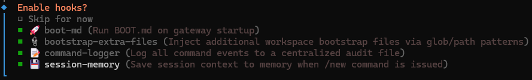

<details>
<summary>🔽 <strong>(클릭) Hooks 상세 설명</strong></summary>

| Hook | 설명 |
| :--- | :--- |
| **boot-md** | 봇 시작 시 Markdown 파일을 읽어 페르소나를 주입합니다. 예: "너는 코딩 비서야" |
| **bootstrap-extra-files** | 워크스페이스 시작 시 컨텍스트에 추가로 주입해야 할 설정 파일 등을 패턴(glob)으로 묶어서 봇에게 전달합니다 |
| **command-logger** | 사용자가 입력한 모든 명령어와 대화 내역을 로그 파일로 저장하여 관리합니다 |
| **session-memory** | 대화 세션의 문맥(Context)을 기억하여, `/new` 명령어로 새 대화를 시작할 때 이전 대화 요약을 제공합니다 |

</details>

이후 아래 명령으로 Web UI를 띄워 직관적으로 확인하실 수 있습니다.

```bash
openclaw dashboard
```

### 5.2 AI 모델 연동 — 3가지 방법

OpenClaw의 가장 큰 장점은 **다양한 AI 모델을 유연하게 연동**할 수 있다는 것입니다. 대표적인 3가지 방법을 소개합니다.

#### 방법 1: Google Gemini API (무료 사용 가능)

비용 부담 없이 시작하고 싶다면 **Google Gemini API**가 좋은 선택입니다. 무료 티어에서도 충분히 테스트할 수 있습니다.

**Step 1. API Key 발급**

1. [Google AI Studio](https://aistudio.google.com/)에 접속합니다.
2. 좌측 하단 **"Get API Key"** 클릭 → **"API Key 만들기"** 선택
3. 키 이름과 프로젝트를 설정한 뒤 **키 생성**
4. 생성된 API Key를 **복사**해 둡니다 (이후 Onboarding에서 사용)

**Step 2. Onboarding에서 설정**

```
Model/auth provider → Google
Google auth method  → Google Gemini API key
Enter Gemini API key → [복사한 API Key 붙여넣기]
Default model       → google/gemini-2.5-flash-preview-05-20
```

> **Warning**: 무료 API Key 사용 시, 일부 모델에서 응답이 오지 않을 수 있습니다. 2026년 2월 기준, 무료 티어에서는 `google/gemini-2.5-flash-preview-05-20` 또는 `google/gemini-2.0-flash` 모델이 안정적으로 동작합니다. 유료 Key라면 더 많은 모델을 사용할 수 있습니다.

**Step 3. 설정 파일 확인**

Onboarding이 완료되면 `~/.openclaw/openclaw.json`에 설정이 저장됩니다.

```json5
// ~/.openclaw/openclaw.json (일부 발췌)
{
  models: {
    providers: {
      google: {
        apiKey: "YOUR_GEMINI_API_KEY",
      },
    },
  },
  agents: {
    defaults: {
      model: {
        primary: "google/gemini-2.5-flash-preview-05-20",
      },
    },
  },
}
```

#### 방법 2: 개인 소유 API Key (ChatGPT, Claude 등)

OpenAI(ChatGPT), Anthropic(Claude) 등 다른 모델의 API Key를 이미 가지고 있다면 Onboarding에서 해당 제공자를 선택하면 됩니다.

```
Model/auth provider → OpenAI (또는 Anthropic)
Enter API key       → [API Key 입력]
Default model       → openai/gpt-4o (또는 anthropic/claude-sonnet-4-20250514)
```

또는 Onboarding 이후에 **설정 파일을 직접 편집**하여 추가할 수도 있습니다.

```json5
// ~/.openclaw/openclaw.json
{
  models: {
    providers: {
      openai: {
        apiKey: "sk-YOUR_OPENAI_KEY",
      },
      anthropic: {
        apiKey: "sk-ant-YOUR_ANTHROPIC_KEY",
      },
    },
  },
}
```

> **Tip**: OpenClaw는 `openclaw.json` 파일의 변경을 **실시간으로 감지**합니다. 파일을 저장하면 Gateway를 재시작하지 않아도 설정이 즉시 반영됩니다.

#### 방법 3: Ollama 또는 LM Studio를 활용한 로컬 LLM 연동 (완전 무료 🔒)

API 비용이 전혀 들지 않으면서도 로컬 PC의 하드웨어 리소스(GPU 등)를 알뜰하게 사용할 수 있는 방법입니다. 우분투 VM 내부가 아닌 **Host PC(로컬 윈도우)** 에 Ollama 또는 LM Studio를 설치하고, VM 내부에서 Host PC 쪽으로 API 요청을 보내는 구조로 연동해 보겠습니다.

> **💡 Host PC 통신이 원활한 이유**
> Hyper-V 가상 머신 생성 시 **Default Switch**를 사용하면 기본적으로 호스트 네트워크와 NAT 환경으로 구성됩니다. 따라서 VM 내에서 확인할 수 있는 **'기본 게이트웨이(Default Gateway) IP'** 가 곧 Host PC의 주소가 되어 통신이 가능합니다. 이 게이트웨이와 통신할 때, 각 서빙 클라이언트 측(Ollama/LM Studio)에서 로컬 네트워크 제공 옵션만 켜준다면 **윈도우 방화벽도 열지 물어보기 때문에** 번거로운 포트 개방 과정이 필요 없습니다.

**Step 1. Host PC에서 로컬 LLM 서버 외부 접근 설정 (Ollama / LM Studio 중 택 1)**

**① Ollama 사용 시:**

- GUI로 ollama 실행 시, 설정의 "Expose Ollama to the network"를 활성화하면 외부 접근이 허용됩니다. 프로그램 종료 시까지 유지됩니다.
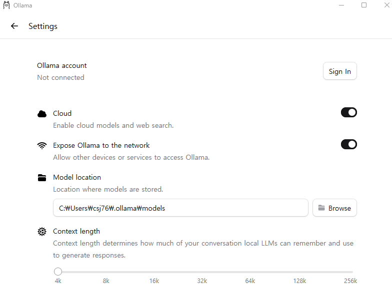
- CLI로 ollama 실행 시, 윈도우의 "시스템 환경 변수 편집"을 열고 시스템 변수 항목에 `OLLAMA_HOST` 값을 `0.0.0.0`으로 추가 설정하여 외부 접근을 허용해 줍니다. 이후 Ollama를 재시작합니다.

**② LM Studio 사용 시:**
설정 화면의 Local Server 탭에서 구동할 모델을 고른 후, `Router / Local Network Activation` 토글 버튼을 **ON**으로 활성화하여 리스닝 상태를 만듭니다.
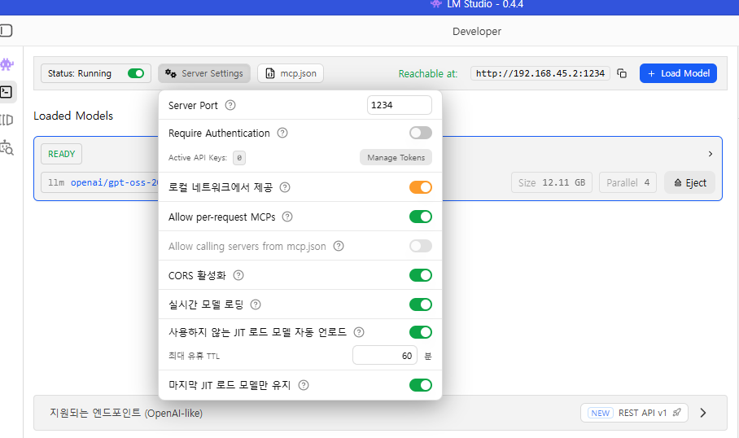

**Step 2. VM에서 게이트웨이 IP(Host PC) 확인**

VM(우분투 또는 WSL 셸) 터미널 창을 열고, 명령어 `ipconfig.exe`(WSL의 경우) 혹은 리눅스 명령어 `ip route`를 입력하여 나타나는 **기본 게이트웨이(Default Gateway) IP 주소**를 확인합니다. 
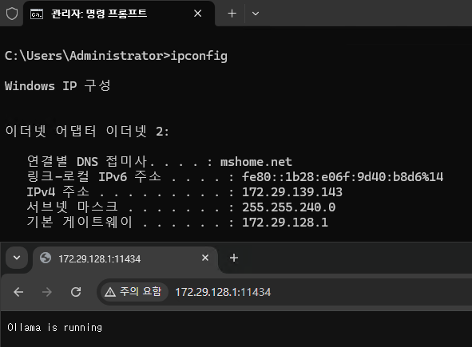
> 일반적으로 `172.x.x.x` 형태로 표시되는 네트워크 대역의 IP입니다. 이 주소를 기록해 두세요.

**Step 3. OpenClaw Custom API 연동 설정**

Onboarding 팝업 창(위 목차 5.1 참고)에서 `Custom API Endpoint (advanced)` 설정으로 들어가 아래와 같이 주입하거나, Onboard가 완료된 상태라면 터미널에서 `~/.openclaw/openclaw.json`을 직접 편집해 주면 됩니다. Ollama와 LM Studio 최신 버전 모두 **OpenAI API 호환 엔드포인트**를 지원하므로 Custom API 모델로 통일할 수 있습니다.

```json5
// ~/.openclaw/openclaw.json
{
  models: {
    providers: {
      openai: {
        apiKey: "lmstudio-or-ollama-local",  // 더미 API 키, 아무 값이나 입력
        baseUrl: "http://[확인한 게이트웨이 IP주소]:11434/v1", // Ollama의 경우 (기본 포트 11434)
        // baseUrl: "http://[확인한 게이트웨이 IP주소]:1234/v1", // LM Studio의 경우 (기본 포트 1234)
      },
    },
  },
}
```

> **Tip**: 모델 연결이 간혹 방화벽에 막히는 것 같다면, 윈도우 보안이나 방화벽 정책에서 해당 포트(11434 또는 1234)가 외부로부터 차단된 상태인지 한 번 더 체크해 보시면 좋습니다.

#### 📊 대표적인 4가지 연동 방식 비교

| 비교 항목 | Google Gemini | 개인 API Key | Ollama (로컬) | Custom API (LM Studio 등) |
| :--- | :--- | :--- | :--- | :--- |
| **비용** | 무료 (사용량 제한) | 유료 (토큰 과금) | 완전 무료 | 완전 무료 |
| **성능** | 높음 | 매우 높음 | 모델/GPU에 따라 다름 | 모델/GPU에 따라 다름 |
| **개인정보 보호** | 클라우드 전송 | 클라우드 전송 | ✅ 로컬 처리 | ✅ 로컬 처리 |
| **인터넷 필요** | ✅ 필요 | ✅ 필요 | ❌ 불필요 (오프라인) | ❌ 불필요 (오프라인) |
| **초기 설정** | API Key 발급만 | API Key 발급만 | 설치 + 모델 다운로드 | 별도 서버 운용 + Endpoint 구성 |
| **추천 대상** | 무료로 빠르게 시작 | 고성능 업무 자동화 | 간편한 로컬 호스팅 | 기존 로컬 LLM 운용 경험자 |

### 5.3 실행 및 확인

Onboarding이 완료되면 접속 URL이 표시됩니다.

```bash
# Gateway 상태 확인
openclaw status

# 브라우저 UI 열기
openclaw dashboard
```

브라우저에서 OpenClaw Dashboard가 열리면 **Chat 창**에서 대화를 시작해 보세요!

```bash
# 터미널에서 설정 문제 확인
openclaw doctor

# Gateway 로그 확인 (문제 발생 시)
openclaw logs --follow
```

트러블슈팅 관련 내용은 7번에서 다루겠습니다.

---

## 6. Chat 채널 연동 (Channel Integration)

OpenClaw의 진정한 힘은 **메신저 채널과 연동**할 때 빛납니다. 브라우저 UI 외에도 Discord, Telegram, LINE 같은 일상적인 메신저에서 AI 비서와 대화할 수 있습니다.

### 6.1 Discord 연동

Discord 서버에 OpenClaw 봇을 추가하여 대화하는 방법입니다.

#### Step 1. Discord Bot 생성

1. [Discord Developer Portal](https://discord.com/developers/applications)에 접속합니다.
2. **New Application** 클릭 → 이름 입력 → **Create**
3. 왼쪽 메뉴에서 **Bot** 탭으로 이동합니다.
4. **TOKEN** 섹션에서 **Reset Token** 클릭 → **Yes, do it!** 클릭
5. 새롭게 생성된 봇 토큰을 **복사**해 둡니다. (이후 사용)

#### Step 2. 봇 서버 초대 및 권한 설정

1. 왼쪽 메뉴 **OAuth2** → **URL Generator** 탭으로 이동합니다.
2. **Scopes** 항목에서 `bot`, `applications.commands` 2가지를 체크합니다.
3. 바로 아래 열리는 **Bot Permissions** 항목에서 `View Channels`, `Send Messages`, `Read Message History`, `Embed Links`, `Attach Files` (필요시 `Add Reactions`)를 찾아 체크합니다.
4. 맨 아래에 생성된 **Generated URL**을 복사하여 브라우저 새 창에서 열고, 봇을 초대할 내 디스코드 서버를 선택하여 권한을 수락(승인)합니다.

#### Step 3. Developer Mode 활성화 및 ID 수집 (중요)

OpenClaw에서 디스코드 서버와 관리자 계정을 명확히 식별하기 위해 고유 ID가 필요합니다.

1. 디스코드 화면 왼쪽 아래의 톱니바퀴 아이콘(**사용자 설정**)을 클릭합니다.
2. 왼쪽 메뉴 하단의 **고급(Advanced)** 탭 설정으로 이동하여 **개발자 모드(Developer Mode)** 를 켭니다.
3. 설정 창을 닫고, 디스코드 좌측 서버 목록에서 봇을 초대한 **내 서버 아이콘**을 우클릭하여 **'서버 ID 복사(Copy Server ID)'** 를 클릭 후 저장해 둡니다.
4. 채팅창이나 우측 멤버 목록에서 **내 프로필 사진**을 우클릭하여 **'사용자 ID 복사(Copy User ID)'** 를 클릭 후 저장해 둡니다.

#### Step 4. OpenClaw에 토큰 설정 및 페어링

터미널을 열고 발급받은 봇 토큰을 설정합니다. (토큰은 절대 공개된 채팅방에 올리지 마세요!)
만약 디스코드가 연동하는 첫 번째 채널이거나 CLI 명령보다 파일 단위 구성(file-based config)을 선호하신다면, 두 가지 방법 중 하나를 선택해 설정할 수 있습니다.

**[옵션 A] CLI 명령어로 설정:**
```bash
# Discord 봇 설정 활성화 및 토큰 입력
openclaw config set channels.discord.token '"YOUR_BOT_TOKEN"' --json
openclaw config set channels.discord.enabled true --json
```

**[옵션 B] 설정 파일 직접 오버라이트:**
`~/.openclaw/openclaw.json` 설정 파일을 열고 `channels` 구문을 통째로 주입합니다.
```json5
{
  channels: {
    discord: {
      enabled: true,
      token: "YOUR_BOT_TOKEN",
    },
  },
}
```

> **Tip**: 기본 계정에 대한 환경변수 폴백(Env fallback)으로 터미널이나 `.bashrc` 등에 `DISCORD_BOT_TOKEN="YOUR_BOT_TOKEN"`을 지정하는 방식도 지원합니다.

설정을 하나라도 마쳤다면 Gateway를 새로 띄워줍니다.

```bash
# Gateway 재시작
openclaw gateway restart
```

재시작 후, 디스코드에서 봇에게 직접 DM을 보내면 봇이 **페어링 코드**가 포함된 메시지를 답장으로 보냅니다. 터미널에서 이 코드를 승인합니다.

```bash
# 페어링 요청 확인
openclaw pairing list discord

# 페어링 승인 (DM으로 받은 CODE 입력)
openclaw pairing approve discord <CODE>
```

#### Step 5. (선택/권장) 길드 워크스페이스(Guild Workspace) 설정

봇이 아무 방에서나 반응하지 않고, 허용된 서버(길드) 지정 멤버에게만 안전하게 반응하도록 구성할 수 있습니다. Step 3에서 수집한 Server ID와 User ID를 활용합니다.
터미널에서 `~/.openclaw/openclaw.json` 설정 파일을 열고 `channels` - `discord` 하위 항목에 다음 구조를 추가합니다.

```json5
// ~/.openclaw/openclaw.json의 채널 설정 예시
{
  channels: {
    discord: {
      enabled: true,
      token: "YOUR_BOT_TOKEN",
      groupPolicy: "allowlist",
      guilds: {
        "YOUR_SERVER_ID": {       // 복사한 Server ID
          requireMention: true,   // true면 봇을 @멘션할 때만 응답함
          users: ["YOUR_USER_ID"] // 복사한 User ID (이 사람들에게만 허용)
        }
      }
    }
  }
}
```

#### 🔍 동작 확인

디스코드에서 봇에게 DM을 보내거나, 서버 채널에서 봇을 `@멘션`하여 대화를 시작해 보세요. AI가 질문에 맞는 응답을 보내게 됩니다!

> 📎 [Discord 연동 공식 문서](https://docs.openclaw.ai/channels/discord)

---

### 6.2 Telegram 연동

Telegram 봇을 만들어 OpenClaw와 연결합니다.

#### Step 1. BotFather에서 봇 생성

1. Telegram에서 **[@BotFather](https://t.me/botfather)**에게 말을 겁니다.
2. `/newbot` 명령어를 보냅니다.
3. 봇 이름과 사용자명을 입력합니다 (사용자명은 `_bot`으로 끝나야 합니다).
4. 생성된 **봇 토큰**을 복사합니다.

#### Step 2. OpenClaw에 토큰 설정

설정 파일을 직접 편집하거나 CLI로 설정합니다.

```json5
// ~/.openclaw/openclaw.json
{
  channels: {
    telegram: {
      enabled: true,
      botToken: "123456789:ABCdefGHIjklMNOpqrsTUVwxyz",
      dmPolicy: "pairing",        // 첫 DM 시 페어링 승인 필요
      groups: {
        "*": {
          requireMention: true,   // 그룹에서는 @멘션 시에만 응답
        },
      },
    },
  },
}
```

#### Step 3. Gateway 시작 및 페어링

```bash
# Gateway 재시작
openclaw gateway restart

# Telegram에서 봇에게 메시지 전송 후 페어링
openclaw pairing list telegram
openclaw pairing approve telegram <CODE>
```

#### Step 4. (선택) Telegram 설정 최적화

BotFather에서 추가 설정을 할 수 있습니다:

- `/setprivacy` → **Disable** (그룹 채팅 메시지를 읽으려면 Privacy Mode를 꺼야 합니다. 또는 봇을 그룹 관리자로 지정하세요.)
- `/setjoingroups` → 그룹 추가 허용/거부

> 📎 [Telegram 연동 공식 문서](https://docs.openclaw.ai/channels/telegram)

---

### 6.3 LINE 연동

LINE은 **플러그인 설치**가 별도로 필요합니다.

#### Step 1. 플러그인 설치

```bash
openclaw plugins install @openclaw/line
```

#### Step 2. LINE Developers 설정

1. [LINE Developers Console](https://developers.line.biz/console/)에 접속합니다.
2. **Provider** 생성 (또는 기존 Provider 선택) → **Messaging API** 채널 추가
3. 채널 설정에서 아래 두 값을 복사합니다:
   - **Channel access token** (채널 액세스 토큰)
   - **Channel secret** (채널 시크릿)
4. **Messaging API** 설정에서 **"Use webhook"** 을 **활성화**합니다.
5. **Webhook URL**을 설정합니다: `https://<gateway-host>/line/webhook`

> **Warning**: LINE은 **HTTPS가 필수**입니다. 로컬 테스트 시에는 [ngrok](https://ngrok.com/) 같은 터널링 도구를 사용하여 HTTPS 엔드포인트를 만들어야 합니다.

#### Step 3. OpenClaw에 LINE 설정 추가

```json5
// ~/.openclaw/openclaw.json
{
  channels: {
    line: {
      enabled: true,
      channelAccessToken: "LINE_CHANNEL_ACCESS_TOKEN",
      channelSecret: "LINE_CHANNEL_SECRET",
      dmPolicy: "pairing",
    },
  },
}
```

환경변수로 설정할 수도 있습니다:
```bash
export LINE_CHANNEL_ACCESS_TOKEN="your-token"
export LINE_CHANNEL_SECRET="your-secret"
```

#### Step 4. 페어링

```bash
openclaw gateway restart
openclaw pairing list line
openclaw pairing approve line <CODE>
```

> 📎 [LINE 연동 공식 문서](https://docs.openclaw.ai/channels/line)

---

### 📊 채널 연동 비교

| 비교 항목 | Discord | Telegram | LINE |
| :--- | :--- | :--- | :--- |
| **토큰 발급처** | Discord Developer Portal | BotFather(@BotFather) | LINE Developers Console |
| **플러그인 필요** | ❌ 불필요 | ❌ 불필요 | ✅ `@openclaw/line` |
| **HTTPS 필수** | ❌ | ❌ | ✅ (Webhook) |
| **그룹 채팅 지원** | ✅ | ✅ (`@멘션` 또는 Privacy 해제) | ✅ |
| **설정 난이도** | ⭐⭐ | ⭐ | ⭐⭐⭐ |

---

## 7. 일반적인 오류 및 트러블슈팅 (Troubleshooting)

OpenClaw 설정 후 Dashboard 채팅 시 발생할 수 있는 주요 오류와 해결책입니다.

### 7.1 Gateway Connect Failed (Pairing Required)

**[증상 (Symptom)]**
`openclaw dashboard`로 UI를 열었는데 연결이 되지 않거나, 터미널에서 `openclaw logs --follow` 확인 시 아래와 같은 오류 로그가 반복해서 나타납니다.
```text
gateway connect failed: Error: pairing required
Gateway not reachable. Is it running and accessible?
```

**[원인 (Cause)]**
이전에 설정했던 OpenClaw의 기기(Device) 또는 인증(Identity) 관련 캐시가 꼬이면서 페어링 정보를 정상적으로 불러오지 못해 발생하는 문제입니다.

**[해결책 (Solution)]**
문제가 되는 캐시 폴더(`devices`, `identity`)를 삭제하고 Gateway 서비스를 강제로 다시 시작하면 해결됩니다.

```bash
# 1. 기존 캐시 폴더 삭제
rm -rf ~/.openclaw/devices/
rm -rf ~/.openclaw/identity/

# 2. Gateway 서비스 재시작
systemctl --user restart openclaw-gateway
# 만약 systemd를 사용하지 않는 환경이라면: openclaw gateway restart
```
> 📎 참고 링크: [Reddit 트러블슈팅 커뮤니티](https://www.reddit.com/r/clawdbot/comments/1r9ly5x/solved_openclaw_gateway_connect_failed_error/)

### 7.2 Model context window too small 오류

**[증상 (Symptom)]**
채팅을 시도해도 답변이 오지 않고 대화가 끊기며, `openclaw logs --follow` 확인 시 "context window too small" 에러 창이 뜹니다.
```text
error agent/embedded {"subsystem":"agent/embedded"} blocked model (context window too small): lmstudio/openai/gpt-oss-20b ctx=4096 (min=16000) source=modelsConfig
error Embedded agent failed before reply: Model context window too small (4096 tokens). Minimum is 16000.
```

**[원인 (Cause)]**
Ollama나 LM Studio 등 Custom API(Local Network) 연동 시, OpenClaw 설정(`openclaw.json`)에 자동 등록된 모델의 `contextWindow` 값이 OpenClaw 에이전트 구동 최소 요구사항인 16,000 토큰보다 작게(기본값 4096 등) 세팅되어 있기 때문에 봇이 대화를 차단하는 현상입니다.

**[해결책 (Solution)]**
`~/.openclaw/openclaw.json` 설정 파일을 열고, 에러가 발생한 모델 설정 항목에서 `contextWindow`와 `maxTokens` 값을 모델이 실제로 지원하는 충분한 최댓값(예: 131072)으로 높여 줍니다.

```json5
// ~/.openclaw/openclaw.json
{
  "models": {
    "mode": "merge",
    "providers": {
      "lmstudio": { // 또는 custom 연동한 프로바이더명
        "baseUrl": "http://172.x.x.x:1234/v1",
        "models": [
          {
            "id": "openai/gpt-oss-20b",
            // ... 생략 ...
            "contextWindow": 131072, // 기존 4096에서 모델 최댓값으로 넉넉하게 변경
            "maxTokens": 131072      // 기존 4096에서 모델 최댓값으로 넉넉하게 변경
          }
        ]
      }
    }
  }
}
```
> 값을 수정한 후 시스템에 저장하면 OpenClaw 내부에서 즉시 변경 내용을 감지(`config change detected; evaluating reload`)하여 Gateway 재시작 없이도 정상적으로 긴 문맥의 채팅이 동작하게 됩니다.

---

## 8. 마치며 (Conclusion)

이번 글에서는 **윈도우 PC에서 Hyper-V로 Ubuntu VM을 만들고**, 그 위에 **OpenClaw를 설치**하는 전 과정을 다뤘습니다.

| 단계 | 내용 |
| :--- | :--- |
| **1. 환경 준비** | Hyper-V 활성화 → 우분투 VM 생성 |
| **2. OpenClaw 설치** | Node.js + Git → OpenClaw CLI → Onboarding |
| **3. AI 모델 연동** | Google Gemini / 개인 API Key / Ollama 로컬 LLM |
| **4. 채널 연동** | Discord / Telegram / LINE |

OpenClaw는 단순한 챗봇을 넘어, **웹 검색, GitHub 관리, 로컬 환경 명령 수행** 등 다양한 **스킬(Skills)** 을 추가하여 진정한 AI 비서로 확장할 수 있습니다. 스킬 설정에 대해서는 다음 포스팅에서 다뤄볼 예정입니다.

여러분의 **나만의 AI 비서**가 잘 동작하기를 바랍니다! 🚀

---

## 검증 환경 (Verification Environment)

| 항목 | 버전 / 스펙 |
| :--- | :--- |
| **호스트 OS** | Windows 11 Pro |
| **Hyper-V** | Windows 기본 제공 |
| **게스트 OS** | Ubuntu 24.04 LTS (Desktop) |
| **Node.js** | 22.x LTS |
| **OpenClaw** | latest (2026-02-21 기준) |
| **Ollama** | latest |
