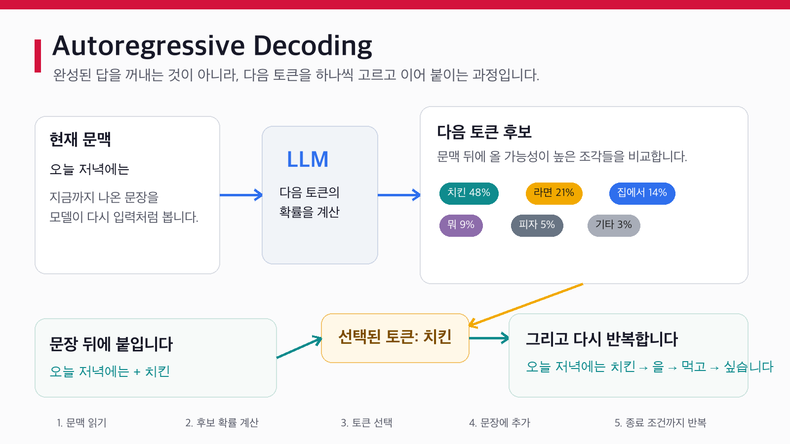
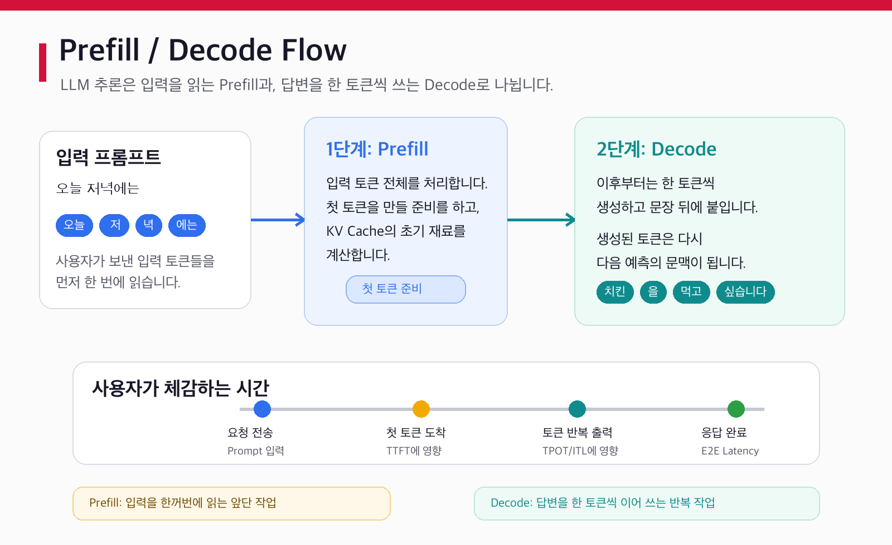

## 1. LLM은 답변을 한 번에 쓰지 않습니다

ChatGPT나 Claude에 질문을 던지면 답변이 마치 이미 완성된 문서를 꺼내오는 것처럼 보일 때가 있습니다.  
하지만 실제로 LLM은 답변 전체를 한 번에 만들어서 보내지 않습니다.

조금 더 정확히 말하면, LLM은 **지금까지 나온 문맥을 보고 다음에 올 가능성이 높은 토큰을 하나씩 고르는 방식**으로 글을 생성합니다.  
우리가 스마트폰 키보드에서 자동완성 후보를 보는 것과 비슷합니다.

예를 들어 사용자가 이렇게 입력했다고 해보겠습니다.

```text
오늘 저녁에는
```

자동완성 키보드는 다음 단어로 `치킨`, `라면`, `뭐`, `집에서` 같은 후보를 띄울 수 있습니다.  
LLM도 비슷하게 현재 문맥을 보고 다음에 올 후보들을 계산합니다.

```text
오늘 저녁에는 -> 치킨
오늘 저녁에는 치킨 -> 을
오늘 저녁에는 치킨을 -> 먹고
오늘 저녁에는 치킨을 먹고 -> 싶습니다
```

겉으로 보면 하나의 문장이 자연스럽게 나온 것처럼 보이지만, 내부에서는 이런 일이 반복됩니다.



<!--truncate-->

## 2. 토큰이란 무엇인가요?

LLM은 우리가 입력한 문장을 사람처럼 “문장”이나 “단어” 그대로 읽지 않습니다.  
모델이 처리할 수 있는 더 작은 단위로 문장을 쪼갠 뒤, 그 조각들을 숫자로 바꿔서 처리합니다.

이때 문장을 쪼갠 조각을 **토큰(Token)** 이라고 부릅니다.

토큰은 꼭 단어 하나와 같지 않습니다. 한 글자일 수도 있고, 단어 하나일 수도 있고, 단어의 일부일 수도 있습니다. 공백이나 문장부호도 토큰에 포함될 수 있습니다.

예를 들어 `o200k_base` tokenizer 기준으로 다음 문장은 이렇게 나뉩니다.

```text
오늘 저녁에는 치킨을 먹고 싶습니다.
[오늘] [ 저] [녁] [에는] [ 치] [킨] [을] [ 먹] [고] [ 싶] [습니다] [.]
```

다른 한국어 예시도 보겠습니다.

```text
김치찌개를 먹고 싶습니다.
[김] [치] [찌] [개] [를] [ 먹] [고] [ 싶] [습니다] [.]
```

`김치찌개`는 사람에게 익숙한 하나의 음식 이름이지만, 모델이 보는 토큰 단위에서는 여러 조각으로 나뉩니다.

영어도 마찬가지입니다.

```text
Autoregressive decoding
[Aut] [ore] [gressive] [ decoding]
```

중요한 점은 이것입니다.

LLM은 “단어 하나씩” 글을 쓰는 것이 아니라, **토큰 하나씩** 글을 씁니다.  
그래서 앞으로 `다음 단어를 예측한다`고 말하더라도, 실제 내부 동작은 더 정확히 말해 **다음 토큰을 예측한다**에 가깝습니다.

직접 문장을 넣어 토큰이 어떻게 나뉘는지 확인해 보고 싶다면 Hugging Face의 Tokenizer Playground를 사용해 볼 수 있습니다.

- https://huggingface.co/spaces/Xenova/the-tokenizer-playground

같은 문장이라도 어떤 tokenizer를 쓰느냐에 따라 쪼개지는 방식이 달라질 수 있으니, 실제 모델을 다룰 때는 “이 모델이 어떤 tokenizer를 쓰는가”도 함께 확인하는 것이 좋습니다.

이 차이는 서빙 최적화에서도 중요합니다.  
모델의 입력 길이, 출력 길이, 처리 속도, 비용, 메모리 사용량은 대부분 “문장 수”가 아니라 **토큰 수**를 기준으로 계산되기 때문입니다.

## 3. 다음 토큰을 예측한다는 것은 무엇인가요?

LLM이 글을 생성할 때 하는 핵심 작업은 단순하게 말하면 이것입니다.

```text
지금까지의 토큰들을 보고, 다음 토큰 후보들의 점수를 계산합니다.
```

예를 들어 현재 문맥이 다음과 같다고 해보겠습니다.

```text
오늘 저녁에는
```

모델은 이 문맥 뒤에 올 수 있는 모든 토큰 후보에 대해 점수를 계산합니다.  
이 점수는 보통 **logit**이라고 부릅니다. logit은 아직 확률은 아니고, 모델이 각 토큰 후보에 부여한 원시 점수에 가깝습니다.

그다음 이 점수를 확률처럼 비교할 수 있는 값으로 바꾸고, 디코딩 전략에 따라 하나의 토큰을 고릅니다.

| 다음 토큰 후보 | 확률 예시 |
| --- | ---: |
| `치킨` | 48% |
| `라면` | 21% |
| `집에서` | 14% |
| `뭐` | 9% |
| `피자` | 5% |
| 기타 | 3% |

여기서 항상 확률이 가장 높은 `치킨`만 고르는 것은 아닙니다.  
설정에 따라 가장 높은 후보를 고를 수도 있고, 어느 정도 무작위성을 섞어서 다른 후보를 고를 수도 있습니다.

선택된 토큰은 기존 문장 뒤에 붙습니다.

```text
오늘 저녁에는 + 치킨
```

그러면 모델은 다시 새 문맥을 보고 다음 토큰을 예측합니다.

```text
오늘 저녁에는 치킨 -> 을
오늘 저녁에는 치킨을 -> 먹고
오늘 저녁에는 치킨을 먹고 -> 싶습니다
```

이 과정을 답변이 끝날 때까지 반복합니다.  
그래서 LLM의 글 생성은 “한 번에 문단을 출력하는 과정”이라기보다는, **다음 토큰 예측을 아주 빠르게 반복하는 과정**에 가깝습니다.

## 4. Prefill과 Decode 흐름

LLM이 토큰을 하나씩 생성한다는 점을 이해했다면, 이제 실제 추론 흐름을 조금 더 정확히 나눠볼 수 있습니다.  
LLM 추론은 보통 크게 두 단계로 설명합니다.

1. **Prefill**
2. **Decode**

이 둘을 구분하면 LLM 서빙 성능을 이해하기 훨씬 쉬워집니다.



**Prefill**은 사용자가 입력한 프롬프트를 모델이 처음 읽는 단계입니다.  
예를 들어 사용자가 `오늘 저녁에는`이라는 프롬프트를 보냈다면, 모델은 이 입력 토큰들을 처리하면서 “이 문맥 다음에 어떤 토큰이 올 수 있는지”를 계산할 준비를 합니다.

여기서 “입력 토큰들을 한 번에 처리한다”는 말은, 답변을 생성할 때처럼 `치킨 -> 을 -> 먹고`를 순서대로 하나씩 뽑는다는 뜻이 아닙니다.  
입력 프롬프트는 이미 사용자가 모두 제공한 상태입니다. 따라서 모델은 프롬프트 안에 있는 여러 입력 토큰을 한꺼번에 보고, 각 토큰이 서로 어떤 관계를 가지는지 계산할 수 있습니다.

예를 들어 입력이 다음과 같다면,

```text
오늘 저녁에는
```

모델은 `오늘`, `저`, `녁`, `에는` 같은 입력 토큰들을 먼저 읽고, 이 전체 문맥을 바탕으로 첫 번째 출력 토큰을 준비합니다.  
즉 Prefill은 **사용자의 입력을 읽고 첫 출력 토큰을 만들기 전까지의 준비 작업**에 가깝습니다.

반면 **Decode**는 실제 답변을 한 토큰씩 생성하는 단계입니다.  
Prefill이 끝난 뒤 모델은 첫 토큰을 고르고, 그 토큰을 문맥 뒤에 붙입니다. 그리고 다시 다음 토큰을 예측합니다.

```text
Prefill:
[오늘] [ 저] [녁] [에는] 입력을 먼저 처리

Decode:
치킨 -> 을 -> 먹고 -> 싶습니다
```

이 차이는 사용자가 체감하는 속도와도 연결됩니다.

첫 토큰이 나오기까지의 시간은 주로 Prefill의 영향을 많이 받습니다.  
서빙 성능 지표에서는 이를 **TTFT(Time To First Token)** 라고 부릅니다.

첫 토큰이 나온 뒤부터는 Decode 단계가 반복됩니다.  
이때는 토큰이 얼마나 일정하고 빠르게 이어져 나오는지가 중요합니다. 서빙 성능 지표에서는 이를 **TPOT(Time Per Output Token), 출력 토큰 하나를 생성하는 데 걸리는 평균 시간** 또는 **ITL(Inter-Token Latency), 스트리밍 중 인접한 출력 토큰 사이의 시간 간격**으로 봅니다.

두 값은 비슷하게 쓰일 때도 있지만 엄밀히는 관점이 다릅니다.  
TPOT는 전체 출력 토큰을 기준으로 평균 처리 시간을 보는 지표에 가깝고, ITL은 사용자가 스트리밍 응답에서 체감하는 토큰 간 간격에 더 가깝습니다.

정리하면 다음과 같습니다.

| 단계 | 하는 일 | 사용자 체감 |
| --- | --- | --- |
| Prefill | 입력 프롬프트 전체를 읽고 첫 토큰을 준비합니다. | 첫 토큰이 나오기 전 대기 시간에 영향을 줍니다. |
| Decode | 답변을 한 토큰씩 반복 생성합니다. | 답변이 줄줄 출력되는 속도에 영향을 줍니다. |

이 구분이 중요한 이유는 두 단계의 병목이 다르기 때문입니다.  
긴 프롬프트를 넣었을 때 첫 응답이 늦는 문제와, 짧은 프롬프트인데 긴 답변이 천천히 나오는 문제는 같은 “느림”처럼 보이지만 내부 원인은 다를 수 있습니다.

## 5. 긴 답변은 왜 느릴까요?

이제 LLM이 답변을 한 토큰씩 만든다는 점을 다시 떠올려 보겠습니다.

짧은 답변은 생성해야 할 토큰 수가 적습니다.

```text
네, 가능합니다.
```

반대로 긴 답변은 생성해야 할 토큰 수가 많습니다.

```text
네, 가능합니다. 다만 운영 환경에서는 모델 크기, GPU 메모리, 동시 요청 수, 입력 길이, 출력 길이를 함께 고려해야 합니다...
```

사람이 보기에는 “문장이 길다” 정도의 차이지만, 모델 입장에서는 해야 할 반복 횟수가 늘어나는 것입니다.

```text
짧은 답변:
토큰 5개 생성 -> Decode 5번 반복

긴 답변:
토큰 500개 생성 -> Decode 500번 반복
```

물론 실제 엔진은 여러 최적화를 사용하기 때문에 이렇게 단순하게만 동작하지는 않습니다.  
하지만 기본 구조는 변하지 않습니다. 출력이 길어질수록 Decode 단계가 더 많이 반복됩니다.

이 때문에 긴 답변은 두 가지 측면에서 느려질 수 있습니다.

첫째, **전체 응답 완료 시간이 길어집니다.**  
토큰을 하나씩 생성해야 하므로 출력 토큰 수가 많을수록 마지막 토큰까지 도착하는 시간이 늘어납니다.

둘째, **서버 자원을 더 오래 점유합니다.**  
한 요청이 오랫동안 Decode를 반복하면 GPU 메모리와 계산 자원을 계속 사용하게 됩니다. 사용자가 한 명뿐이라면 크게 문제되지 않을 수 있지만, 여러 사용자가 동시에 요청하는 서비스에서는 이야기가 달라집니다.

예를 들어 A 사용자가 짧은 답변을 요청하고, B 사용자가 매우 긴 답변을 요청했다고 해보겠습니다.  
B 사용자의 요청이 오랫동안 토큰을 생성하는 동안, 서버는 계속 그 요청의 상태를 유지해야 합니다. 이런 요청이 많아지면 대기열이 길어지고, 다른 사용자들의 응답도 함께 느려질 수 있습니다.

그래서 LLM 서빙에서는 단순히 “모델이 똑똑한가”만 보지 않습니다.  
다음과 같은 질문을 함께 봅니다.

- 첫 토큰은 얼마나 빨리 나오나요?
- 이후 토큰은 얼마나 일정하게 나오나요?
- 한 요청이 GPU를 얼마나 오래 점유하나요?
- 동시에 몇 명의 요청을 처리할 수 있나요?
- 긴 입력과 긴 출력이 섞였을 때도 안정적인가요?

이 질문들이 바로 이후 글에서 다룰 `TTFT`, `TPOT`, `Throughput`, `Batching` 같은 서빙 지표와 연결됩니다.

## 6. 그래서 KV Cache가 필요합니다

지금까지의 내용을 정리하면 LLM 생성은 다음과 같습니다.

1. 사용자의 입력 프롬프트를 읽습니다.
2. 다음 토큰을 하나 고릅니다.
3. 고른 토큰을 문맥 뒤에 붙입니다.
4. 다시 다음 토큰을 고릅니다.
5. 이 과정을 답변이 끝날 때까지 반복합니다.

여기서 중요한 문제가 하나 생깁니다.

매번 다음 토큰을 예측할 때마다, 모델은 지금까지의 문맥을 참고해야 합니다.  
그렇다면 이런 의문이 생깁니다.

```text
방금 전에 계산한 앞부분 문맥을 매번 다시 계산해야 할까요?
```

예를 들어 모델이 다음과 같이 답변을 생성하고 있다고 해보겠습니다.

```text
오늘 저녁에는 치킨을 먹고 싶습니다.
```

`먹고` 다음에 올 토큰을 예측할 때도 앞의 `오늘 저녁에는 치킨을`이라는 문맥이 필요합니다.  
그다음 `싶습니다`를 예측할 때도 앞의 문맥이 다시 필요합니다.

만약 매번 처음부터 모든 문맥을 다시 계산한다면, 답변이 길어질수록 낭비가 매우 커집니다.  
이미 계산한 내용을 계속 다시 계산하는 셈이기 때문입니다.

그래서 LLM 서빙에서는 이전 토큰들에 대해 계산해 둔 일부 중간 결과를 저장해 두고 재사용합니다.  
이때 사용하는 대표적인 기술이 **KV Cache**입니다.

KV Cache는 쉽게 말해, 모델이 이전 문맥을 처리하면서 만들어 둔 “계산 메모”를 저장해 두는 방식입니다.  
덕분에 다음 토큰을 만들 때 앞부분 전체를 매번 처음부터 다시 계산하지 않아도 됩니다.

다만 공짜는 아닙니다.  
KV Cache는 속도를 높여주는 대신 GPU 메모리를 사용합니다. 출력이 길어지고, 입력 문맥이 길어지고, 동시 요청이 늘어날수록 KV Cache가 차지하는 메모리도 커집니다.

즉 KV Cache는 LLM 서빙에서 아주 중요한 trade-off를 만듭니다.

```text
계산을 아끼기 위해 메모리를 쓴다.
```

이 trade-off를 이해하면 이후에 등장하는 `PagedAttention`, `Prefix Caching`, `FP8 KV Cache`, `Chunked Prefill` 같은 최적화 기법이 훨씬 자연스럽게 이해됩니다.

다음 글에서는 이 KV Cache가 정확히 무엇을 저장하고, 왜 LLM 서빙 성능을 크게 바꾸는지 살펴보겠습니다.

## [출처]

- OpenAI Help Center, “What are tokens and how to count them?”  
  https://help.openai.com/en/articles/4936856-what-are-tokens-and-how-to-count-them

- OpenAI, `tiktoken` GitHub repository  
  https://github.com/openai/tiktoken

- OpenAI Tokenizer  
  https://platform.openai.com/tokenizer

- Hugging Face Transformers, “Text generation”  
  https://huggingface.co/docs/transformers/en/llm_tutorial

- Hugging Face LLM Course, “Tokenizers”  
  https://huggingface.co/learn/llm-course/en/chapter2/4

- Hugging Face LLM Course, “Deep dive into Text Generation Inference with LLMs”  
  https://huggingface.co/learn/llm-course/en/chapter1/8

- Google Cloud, “Generative AI glossary - tokens”  
  https://docs.cloud.google.com/docs/generative-ai/glossary#tokens

- NVIDIA Developer Blog, “Mastering LLM Techniques: Inference Optimization”  
  https://developer.nvidia.com/blog/mastering-llm-techniques-inference-optimization/

- vLLM Documentation, “Disaggregated Prefilling”  
  https://docs.vllm.ai/en/v0.9.2/features/disagg_prefill.html
