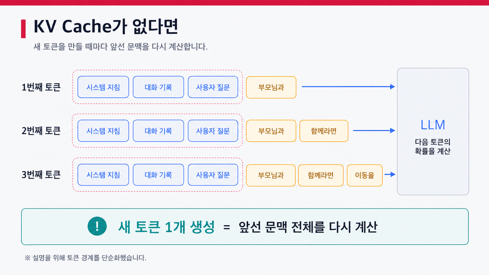
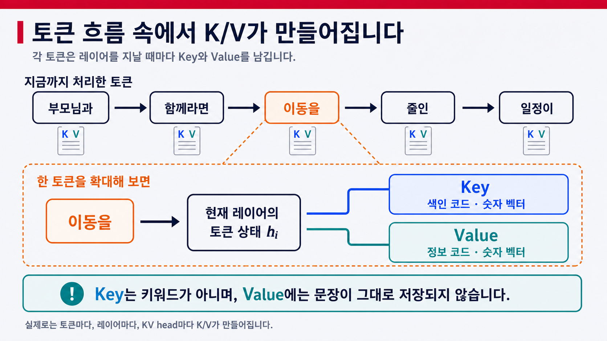
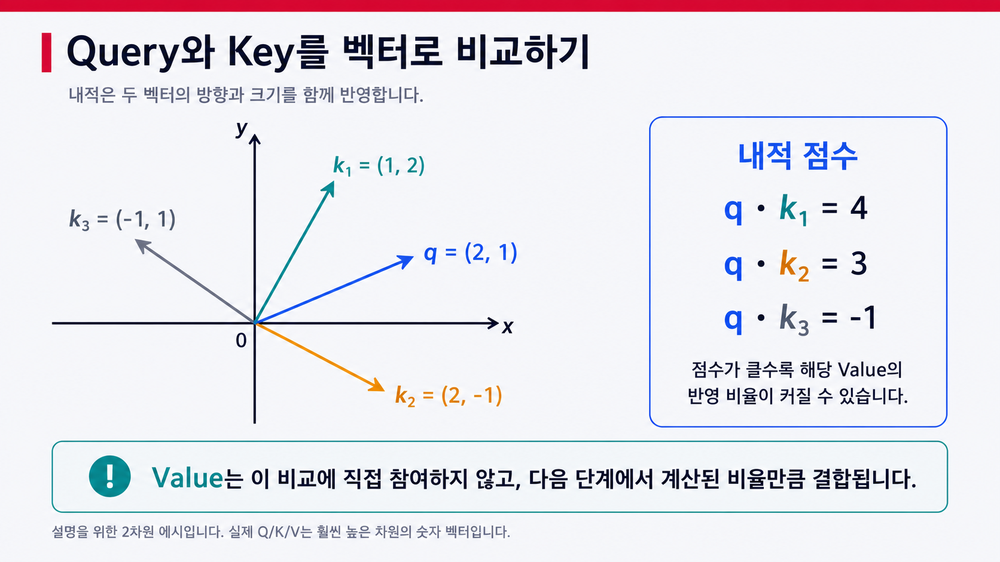
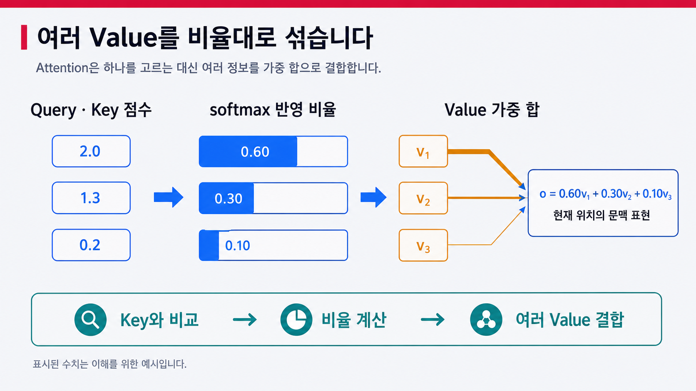
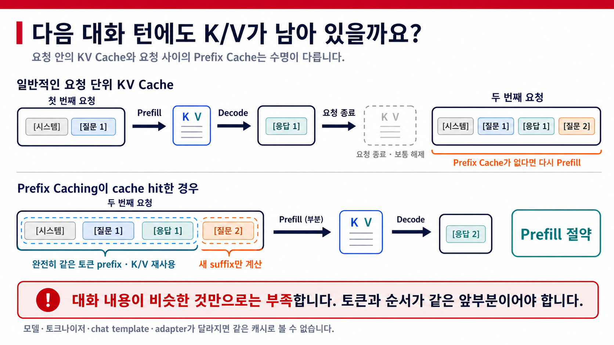
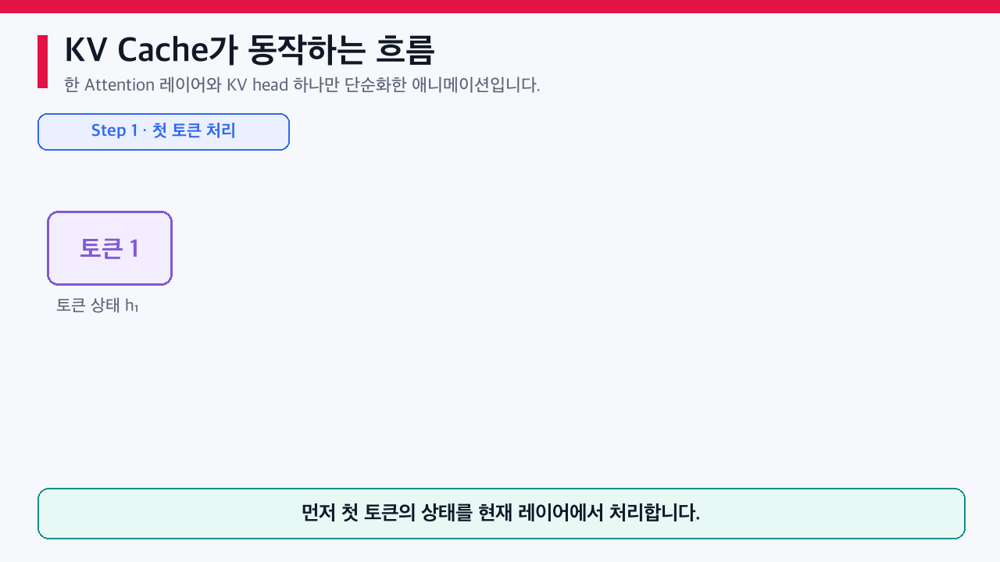
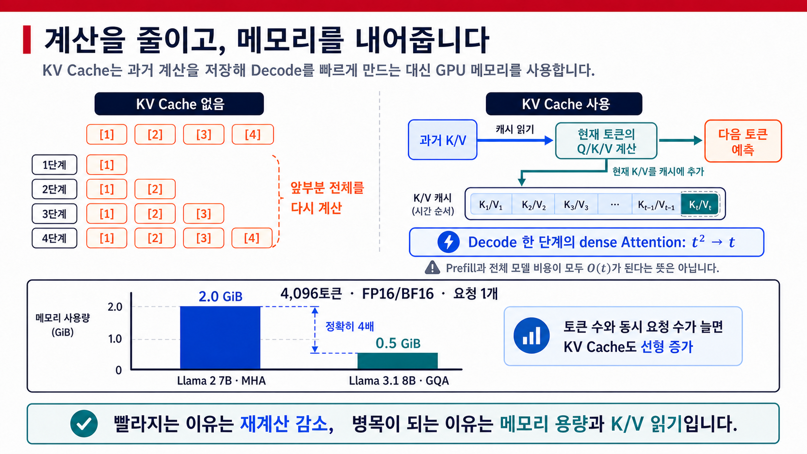

## 1. 왜 같은 문맥을 다시 계산할까요?

[이전 글](/llm-autoregressive-decoding)에서 LLM은 완성된 답변을 한 번에 꺼내는 대신, 지금까지의 문맥을 보고 다음 토큰을 하나씩 생성한다는 사실을 살펴봤습니다.

이 방식에는 눈에 잘 띄지 않는 반복 작업이 숨어 있습니다. 이 글은 표준 Transformer의 dense causal self-attention을 기준으로 삼습니다. 이 구조는 다음 토큰을 예측할 때 현재 위치까지 쌓인 문맥을 참고합니다. Sliding Window Attention처럼 참조 범위를 제한하거나, Attention과 다른 구조를 섞은 모델은 동작과 캐시 형태가 달라질 수 있습니다.

:::note 처음 만나는 용어: 레이어와 Attention

- <strong>레이어(layer)</strong>는 Transformer가 토큰의 숫자 표현을 한 단계씩 바꾸는 반복 단위입니다. 여러 레이어가 앞 레이어의 출력을 차례로 이어받습니다.
- <strong>causal self-attention</strong>은 현재 위치가 자기 자신과 앞선 토큰만 참고하도록 미래 위치를 가린 Attention입니다.
- <strong>dense</strong>는 허용된 앞부분 전체를 살펴본다는 뜻입니다. Sliding Window Attention은 이 범위를 최근 일정 구간으로 제한합니다.

:::

이 문제를 채팅 상담 장면으로 바꿔 보겠습니다. 상담원에게 다음과 같은 정보가 주어졌습니다.

```text
상담 지침: 가족 여행 일정을 친절하게 설계해 주세요.
대화 기록: 사용자는 부모님과 여행하며, 오래 걷기 어렵다고 말했습니다.
사용자 질문: 지금까지의 조건을 반영해 제주도 2박 3일 일정을 짜 주세요.
```

상담원은 이 내용을 읽고 다음과 같이 답하려고 합니다.

```text
"부모님과 함께라면 이동을 줄인 일정이 좋습니다."
```

보통 상담원이라면 지침과 대화 기록을 한 번 확인한 뒤 답변을 이어서 말할 것입니다. 그런데 답변을 한 토막 말할 때마다 상담 기록의 첫 줄로 돌아가야 한다는 이상한 규칙이 있다고 해보겠습니다.

```text
1번째:
[상담 지침] [대화 기록] [사용자 질문]을 읽습니다.
→ 상담원: "부모님과"

2번째:
[상담 지침] [대화 기록] [사용자 질문] [부모님과]를 다시 읽습니다.
→ 상담원: "함께라면"

3번째:
[상담 지침] [대화 기록] [사용자 질문] [부모님과] [함께라면]을 다시 읽습니다.
→ 상담원: "이동을"
```

무슨 말을 하려는지 먼저 알고 나니, 어디서 반복이 생기는지도 조금 더 선명하게 보입니다. 새로 말한 부분은 `부모님과`, `함께라면`, `이동을`처럼 한 조각씩 늘어나는데 그때마다 앞의 상담 지침과 대화 기록을 다시 읽고 있습니다.

다만 이 비유와 실제 LLM 사이에는 중요한 차이가 있습니다. 상담원은 완성된 답변을 머릿속에 미리 떠올릴 수 있지만 LLM은 위 문장을 미리 완성해 두고 한 조각씩 꺼내는 것이 아닙니다. 그때까지의 문맥을 바탕으로 다음 토큰을 하나씩 선택합니다.

그럼에도 KV Cache를 사용하지 않을 때 계산이 반복되는 모습은 비슷합니다. 아래 그림처럼 새 토큰은 하나씩 늘어나지만 모델에 들어가는 앞선 문맥은 매 단계 다시 계산됩니다. 그림에서는 흐름을 알아보기 쉽도록 실제 토큰보다 큰 말 조각으로 단순화했습니다.



<!--truncate-->

새로 늘어난 부분은 매번 토큰 하나뿐입니다. 하지만 아무것도 저장하지 않는다면 모델은 새 토큰을 만들 때마다 앞선 토큰들을 다시 입력으로 처리하고 각 Transformer 레이어의 중간 계산도 다시 수행해야 합니다.

문맥이 짧고 답변도 짧다면 이 낭비가 크게 느껴지지 않을 수 있습니다. 문제는 문맥과 출력이 길어질 때입니다. 1,000번째 토큰을 예측하려면 앞선 999개 토큰의 정보가 필요합니다. 바로 다음인 1,001번째 토큰을 예측할 때도 거의 같은 999개 토큰의 정보와 방금 생성한 1개 토큰이 다시 필요합니다.

답변이 길어질수록 이미 했던 계산의 비중이 커지는 셈입니다. 긴 시스템 프롬프트, 여러 차례 쌓인 대화 기록, 검색한 문서를 프롬프트에 붙이는 RAG 요청이라면 반복되는 앞부분은 훨씬 더 커집니다.

> 여기서 말하는 반복은 모델이 같은 질문에 여러 번 답한다는 뜻이 아닙니다. **한 번의 답변 안에서 다음 토큰을 만들 때마다 앞선 문맥의 정보가 다시 필요하다**는 뜻입니다. 대화가 끝난 뒤에도 이전 요청의 계산 결과를 유지하고 재사용하는 문제는 이후에 다룰 Prefix Caching과도 연결됩니다.

Transformer 기반 LLM의 추론 도구와 서빙 엔진은 이런 낭비를 줄이기 위해 보통 KV Cache를 사용합니다. 그렇다면 앞선 토큰을 처리하며 얻은 결과 중 무엇을 남겨야 할까요?

그 답이 이름에 들어 있는 Key와 Value, 그리고 이 값을 보관하는 문맥 메모입니다.

## 2. Key와 Value를 "문맥 메모"로 이해하기

앞에서 살펴본 반복 계산을 줄이려면, 이미 처리한 문맥에서 나중에도 다시 쓸 계산 결과를 남겨야 합니다. 그렇다고 모델이 계산한 모든 값을 통째로 보관할 필요는 없습니다. 다음 토큰을 만들 때 Attention이 다시 사용하는 값인 Key와 Value를 남깁니다.

Key와 Value를 이해하려면 Attention이 하는 일을 먼저 아주 작게 나눠볼 필요가 있습니다. Transformer의 각 Attention 레이어는 현재 위치를 처리하면서 이런 질문에 답합니다.

```text
현재 위치까지 나온 정보 중 지금 참고할 곳은 어디이며,
각 정보를 어느 정도씩 반영해야 할까요?
```

처음에는 하나의 Transformer 레이어, 그 안의 Attention head 하나만 들여다본다고 생각하겠습니다. 여기서 head는 문맥을 바라보는 하나의 계산 단위입니다. 한 레이어 안의 여러 head는 병렬로 계산되지만 레이어들은 앞 레이어의 출력을 받아 순서대로 계산됩니다.

:::note Attention head와 KV head

<strong>Attention head</strong>는 한 레이어 안에서 문맥을 병렬로 바라보는 계산 단위입니다. 그중 Query를 만드는 단위의 수를 Query head, Key와 Value를 만드는 단위의 수를 KV head라고 부릅니다. MHA에서는 두 수가 같지만 GQA와 MQA에서는 여러 Query head가 더 적은 KV head를 공유합니다. 따라서 `KV head 하나`는 `토큰 하나`나 `레이어 하나`를 뜻하지 않습니다.

:::

상담원 비유를 조금 더 이어가 보겠습니다. 상담원이 대화를 읽으며 이전 말 조각마다 작은 문맥 메모 카드를 만들어 둔다고 생각해 보겠습니다. 카드에는 두 종류의 코드가 들어 있습니다.

- 카드 앞면에는 나중에 이 메모가 필요한지 비교할 색인 코드가 있습니다. 이것이 Key입니다.
- 카드 뒷면에는 이 메모를 참고할 때 실제 계산에 반영할 정보 코드가 있습니다. 이것이 Value입니다.

아래 그림 위쪽의 작은 K/V 카드는 토큰 하나에 K/V 한 쌍만 생긴다는 뜻이 아닙니다. 그 토큰을 처리하며 레이어별, KV head별로 만들어지는 K/V 묶음을 간단히 표시한 것입니다. 확대 영역은 그중 한 레이어와 KV head 하나에서 만들어지는 K/V를 보여줍니다.



여기서 `색인 코드`와 `정보 코드`는 이해를 돕기 위한 표현입니다. Key에 `부모님`, `이동` 같은 키워드가 글자로 적히거나, Value에 문장의 뜻이 그대로 저장되는 것은 아닙니다. 둘 다 각 레이어가 문맥을 반영한 토큰 상태를 서로 다른 계산 공간으로 바꿔 만든 숫자 벡터입니다.

그렇다면 모델은 수많은 문맥 메모 중 무엇을 참고할지 어떻게 정할까요? 현재 처리 중인 위치에서도 Query라는 숫자 벡터를 만듭니다. Query는 사용자가 입력한 질문 문장이 아닙니다. 현재 위치에 필요한 정보를 찾기 위해 현재 위치까지의 Key와 비교하는 검색 코드에 가깝습니다.

여행 상담 예시를 다시 가져와 보겠습니다. 현재 위치를 처리하는 어떤 Attention head의 Query가 과거 문맥에 있는 여러 Key와 비교됩니다. 그 결과 `오래 걷기 어렵다`와 관련된 위치의 Key가 더 높은 점수를 받을 수도 있습니다. 그러면 그 위치의 Value가 현재 계산에 더 많이 반영됩니다.

:::note 은닉 상태, 벡터, 투영, 텐서

<strong>은닉 상태(hidden state)</strong>는 한 토큰이 앞선 레이어를 거치며 문맥을 반영한 중간 숫자 표현이고 <strong>벡터</strong>는 그 숫자들을 한 줄로 묶은 형태입니다. 이 은닉 상태에 학습된 가중치를 적용해 Q/K/V처럼 다른 계산 공간의 벡터로 바꾸는 연산을 <strong>투영(projection)</strong>이라고 합니다. 여러 토큰과 head의 벡터를 여러 축으로 쌓은 다차원 숫자 배열은 <strong>텐서(tensor)</strong>라고 부릅니다.

:::

다만 특정 head가 실제로 `여행 강도`나 `부모님 여행`처럼 사람이 이름 붙인 역할만 맡는다고 단정할 수는 없습니다. 모델은 학습 과정에서 각 head가 사용할 비교 공간을 만들며 그 내부 역할이 언제나 사람에게 깔끔하게 해석되는 것은 아닙니다.

아래 그림은 Query와 Key의 비교를 눈으로 볼 수 있도록 2차원으로 줄인 예시입니다. 실제 Attention의 Q/K/V는 훨씬 높은 차원의 벡터이며 내적은 단순히 화살표의 방향만 보는 것이 아니라 방향과 크기를 함께 반영합니다.



전체 흐름을 간단히 적으면 다음과 같습니다.

```text
현재 위치에서 Query를 만듭니다.
        ↓
Query와 현재 위치까지의 Key를 비교합니다.
        ↓
각 위치를 얼마나 반영할지 비율을 계산합니다.
        ↓
그 비율만큼 여러 Value를 섞습니다.
```

중요한 점은 가장 관련 있는 메모 하나만 꺼내는 것이 아니라는 사실입니다. 보통 Attention은 여러 위치의 Value에 서로 다른 비율을 주고 합쳐서 현재 위치에 필요한 문맥 표현을 만듭니다.



비유를 실제 계산과 연결하면 다음 세 줄로 나타납니다. 아래 수식도 앞에서 정한 Attention head 하나를 기준으로 단순화했습니다. 수식이 낯설다면 `비교하고, 비율을 만들고, 섞는다`는 흐름만 기억해도 괜찮습니다.

$$
s_i = \frac{q_t \cdot k_i}{\sqrt{d_k}}
$$

$$
\alpha_i = \operatorname{softmax}(s)_i
$$

$$
o_t = \sum_{i \leq t} \alpha_i v_i
$$

- $q_t$는 현재 위치의 Query입니다.
- $k_i$와 $v_i$는 현재 위치까지 처리한 각 위치의 Key와 Value입니다.
- $s_i$는 Query와 각 Key를 비교한 점수입니다.
- $\alpha_i$는 softmax를 거쳐 얻은 반영 비율이며 허용된 위치들의 비율을 모두 더하면 1이 됩니다.
- $o_t$는 그 비율만큼 여러 Value를 합친 결과입니다.

두 벡터를 비교할 때는 내적을 사용하고 벡터 차원이 커질 때 점수가 지나치게 커지는 것을 줄이기 위해 $\sqrt{d_k}$로 나눕니다. 이 방식은 2017년 Transformer 논문인 [Attention Is All You Need](https://arxiv.org/abs/1706.03762)에서 **Scaled Dot-Product Attention**으로 설명되었습니다.

이제 Query가 아니라 Key와 Value를 저장하는 이유도 분명해집니다. 다음 토큰으로 넘어가면 현재 위치가 달라지므로 새로운 Query가 필요합니다. 반면 이전 토큰에서 이미 계산한 Key와 Value는 표준적인 causal self-attention에서 미래 토큰이 추가되어도 바뀌지 않습니다. 다음 Query들도 계속 이 Key들과 비교하고 Value들을 가져다 씁니다. 그래서 과거의 Key와 Value를 남겨 두는 편이 유리합니다.

| 문맥 메모 비유 | 실제 Attention 계산 |
| --- | --- |
| 현재 위치의 검색 코드 | 현재 은닉 상태에서 만든 Query $q_t$ |
| 메모 앞면의 색인 코드 | 현재 위치까지의 각 위치에서 만든 Key $k_i$ |
| 메모 뒷면의 정보 코드 | 현재 위치까지의 각 위치에서 만든 Value $v_i$ |
| 검색 코드와 색인 코드 비교 | Query와 Key의 내적으로 Attention 점수 계산 |
| 메모별 반영 비율 | 점수에 softmax를 적용한 Attention weight |
| 여러 메모의 정보 결합 | Value들의 가중 합 |

> **문맥 메모는 비유입니다.** 실제 KV Cache에는 대화가 문장이나 요약문 형태로 들어 있지 않습니다. 입력 토큰과 생성된 토큰에서 계산한 K/V 숫자 텐서가 레이어별, KV head별로 쌓입니다. 일반적인 요청의 KV Cache는 그 요청을 처리하는 동안 사용하는 상태이며, 모델이 대화를 영구히 기억하는 장기 기억과도 다릅니다.

:::note Prefill과 Decode

<strong>Prefill</strong>은 입력 프롬프트 전체를 읽어 첫 K/V Cache를 채우는 단계입니다. <strong>Decode</strong>는 그 캐시를 읽으며 새 토큰을 하나씩 만들고 방금 만든 토큰의 K/V를 뒤에 추가하는 단계입니다. 한 요청 안에서는 Prefill이 만든 K/V를 이어지는 Decode 단계들이 계속 재사용합니다.

:::

이제 `문맥 메모`라는 비유를 조금 더 정확한 말로 바꿔 보겠습니다. KV Cache는 무엇을 저장하고 어떻게 갱신하는 자료구조일까요? 다음 절에서는 공식 정의와 실제 텐서 구조를 살펴보겠습니다.

## 3. KV Cache의 정확한 정의

먼저 지금까지의 내용을 한 문장으로 정의해 보겠습니다.

> **KV Cache는 자기회귀 Transformer가 추론할 때, 이미 처리한 토큰에서 각 self-attention 레이어가 계산한 Key와 Value 상태를 저장해 두었다가 다음 토큰을 생성할 때 다시 사용하는 추론용 캐시입니다.**

새 토큰을 처리할 때는 그 토큰의 Query, Key, Value를 새로 계산합니다. 과거 토큰의 Key와 Value는 캐시에서 가져오고 새 Key와 Value만 캐시 뒤에 추가합니다. 이렇게 하면 앞선 토큰들을 Transformer 전체에 다시 통과시켜 과거 K/V를 만드는 작업을 반복하지 않아도 됩니다. 이 정의는 [Hugging Face의 공식 Caching 문서](https://huggingface.co/docs/transformers/cache_explanation)에서도 같은 방식으로 설명합니다.

KV Cache는 학습된 모델 파라미터도, 원문을 저장한 대화 기록도 아닙니다. Attention 계산 도중 생긴 중간 상태를 보관하는 **추론 시점의 요청 상태**에 가깝습니다. KV Cache는 보통 학습이 아닌 추론에서 사용합니다. 요청이 끝나면 해당 요청의 캐시도 대개 해제됩니다.

### 무엇을 저장할까요?

한 self-attention 레이어를 기준으로 KV Cache의 논리 구조를 나타내면 다음과 같습니다.

$$
K_{cache}^{(\ell)} \in \mathbb{R}^{B \times H_{kv} \times T \times d_k}
$$

$$
V_{cache}^{(\ell)} \in \mathbb{R}^{B \times H_{kv} \times T \times d_v}
$$

- $\ell$은 Transformer 레이어 번호입니다.
- $B$는 함께 처리하는 요청 또는 시퀀스 수입니다.
- $H_{kv}$는 Key와 Value를 담당하는 KV head 수입니다.
- $T$는 지금까지 처리한 입력 토큰과 생성 토큰의 수입니다.
- $d_k$와 $d_v$는 head 하나가 가지는 Key와 Value 벡터의 차원입니다.

쉽게 말하면 **레이어별, KV head별, 토큰별로 K/V 숫자 벡터가 쌓이는 구조**입니다. 여기서 KV head는 앞 절에서 살펴본 것처럼 Key와 Value 벡터 한 묶음을 만드는 계산 단위입니다. 모델에 self-attention 레이어가 32개라면 한 군데에 메모 하나를 만드는 것이 아니라, 각 레이어가 자신의 K/V 캐시를 따로 관리합니다. Hugging Face는 기본적인 캐시 텐서 형태를 `[batch_size, num_heads, seq_len, head_dim]`으로 설명합니다.

그렇다고 작은 캐시 객체가 토큰마다 따로 생기는 것은 아닙니다. 실제 구현에서는 이 벡터들을 큰 텐서나 메모리 블록에 묶어 저장합니다. 레이어마다 입력 은닉 상태와 K/V 투영 가중치가 다릅니다. KV head마다 서로 다른 투영 공간을 사용하므로 각 위치의 K/V 값도 일반적으로 서로 다릅니다. 같은 글자 토큰이 다시 등장해도 문맥과 위치가 다르면 K/V는 대개 달라집니다. 반대로 같은 모델과 설정에서 토큰과 위치가 동일한 앞부분은 같은 계산 결과를 재사용할 수 있습니다. Prefix Caching은 이 성질을 이용합니다.

여기서 `num_heads`를 정확히 말하면 KV head 수입니다. Attention 구조에 따라 이 수가 달라질 수 있습니다.

| Attention 구조 | Query head와 KV head의 관계 |
| --- | --- |
| MHA(Multi-Head Attention) | Query head마다 K/V head가 있습니다. 보통 $H_{kv}=H_q$입니다. |
| GQA(Grouped-Query Attention) | 여러 Query head가 하나의 K/V head를 공유합니다. $H_{kv}<H_q$입니다. |
| MQA(Multi-Query Attention) | 모든 Query head가 하나의 K/V head를 공유합니다. $H_{kv}=1$입니다. |

따라서 `head마다 K/V가 다르다`는 말에서 head는 **Query head가 아니라 KV head**를 가리킵니다. MQA의 공유 방식은 2019년 [Fast Transformer Decoding: One Write-Head is All You Need](https://arxiv.org/abs/1911.02150), GQA의 중간 구조는 2023년 [GQA: Training Generalized Multi-Query Transformer Models from Multi-Head Checkpoints](https://arxiv.org/abs/2305.13245)에서 다룹니다.

실제 서빙 엔진의 메모리 배치는 이 수식과 다르게 보이기도 합니다. 예를 들어 vLLM은 연속된 큰 텐서 하나로만 관리하지 않고 KV Cache를 블록 단위로 나눕니다. 그래도 논리적으로 저장하는 대상이 레이어·KV head·토큰별 Key와 Value라는 점은 같습니다. 실제 배치 방식은 [vLLM KV Cache 인터페이스 문서](https://docs.vllm.ai/en/stable/api/vllm/v1/kv_cache_interface/)에 나와 있습니다.

### 새 토큰이 생기면 어떻게 갱신할까요?

Decode 단계에서 새 토큰 위치를 $t$라고 하면, 현재 레이어는 새 $q_t$, $k_t$, $v_t$를 계산합니다. 과거 K/V를 다시 만드는 대신 새 K/V를 기존 캐시 뒤에 붙입니다. 아래 `concat`은 이 갱신을 논리상 나타냅니다. 실제 엔진에서는 미리 할당한 공간이나 block에 새 값을 써 물리적인 복사를 피하기도 합니다.

$$
K_{cache} \leftarrow \operatorname{concat}(K_{cache}, k_t)
$$

$$
V_{cache} \leftarrow \operatorname{concat}(V_{cache}, v_t)
$$

그리고 현재 Query는 갱신된 전체 Key와 비교하고 그 결과로 전체 Value를 가중 합합니다. 다음 식은 Query head와 KV head가 하나씩 대응하는 head 하나를 기준으로 단순화했습니다. GQA와 MQA에서는 여러 Query head가 더 적은 수의 KV head를 공유하도록 연결됩니다.

$$
o_t = \operatorname{softmax}\left(\frac{q_t K_{cache}^{\top}}{\sqrt{d_k}}\right)V_{cache}
$$

아래 애니메이션은 토큰이 1개에서 4개로 늘어날 때의 Attention 계산을 `Without cache`와 `With cache`로 나누어 보여줍니다. 위쪽은 토큰이 추가될 때마다 지금까지의 Q/K/V 전체를 다시 계산하는 모습이고 아래쪽은 현재 토큰의 Query와 새 K/V만 계산한 뒤 과거 K/V를 캐시에서 가져오는 모습입니다.

<div style={{textAlign: 'center'}}>
  
</div>

아래쪽의 보라색 영역은 캐시에서 가져온 과거 K/V이고 새 토큰에 해당하는 초록색 Key와 주황색 Value만 뒤에 붙습니다. 반면 위쪽에서는 Q, K, V와 Attention 행렬의 크기가 토큰 수에 맞춰 모두 커집니다. 회색 영역은 causal mask로 가려지는 미래 위치입니다. 행렬 모양과 축 표기는 구현에 따라 다를 수 있지만 과거 K/V를 유지한 채 새 값만 토큰 축에 추가한다는 원리는 같습니다.

### Prefill과 Decode에서는 어떻게 다를까요?

| 단계 | K/V Cache에서 일어나는 일 |
| --- | --- |
| Prefill | 시스템 프롬프트, 대화 기록, 사용자 질문 등 입력 토큰 전체의 K/V를 계산해 캐시를 채웁니다. 입력 토큰들은 causal mask 범위 안에서 병렬로 처리할 수 있습니다. |
| Decode | 새 토큰의 Q/K/V만 계산하고 K/V를 캐시에 추가합니다. 새 Query는 캐시된 과거 Key와 방금 만든 현재 Key를 함께 비교하고, 과거와 현재의 Value를 가져다 씁니다. |

### 다음 대화에서도 이전 K/V가 남아 있을까요?

여기서 `대화 기록의 K/V를 계산한다`는 말이 특히 헷갈리는 대목입니다. 한 번의 응답을 생성하는 동안에는 Prefill에서 만든 K/V를 Decode가 계속 사용합니다. 하지만 사용자가 다음 질문을 보내면 보통 새로운 추론 요청이 시작됩니다.

보통 무상태(stateless) Chat API에서는 애플리케이션이 이전 메시지와 새 질문을 다시 묶어 서버에 보냅니다. 요청 사이의 KV 재사용 기능이 없다면 서버는 시스템 프롬프트, 지난 질문과 응답, 새 질문을 포함한 입력 전체를 다시 Prefill합니다. [OpenAI의 대화 상태 문서](https://developers.openai.com/api/docs/guides/conversation-state)에서 설명하는 것처럼, 이전 대화를 API가 보관해 주는 기능과 모델의 K/V를 그대로 보존하는 기능은 같은 개념이 아닙니다.

```text
첫 번째 요청
[시스템][질문 1] → Prefill → [응답 1] 생성

두 번째 요청
[시스템][질문 1][응답 1][질문 2] → 다시 Prefill
```

이 반복을 요청 사이에서도 줄이는 기능이 **Prefix Caching**입니다. 엔진이 첫 요청에서 계산한 레이어별 K/V block을 재사용 가능한 캐시로 남겨 두고 두 번째 요청의 토큰열이 같은 앞부분을 가지면 해당 block을 가져옵니다. 일치하지 않는 새 질문 부분만 Prefill하면 되므로 긴 대화 이력과 공통 시스템 프롬프트를 다시 계산하는 시간을 줄일 수 있습니다.



:::note exact prefix와 cache hit

<strong>exact prefix</strong>는 뜻이 비슷한 입력이 아니라, Chat Template까지 적용해 토큰으로 바꿨을 때 시작 부분의 토큰 ID와 순서가 같은 경우입니다. 모델, 토크나이저, Chat Template이나 LoRA adapter가 다르거나 중간 토큰 하나가 달라지면 그 지점 뒤의 K/V는 새로 계산합니다. 캐시에서 이 앞부분을 실제로 찾은 상태를 <strong>cache hit</strong>이라고 합니다.

:::

vLLM은 이를 [Automatic Prefix Caching](https://docs.vllm.ai/en/stable/features/automatic_prefix_caching/)으로 제공하고 완전히 채워진 KV block을 hash로 찾아 재사용합니다. SGLang의 [RadixAttention 논문](https://papers.nips.cc/paper_files/paper/2024/file/724be4472168f31ba1c9ac630f15dec8-Paper-Conference.pdf)은 프롬프트와 생성 결과의 K/V를 radix tree로 관리해 공통 prefix를 재사용합니다. 구현에 따라 block 경계 때문에 일치하는 마지막 몇 토큰을 다시 계산할 수도 있습니다.

> **요청의 대화 상태와 KV Cache 수명은 따로 확인해야 합니다.** `conversation_id`나 `previous_response_id`처럼 메시지 이력을 이어 주는 API가 있어도 K/V 재사용까지 보장하는 것은 아닙니다. 여러 서버 replica를 운영할 때는 Prefix Cache가 어느 replica에 남는지, 세션을 같은 replica로 보낼지, 캐시 hit 지표를 제공하는지도 엔진과 배포 설정에서 확인해야 합니다.

과거 Query는 저장하지 않습니다. 이전 위치의 Query는 그 위치의 Attention 출력을 계산할 때 이미 역할을 마쳤기 때문입니다. 새 토큰에서는 Query를 새로 만들지만 그 Query가 참고할 과거 K/V는 그대로 남겨 둡니다.

KV Cache가 Attention 계산을 전부 없애는 것도 아닙니다. 과거 K/V를 **다시 만드는 계산**은 피하지만 현재 Query와 캐시된 Key를 비교하고 Value를 읽는 작업은 남습니다. Dense Attention에서는 문맥이 길어질수록 한 토큰을 생성할 때 읽어야 하는 K/V도 늘어납니다. 이 차이가 이후에 살펴볼 속도 이점과 메모리·대역폭 비용으로 이어집니다.

### KV Cache는 언제 처음 등장했을까요?

KV Cache를 한 논문이나 한 사람의 발명으로 단정하기는 어렵습니다. Transformer의 Attention 구조와 자기회귀 디코딩을 실제로 빠르게 구현하는 과정에서 자연스럽게 정착한 최적화에 가깝습니다.

| 시점 | 확인할 수 있는 근거 | 의미 |
| --- | --- | --- |
| 2017년 6월 | Ashish Vaswani, Noam Shazeer 등이 발표한 [Attention Is All You Need](https://arxiv.org/abs/1706.03762) | Query, Key, Value와 causal decoder의 구조적 기반을 제시했습니다. 논문에 `KV Cache`라는 이름이나 캐시 구현은 나오지 않습니다. |
| 2017년 9월 | Google Tensor2Tensor의 [Transformer fast decoding 코드](https://github.com/tensorflow/tensor2tensor/commit/1c7d365dd37a5873017b9529e9fa6fba9c1a6e50) | `cache["k"]`, `cache["v"]`에 새 K/V를 이어 붙이는 초기 공개 구현을 확인할 수 있습니다. |
| 2019년 | OpenAI의 [GPT-2 공개 코드](https://github.com/openai/gpt-2/commit/c2dae27c1029770cea40978813f17a5fd545b883) | K/V를 `present`로 묶어 반환하고 다음 호출의 `past`와 결합했습니다. |
| 2020년 | Hugging Face Transformers의 [`past_key_values` API 변경](https://github.com/huggingface/transformers/commit/df983b7483bf9fa6e9f5452498c639616c9a7d0d) | 기존 `past`라는 이름을 `past_key_values`로 구체화했습니다. |
| 2023년 | Woosuk Kwon 등이 발표한 [vLLM PagedAttention 논문](https://arxiv.org/abs/2309.06180) | KV Cache를 새로 발명한 것이 아니라, 이미 쓰이던 KV Cache의 파편화와 중복 문제를 page 단위 관리로 개선했습니다. |

따라서 “KV Cache는 2017년 Transformer 논문에서 제안됐다”거나 “vLLM이 KV Cache를 처음 만들었다”고 쓰면 정확하지 않습니다. 현재 확인되는 근거에 맞춰 표현하면 다음 문장이 가장 안전합니다.

> **2017년 Transformer 논문에서 Q/K/V와 causal self-attention의 구조적 기반이 마련됐고, 같은 해 Tensor2Tensor의 fast decoding 공개 코드에서 과거 K/V를 캐시에 저장해 재사용하는 초기 구현을 확인할 수 있습니다.**

### KV Cache 동작 흐름을 한 번 더 정리해 보기

원본 도식에서 압축해 본 두 단계를 이번에는 시간 순서로 펼쳐 보겠습니다. 아래 애니메이션은 한 Attention 레이어와 KV head 하나만 남겨 단순화했습니다.



파랑과 청록은 이미 저장해 둔 K/V, 주황은 이번 토큰에서 새로 계산한 Q/K/V입니다. 실제 모델에서는 아래 과정이 모든 self-attention 레이어에서 일어나며 여러 KV head가 있다면 head별로 각자의 K/V가 쌓입니다.

1. 입력 문맥으로 현재 요청의 캐시를 채웁니다. Prefix Cache hit이 없다면 시스템 프롬프트와 대화 기록을 포함한 입력 전체의 K/V를 계산합니다. Hit한 prefix가 있다면 해당 K/V block을 가져오고 일치하지 않는 suffix만 계산합니다.
2. 현재 토큰의 Q/K/V만 새로 계산합니다. Decode 단계에서는 이전 토큰의 Q/K/V를 모두 다시 만들지 않습니다. 지금 위치에 필요한 $q_t$, $k_t$, $v_t$만 계산합니다.
3. 새 Query가 과거와 현재의 Key를 함께 비교합니다. $q_t$는 캐시에 있던 $k_1, \ldots, k_{t-1}$과 방금 만든 $k_t$를 대상으로 Attention 점수를 구합니다.
4. 과거와 현재의 Value를 비율대로 섞습니다. Attention weight에 따라 캐시된 $v_1, \ldots, v_{t-1}$과 새 $v_t$를 가중 합해 현재 위치의 출력을 만듭니다.
5. 새 K/V를 캐시 뒤에 추가합니다. 이번에 만든 $k_t$, $v_t$가 다음 토큰에서도 쓰일 수 있도록 토큰 축의 맨 뒤에 붙습니다.
6. 종료 토큰이 나올 때까지 반복합니다. 다음 위치에서는 또 새로운 Query를 만들고 한 칸 더 길어진 K/V Cache를 읽습니다.
7. 요청이 끝나면 활성 요청으로서의 캐시 사용은 끝납니다. Prefix Caching을 사용하지 않으면 K/V 공간을 반환합니다. Prefix Caching이 활성화되어 있다면 재사용 가능한 block은 공유 캐시 풀에 남았다가 다음 요청에서 쓰이거나 메모리가 필요할 때 축출될 수 있습니다.

여기까지 보면 KV Cache가 계산을 공짜로 없애는 장치가 아니라는 점도 드러납니다. 과거 K/V를 만드는 계산은 줄어들지만 대신 그 값을 GPU 메모리에 보관하고 새 토큰마다 읽어야 합니다. 다음 절에서는 이 교환이 속도와 메모리에 어느 정도 영향을 주는지 살펴보겠습니다.

## 4. 속도 이점과 메모리 비용

KV Cache가 하는 거래는 단순합니다.

> **이미 끝낸 계산을 다시 하지 않는 대신, 그 결과를 메모리에 쌓아 둡니다.**

그래서 KV Cache를 평가할 때는 `얼마나 빨라지는가`와 `메모리를 얼마나 쓰는가`를 함께 봐야 합니다. 속도만 보면 거의 항상 이득처럼 보입니다. 다만 긴 문맥과 많은 동시 요청이 들어오는 서빙 환경에서는 캐시가 모델 가중치 다음으로 큰 GPU 메모리 사용처가 되기도 합니다.

### 무엇을 덜 계산해서 빨라질까요?

현재까지의 문맥 길이를 $t$라고 하겠습니다. KV Cache가 없다면 다음 토큰 하나를 만들 때도 길이 $t$인 문맥 전체를 다시 모델에 넣어야 합니다. 각 레이어에서 과거 토큰들의 Q/K/V와 Attention 출력, MLP 출력까지 다시 계산합니다.

KV Cache를 사용하면 각 레이어에서 새 토큰 한 위치에 필요한 계산만 진행합니다. 새 Query는 과거 Key 전체와 비교해야 하지만 과거 토큰의 K/V를 만들기 위해 앞부분 전체를 다시 통과시키지는 않습니다.

| Decode 한 단계 | KV Cache 없음 | KV Cache 사용 |
| --- | --- | --- |
| 레이어에 다시 넣는 위치 | 지금까지의 $t$개 위치 전체 | 새 위치 1개 |
| Q/K/V projection | 과거와 현재 위치를 모두 다시 계산 | 현재 위치의 Q/K/V만 계산 |
| Attention 점수 | 과거 위치끼리의 관계까지 다시 계산 | 현재 Query와 $t$개 Key의 관계만 계산 |
| MLP와 나머지 레이어 계산 | $t$개 위치를 다시 처리 | 현재 위치만 처리 |
| 과거 K/V | 다시 계산 | 캐시에서 읽음 |



그림의 위쪽은 계산량의 차이를 보여줍니다. 아래쪽에서는 같은 4,096토큰일 때 Attention 구조에 따라 캐시 크기가 어떻게 달라지는지 비교합니다. `t² → t`는 **Decode 한 단계의 dense Attention 계산**을 가리키며 Prefill과 모델 전체 비용이 모두 선형이 된다는 뜻은 아닙니다.

표준적인 dense causal self-attention을 단순화하면, 한 레이어의 Decode 한 단계 비용은 대략 다음처럼 바뀝니다. $d$는 모델의 hidden dimension입니다.

$$
C_{\text{no cache}} = \Theta(td^2 + t^2d)
$$

$$
C_{\text{cache}} = \Theta(d^2 + td)
$$

Attention 행렬곱만 떼어 보면 문맥 길이에 제곱으로 늘던 한 단계 비용이 선형으로 줄어듭니다. [Hugging Face 공식 문서](https://huggingface.co/docs/transformers/cache_explanation)도 이를 `quadratic`에서 `linear`로 바뀐다고 설명합니다. Projection과 MLP에서도 과거 $t$개 위치를 다시 처리하지 않고 새 위치만 계산하므로 반복 계산도 더 줄어듭니다.

다만 이 문장을 `LLM의 모든 생성 비용이 O(n)으로 줄어든다`고 읽으면 안 됩니다.

- 처음 입력을 읽는 **Prefill의 dense Attention 비용은 여전히 입력 길이의 제곱에 비례**합니다.
- Decode에서도 새 Query는 지금까지 쌓인 Key 전체와 비교하고 Value 전체를 읽습니다.
- 출력 토큰을 여러 개 만들면, 한 토큰마다 점점 길어지는 캐시를 읽는 비용이 누적됩니다.

입력 길이를 고정하고 출력 토큰 수만 $M$개로 늘린다면, Attention의 누적 계산량은 캐시가 없을 때 대략 $\Theta(M^3)$, 캐시를 사용할 때 $\Theta(M^2)$로 줄어듭니다. 이 표현도 어디까지나 **점점 길어지는 문맥을 매번 다시 처리하는 dense Attention의 누적 비용**을 비교한 것입니다.

실제 속도 향상은 모델, 하드웨어, 커널, 문맥과 출력 길이에 따라 달라집니다. 한 가지 공개 사례로, Hugging Face가 소형 VLM인 nanoVLM에 기본 KV Cache를 직접 구현했을 때 [생성 속도가 38% 향상](https://huggingface.co/blog/kv-cache)됐습니다. 다만 해당 글에는 하드웨어와 토큰 길이가 자세히 공개되어 있지 않으므로 `모든 모델이 38% 빨라진다`는 보편적인 수치로 사용해서는 안 됩니다. 구현 전후에 실제로 중복 계산이 줄어드는 모습을 확인한 사례로 보는 편이 맞습니다.

### 캐시는 얼마나 많은 메모리를 사용할까요?

표준적인 Full Attention 구조에서는 토큰이 하나 늘어날 때마다 토큰별 K/V를 저장하는 모든 self-attention 레이어에 새 K/V를 추가합니다. 아래 식은 Key와 Value의 head 차원이 같고 같은 자료형으로 저장되는 MHA·GQA·MQA 구조를 가정합니다. 두 차원이 다르면 $2 \times d_{head}$ 대신 $d_k + d_v$를 사용합니다.

$$
\text{KV Cache bytes}
= 2 \times B \times L \times T \times H_{kv} \times d_{head} \times s
$$

| 기호 | 뜻 |
| --- | --- |
| $2$ | Key와 Value 두 종류 |
| $B$ | 동시에 캐시를 유지하는 시퀀스 수 |
| $L$ | 토큰별 K/V를 저장하는 self-attention 레이어 수 |
| $T$ | 입력과 출력을 합쳐 지금까지 저장한 토큰 수 |
| $H_{kv}$ | KV head 수 |
| $d_{head}$ | head 하나의 K/V 차원 |
| $s$ | 원소 하나의 바이트 수. FP16/BF16은 보통 2바이트 |

이 식에서 눈여겨볼 부분은 $B$와 $T$입니다. 대화가 길어져 토큰 수가 두 배가 되면 캐시도 두 배가 되고 같은 길이의 요청을 동시에 두 배 더 처리하면 전체 캐시도 다시 두 배가 됩니다. [NVIDIA의 추론 최적화 문서](https://developer.nvidia.com/blog/mastering-llm-techniques-inference-optimization/)도 KV Cache가 batch size와 sequence length에 선형으로 증가한다고 설명합니다.

위 식은 $B$개 요청의 길이가 모두 $T$로 같다고 단순화한 형태입니다. 요청마다 길이가 다르면 $B \times T$ 대신 각 요청 길이의 합인 $\sum_i T_i$를 넣어야 합니다.

Llama 2 7B를 FP16 또는 BF16으로 실행하는 예를 계산해 보겠습니다. [Meta의 공식 Llama 2 코드](https://github.com/meta-llama/llama/blob/689c7f261b9c5514636ecc3c5fefefcbb3e6eed7/llama/model.py#L19-L31)와 [모델 카드](https://github.com/meta-llama/llama-models/blob/main/models/llama2/MODEL_CARD.md)를 기준으로, 이 모델은 32개 레이어, 32개 KV head, 128차원 head를 사용하는 MHA 구조입니다.

```text
토큰 1개의 KV Cache
= 2 × 32 layers × 32 KV heads × 128 dimensions × 2 bytes
= 524,288 bytes
= 512 KiB
```

| 저장한 토큰 수 | 요청 1개의 이론상 KV Cache |
| ---: | ---: |
| 1 token | 512 KiB |
| 4,096 tokens | 2 GiB |
| 10,000 tokens | 약 4.88 GiB |

4,096토큰에서 약 2GB라는 값은 NVIDIA의 계산 예시와 같습니다. Hugging Face도 10,000토큰에서 [약 5GB가 필요하다고 계산](https://huggingface.co/blog/kv-cache-quantization)합니다. 7B 모델의 FP16 가중치가 대략 14GB라는 점을 떠올리면, 긴 요청 몇 개만으로도 캐시가 가중치와 비슷한 규모까지 커지기도 합니다.

예를 들어 4,096토큰짜리 요청 32개가 각각 독립된 캐시를 가진다면 이론값만 64GiB입니다. 여기에 모델 가중치, 임시 activation, CUDA graph와 엔진 작업 공간도 필요하므로 80GB GPU라고 해서 이 요청들을 그대로 모두 담을 수 있다는 뜻은 아닙니다. 실제 배치 크기를 결정할 때 모델 크기만 보면 안 되는 이유입니다.

MHA, GQA, MQA에 따라 캐시 크기가 달라지는 이유도 식에 드러납니다. 같은 레이어 수와 head dimension에서 KV head를 32개에서 8개로 줄인 GQA 모델은 MHA 모델의 4분의 1 크기만 K/V에 사용합니다. 모든 Query head가 K/V head 하나를 공유하는 MQA라면 더 작아집니다.

실제 모델을 나란히 놓으면 차이가 더 잘 보입니다. [Meta Llama 3.1 8B의 공식 설정](https://github.com/meta-llama/llama-models/blob/0e0b8c519242d5833d8c11bffc1232b77ad7f301/models/sku_list.py#L232-L246)은 Llama 2 7B와 마찬가지로 32개 레이어와 128차원 head를 사용하지만 KV head는 8개인 GQA 구조입니다.

| 모델과 문맥 길이 | 토큰당 KV Cache | 요청 1개의 KV Cache |
| --- | ---: | ---: |
| Llama 2 7B, 4,096 tokens | 512 KiB | 2 GiB |
| Llama 3.1 8B, 4,096 tokens | 128 KiB | 0.5 GiB |
| Llama 3.1 8B, 32,768 tokens | 128 KiB | 4 GiB |
| Llama 3.1 8B, 131,072 tokens | 128 KiB | 16 GiB |

GQA 덕분에 같은 4,096토큰에서는 4분의 1로 줄지만 [최대 131,072토큰](https://github.com/meta-llama/llama-models/blob/0e0b8c519242d5833d8c11bffc1232b77ad7f301/models/sku_types.py#L200-L208)을 모두 채우면 요청 하나의 순수 K/V 데이터만 16GiB가 됩니다. 구조를 개선해 토큰당 비용을 줄여도 긴 문맥의 선형 증가는 사라지지 않습니다.

Llama 예시는 기본 공식을 익히기에는 좋지만 최근 모델은 Attention 구조가 더 다양합니다. 2026년 7월 17일 공개 설정을 기준으로 Qwen3.6은 Full Attention과 Linear Attention을 섞고 GLM-5.2와 Kimi-K2.7-Code는 여러 head의 K/V를 더 작은 압축 벡터로 줄여 저장하는 MLA(Multi-head Latent Attention)를 사용합니다. 그래서 모델 이름이나 전체 파라미터 수만 보고 캐시 크기를 짐작하면 안 됩니다.

| 최신 모델 | 토큰에 비례해 늘어나는 캐시 구조 | BF16 기준 이론값 | 32,768 tokens |
| --- | --- | ---: | ---: |
| [Qwen3.6-27B](https://huggingface.co/Qwen/Qwen3.6-27B/blob/main/config.json) | 64개 레이어 중 16개 Full Attention 레이어의 GQA K/V | 64 KiB/token | 약 2 GiB |
| [GLM-5.2](https://huggingface.co/zai-org/GLM-5.2/blob/main/config.json) | 78개 레이어의 576차원 MLA 압축 벡터 | 87.75 KiB/token | 약 2.74 GiB |
| [Kimi-K2.7-Code](https://huggingface.co/moonshotai/Kimi-K2.7-Code/blob/main/config.json) | 61개 레이어의 576차원 MLA 압축 벡터 | 68.63 KiB/token | 약 2.14 GiB |

Qwen3.6의 값은 토큰마다 늘어나는 Full Attention K/V만 계산한 것이며 Linear Attention 레이어가 유지하는 고정 크기 상태는 제외했습니다. GLM과 Kimi의 값은 `kv_lora_rank=512`와 `qk_rope_head_dim=64`를 BF16으로 저장한다고 가정한 압축 벡터 크기입니다. GLM-5.2의 Dynamic Sparse Attention 검색 index, 엔진의 block 정렬과 메타데이터 같은 추가 비용도 포함하지 않았으므로 **실측 VRAM이 아니라 구조를 비교하기 위한 이론값**으로 봐야 합니다. MLA의 캐시 원리는 [GLM-5 기술 보고서](https://arxiv.org/abs/2602.15763)와 [Kimi K2 기술 보고서](https://arxiv.org/abs/2507.20534)에서 확인됩니다.

GLM과 Kimi는 여러 Expert MLP 중 일부만 사용하는 MoE 모델이지만 expert 수를 KV Cache 계산에 곱하지 않습니다. KV Cache는 Attention 레이어의 상태이기 때문입니다. 운영에서는 모델의 `config.json`과 함께 서빙 엔진이 시작할 때 출력하는 실제 KV block 수와 cache dtype을 확인하는 편이 안전합니다.

그래서 GQA와 MQA는 모델 구조의 선택인 동시에 캐시 메모리와 대역폭을 줄이는 추론 최적화이기도 합니다. MQA를 제안한 2019년 논문 [Fast Transformer Decoding: One Write-Head is All You Need](https://arxiv.org/abs/1911.02150)도 incremental decoding에서 K/V를 반복해서 읽는 메모리 대역폭 문제를 주요 동기로 설명합니다.

> 위 계산은 이해를 위한 논리적인 크기입니다. 실제 사용량에는 엔진의 block 크기와 padding, 메모리 정렬, KV Cache 양자화용 scale, tensor parallel 배치 방식 등이 영향을 줍니다. `nvidia-smi`에서 보이는 전체 GPU 메모리와 이론식이 정확히 일치하지 않을 수 있습니다.

### 실제 서빙에서는 메모리가 어떻게 속도를 제한할까요?

vLLM의 [PagedAttention 논문](https://arxiv.org/abs/2309.06180)은 OPT-13B의 FP16 KV Cache가 **토큰당 800KB**, 최대 2,048토큰인 요청 하나에서 **약 1.6GB**까지 커진다고 계산했습니다. 같은 논문의 A100 40GB 예시에서는 모델 가중치가 약 65%, 동시에 처리 중인 요청들의 KV Cache 전체가 약 30%를 차지합니다. 요청 하나의 캐시는 감당할 만해 보여도, 동시 요청을 묶어 처리하려는 순간 남은 GPU 메모리가 빠르게 사라집니다.

크기만 문제가 되는 것도 아닙니다. 요청마다 입력과 출력 길이가 다르고 앞으로 몇 토큰을 생성할지 미리 알기 어렵습니다. 연속된 큰 공간을 최대 길이만큼 예약하는 기존 방식에서는 실제 토큰 상태가 차지한 비율이 KV Cache 공간의 <strong>20.4~38.2%</strong>에 그친 경우도 있었습니다. vLLM은 캐시를 고정 크기 block으로 나눠 필요한 만큼 할당하는 PagedAttention으로 이 낭비를 줄였습니다.

이 논문이 보고한 vLLM의 **2~4배 처리량 향상**을 `기본 KV Cache를 켜서 2~4배 빨라졌다`고 해석해서는 안 됩니다. 비교 대상 시스템들도 KV Cache를 사용했습니다. 이 수치는 PagedAttention의 메모리 관리, 더 커진 batch, 스케줄러와 전용 커널을 함께 적용한 **서빙 시스템 전체의 결과**입니다. 기본 KV Cache의 속도 이점과 캐시를 효율적으로 배치한 효과는 구분해서 봅니다.

캐시를 빈틈없이 담았다고 끝나는 것도 아닙니다. 새 토큰 하나를 생성할 때마다 각 레이어는 지금까지 쌓인 Key와 Value를 GPU HBM에서 읽습니다. 문맥이 길어질수록 새로 계산하는 Q/K/V의 크기는 비슷한데 읽어야 하는 K/V는 계속 늘어납니다. 이 때문에 Decode는 GPU의 연산 성능보다 **메모리 대역폭**에 먼저 묶이는 경우가 많습니다.

| 얻는 것 | 치르는 비용 |
| --- | --- |
| 과거 토큰의 레이어 계산을 반복하지 않음 | 요청별 K/V를 GPU 메모리에 유지 |
| Decode 한 단계의 Attention 계산량을 제곱 증가에서 선형 증가로 줄임 | 문맥이 길어질수록 읽어야 할 K/V도 선형 증가 |
| 토큰 생성 지연을 크게 낮춤 | 동시 요청이 늘면 캐시가 batch size를 제한 |
| 긴 출력을 현실적인 시간에 생성 | 캐시 관리, 양자화, offload 같은 추가 최적화가 필요할 수 있음 |

KV Cache는 계산을 메모리로 바꾸는 최적화입니다. 짧은 설명에서는 여기까지로도 충분합니다. 서빙 운영에서는 `캐시가 있으니 빠르다`보다 한 단계 더 들어가야 합니다. 어떤 요청에서 이 교환이 유리한지, 어느 순간부터 캐시가 OOM·preemption·대역폭 병목을 만드는지 다음 절에서 이어서 살펴보겠습니다.

## 5. 언제 쓰이고, 언제 병목이 될까요?

표준적인 자기회귀 LLM 서빙에서 KV Cache는 특별한 상황에만 켜는 기능이라기보다 **여러 토큰을 생성하기 위한 기본 동작**에 가깝습니다. Hugging Face도 일반적인 생성에서 `DynamicCache`를 기본 캐시로 사용하며 [KV Cache는 추론에서 사용해야 한다](https://huggingface.co/docs/transformers/kv_cache)고 안내합니다.

### KV Cache가 특히 유용한 요청

- **일반 채팅과 코드 생성**처럼 답변을 여러 토큰에 걸쳐 이어 쓰는 요청
- 긴 문서를 읽고 긴 요약이나 분석을 생성하는 요청
- 같은 대화 이력을 이어 보내는 멀티턴 채팅
- 공통 시스템 프롬프트, Few-shot 예시나 같은 문서를 반복해서 사용하는 RAG와 에이전트
- 하나의 프롬프트에서 여러 후보를 생성하는 Parallel Sampling과 Beam Search

앞의 두 경우에는 요청 안의 기본 KV Cache가 Decode 재계산을 줄입니다. 멀티턴 채팅과 반복 RAG처럼 **요청 사이의 앞부분이 다시 등장하는 경우에는 Prefix Caching이 Prefill과 TTFT를 줄이는 역할**을 합니다. Prefix Caching이 이미 시작된 긴 답변의 Decode 자체를 빨라지게 하는 기능은 아니라는 점을 구분해서 봅니다.

Parallel Sampling이나 Beam Search에서는 공통 프롬프트의 K/V block을 공유할 수 있습니다. 하지만 후보들이 서로 다른 토큰을 생성하기 시작한 뒤의 suffix cache는 후보마다 따로 늘어납니다. [PagedAttention 논문](https://arxiv.org/abs/2309.06180)이 copy-on-write로 공통 block을 공유하는 이유도 이 중복을 줄이기 위해서입니다. 후보 수를 늘려도 KV 메모리가 그대로인 것은 아닙니다.

반대로 학습 중에는 KV Cache를 사용하지 않습니다. 과거 상태가 고정된 추론과 달리 학습은 모든 위치의 activation과 gradient가 필요하기 때문입니다. 출력 토큰을 생성하지 않는 embedding, 분류나 점수 계산처럼 한 번의 forward pass로 끝나는 작업도 Decode용 캐시의 이점이 거의 없습니다.

<div style={{textAlign: 'center'}}>
  
</div>

### 운영에서 자주 만나는 병목

| 상황 | 보이는 증상 | 원인 | 우선 확인할 대응 |
| --- | --- | --- | --- |
| 긴 Context와 높은 동시성이 겹침 | 대기열과 TTFT가 늘고 OOM이나 preemption 발생 | 활성 토큰 수에 비례해 KV Cache pool 소진 | 입력·출력 길이 제한, 동시 시퀀스 축소, KV 공간이나 GPU 확대 |
| Context가 길수록 TPOT만 악화 | VRAM은 남았는데 뒤쪽 토큰 생성이 점점 느려짐 | Decode마다 누적된 K/V를 HBM에서 읽음 | GQA/MQA 모델, 검증된 KV 양자화, Attention·Decode 커널 점검 |
| 요청 길이 편차가 큼 | 예상보다 batch가 작고 메모리 활용률이 낮음 | 최대 길이 선할당과 내·외부 파편화 | Paged allocation 사용, 현실적인 최대 길이, block/page 크기 검증 |
| KV Cache pool이 계속 가득 참 | vLLM preemption 또는 SGLang request retraction 반복 | 진행 중인 요청을 유지할 block 부족 | KV 공간 확대, `max_num_seqs`나 `max_running_requests` 축소 |
| 공통 Prefix가 많은데 TTFT가 그대로 | Prefix hit rate가 낮고 Prefill 비용이 반복 | 토큰·Chat Template·adapter·replica 불일치 또는 빠른 축출 | 입력 형식 통일, 세션 라우팅, APC/RadixAttention과 hit 지표 확인 |
| 후보 수나 Beam 폭이 큼 | 요청 하나가 많은 block을 점유 | 분기 뒤 suffix cache가 후보별로 증가 | 후보 수 제한, copy-on-write를 지원하는 block 기반 엔진 사용 |
| KV Cache를 CPU나 외부 저장소로 offload | OOM은 줄지만 TTFT나 TPOT가 악화 | PCIe·NVLink·네트워크를 통한 K/V 전송 | 인터커넥트 대역폭 확인, 재계산과 전송 시간 비교, hot cache만 보존 |
| Sliding Window·Hybrid 모델 | 이론식과 실제 사용량이 다름 | Local layer와 Full Attention layer의 캐시 수명이 다름 | 모델의 Attention 구조와 Hybrid KV manager 동작 확인 |

Paged allocation은 캐시를 고정 크기 block으로 나눠 필요한 만큼 배정하므로 외부 파편화를 줄이고 내부 낭비를 마지막 block 수준으로 제한합니다. block이 너무 크면 각 요청의 마지막 빈 공간이 늘고 너무 작으면 block table과 관리 비용이 커질 수 있습니다. 엔진의 기본값을 무조건 바꾸기보다 실제 요청 길이 분포로 벤치마크합니다.

KV Cache 양자화도 `메모리를 줄이면서 무조건 빨라지는 옵션`은 아닙니다. 더 많은 토큰을 담을 수 있지만 Attention kernel이 양자화된 K/V를 직접 효율적으로 읽지 못하면 역양자화 비용이 생깁니다. scale이 잘못되면 응답 품질이 달라지기도 합니다. [vLLM FP8 KV Cache 문서](https://docs.vllm.ai/en/stable/features/quantization/quantized_kvcache/)와 [SGLang Quantized KV Cache 문서](https://docs.sglang.io/docs/advanced_features/quantized_kv_cache)를 기준으로 모델·GPU 지원 여부와 품질을 함께 검증합니다.

Sliding Window Attention도 일반 Full Attention 모델의 캐시를 실행 옵션으로 임의 삭제하는 기술이 아닙니다. 오래된 K/V를 버리는 방식은 원래 그런 Attention 구조로 설계된 모델에만 적용합니다. Full Attention과 Sliding Window layer가 섞인 모델은 [vLLM Hybrid KV Cache Manager](https://docs.vllm.ai/en/stable/design/hybrid_kv_cache_manager/)처럼 레이어 종류별 규칙을 아는 관리자가 필요합니다.

### 사용률 하나만 보면 놓치는 것

KV Cache 사용률이 높다고 곧바로 장애 상태는 아닙니다. 메모리를 놀리지 않고 batch를 잘 채운 결과일 수도 있습니다. 다음 네 종류의 지표가 함께 나빠지는지 확인합니다.

1. 용량: KV Cache 사용률과 실제 사용 토큰 수
2. 대기: 실행 중인 요청과 waiting queue 길이
3. 회수: preemption, recomputation, request retraction 횟수
4. 지연과 재사용: TTFT, TPOT·ITL, 요청 길이 분포와 Prefix Cache hit rate

vLLM의 `vllm:kv_cache_usage_perc`, running·waiting 요청 수와 Prefix Cache hit/query counter는 [공식 Metrics 문서](https://docs.vllm.ai/en/stable/design/metrics/)에 나와 있습니다. SGLang도 `token_usage`, `num_used_tokens`, running·queue 요청 수와 `cache_hit_rate`를 [Production Metrics 문서](https://docs.sglang.io/docs/references/production_metrics)에 공개합니다.

사용률 상승과 함께 대기열, preemption, TTFT나 TPOT가 악화된다면 실제 병목일 가능성이 큽니다. 반대로 캐시가 남아 있는데도 대기열만 길다면 Scheduler의 Prefill budget이나 보수적인 동시성 제한, 모델 계산 병목을 먼저 확인합니다. 캐시 용량만 키워서는 해결되지 않는 경우도 있습니다.

## 6. vLLM, SGLang, LM Studio, Ollama에서 설정하기

아래 내용은 **2026년 7월 17일 KST에 확인한 최신 안정 릴리스**를 기준으로 합니다. RC, nightly와 beta 배포는 제외했습니다. 옵션은 빠르게 바뀌므로 실제 적용할 때는 설치한 버전의 문서와 `--help`를 함께 확인합니다.

| 엔진 | 기준 버전 | 버전 근거 |
| --- | --- | --- |
| vLLM | `v0.25.1` | [GitHub Release](https://github.com/vllm-project/vllm/releases/tag/v0.25.1), [PyPI](https://pypi.org/project/vllm/0.25.1/) |
| SGLang | `v0.5.15.post1` | [GitHub Release](https://github.com/sgl-project/sglang/releases/tag/v0.5.15.post1), [PyPI](https://pypi.org/project/sglang/0.5.15.post1/) |
| LM Studio | `0.4.19 Build 2` | [공식 Changelog](https://lmstudio.ai/changelog/lmstudio-v0.4.19) |
| Ollama | `v0.32.1` | [GitHub Release](https://github.com/ollama/ollama/releases/tag/v0.32.1) |

### vLLM v0.25.1

vLLM의 전체 옵션과 기본값은 [Engine Arguments](https://docs.vllm.ai/en/stable/configuration/engine_args/)에 정리되어 있습니다.

| 옵션 | v0.25.1 기준 의미와 주의점 |
| --- | --- |
| `--gpu-memory-utilization` | 기본 `0.92`. 전체 GPU 메모리 중 현재 vLLM 인스턴스가 모델 실행에 사용할 예산입니다. KV Cache 점유율이나 GPU 연산 사용률이 아닙니다. |
| `--kv-cache-memory-bytes` | GPU별 KV Cache 크기를 `8G`처럼 직접 지정합니다. 자동 프로파일링으로 구한 KV 크기를 덮어쓰므로 가중치·활성화·CUDA graph와 다른 작업 공간은 별도로 남겨야 합니다. |
| `--max-model-len` | 입력과 출력을 합친 요청 하나의 최대 Context Length입니다. `auto`는 GPU 메모리에 들어가는 길이를 탐색하며, 값을 줄이면 요청당 KV Cache 상한도 함께 줄어듭니다. |
| `--block-size` | 캐시 block의 토큰 수입니다. 자동값은 보통 16이지만 backend와 모델에 따라 조정될 수 있습니다. Paged KV 관리를 켜는 스위치가 아닙니다. |
| `--kv-cache-dtype` | 기본 `auto`. 일반적으로 `float16`, `bfloat16`, `fp8`, `fp8_e4m3`, `fp8_e5m2` 등을 선택합니다. 특수 dtype은 모델·GPU·kernel 지원을 확인해야 합니다. |
| `--enable-prefix-caching` | v0.25.1에서는 기본 활성화됩니다. 반복되는 토큰 prefix의 Prefill 결과를 재사용하며 `--no-enable-prefix-caching`으로 끌 수 있습니다. |
| `--prefix-caching-hash-algo` | 기본 `sha256`. hash 방식은 lookup 비용과 충돌·보안 특성이 다릅니다. |
| 요청의 `cache_salt` | 같은 salt를 가진 요청끼리만 Prefix Cache를 공유합니다. 다중 테넌트에서는 예측하기 어려운 tenant별 값을 사용합니다. [설계 문서](https://docs.vllm.ai/en/stable/design/prefix_caching/) |
| `--kv-offloading-size` | CPU 쪽에 둘 KV Cache 공간을 GiB 단위로 지정합니다. TP를 사용하면 모든 rank의 버퍼 합계입니다. |
| `--kv-offloading-backend` | `native` 또는 `lmcache`. `kv-offloading-size`와 함께 사용합니다. [KV Offloading 가이드](https://docs.vllm.ai/en/stable/features/kv_offloading_usage/) |

:::warning `--gpu-memory-utilization`은 실시간 사용률 목표가 아닙니다

`0.90`을 주면 vLLM은 전체 GPU 메모리의 90%를 현재 인스턴스의 예산으로 잡습니다. 그런 다음 모델 가중치와 profile run에서 측정한 활성화 peak, non-Torch 메모리 증가분, 적용된 CUDA graph 메모리 추정치를 차감합니다. 남은 공간으로 KV Cache 크기를 정합니다. 이 과정은 v0.25.1의 [`request_memory()`](https://github.com/vllm-project/vllm/blob/v0.25.1/vllm/v1/worker/utils.py#L405-L425)와 [`determine_available_memory()`](https://github.com/vllm-project/vllm/blob/v0.25.1/vllm/v1/worker/gpu_worker.py#L430-L523)에서 확인됩니다.

값 `1.0`도 문법상 허용되지만 일반적인 운영값으로 권하기는 어렵습니다. 시작 전에 이미 만들어진 CUDA context·NCCL 버퍼, 다른 프로세스의 할당이나 프로파일링에서 잡히지 않은 변동을 흡수할 여유가 없어 초기화 실패나 OOM에 더 민감해집니다. 특히 `--kv-cache-memory-bytes`를 직접 지정하면 자동 KV 크기 산정을 건너뛰므로 이 여유를 운영자가 직접 계산합니다.

vLLM은 산정한 KV pool을 GPU 텐서로 미리 할당합니다. 그래서 아직 토큰으로 채워지지 않아 논리상 비어 있는 block이나 [PyTorch 캐싱 할당기](https://docs.pytorch.org/docs/stable/notes/cuda.html#memory-management)가 보유한 공간도 DCGM의 `FB_USED`나 `nvidia-smi`에서는 사용 중인 메모리처럼 보이기도 합니다. [NVIDIA의 DCGM 정의](https://docs.nvidia.com/datacenter/dcgm/latest/dcgm-api/dcgm-api-field-ids.html)에서 `FB_USED`는 드라이버 관점의 할당량이고 드라이버·펌웨어가 따로 잡는 `FB_RESERVED`와는 구분됩니다. 실제 KV block 점유율은 [`vllm:kv_cache_usage_perc`](https://github.com/vllm-project/vllm/blob/v0.25.1/docs/design/metrics.md#L22-L31)와 함께 봐야 합니다.

:::

일반적인 Llama 서빙에서 GPU 예산과 block 크기를 고정하고 Prefix Caching을 명시하려면 다음처럼 실행할 수 있습니다.

```bash
vllm serve meta-llama/Llama-3.1-8B-Instruct \
  --gpu-memory-utilization 0.90 \
  --block-size 16 \
  --enable-prefix-caching
```

FP8 KV Cache는 단순히 dtype만 바꿔 끝내기보다 scale이 포함된 보정 checkpoint를 사용하는 편이 안전합니다. 공식 [Quantized KV Cache 문서](https://docs.vllm.ai/en/stable/features/quantization/quantized_kvcache/)는 scale이 없을 때 `1.0`이 적용되어 정확도가 떨어질 수 있다고 경고합니다.

```bash
vllm serve ./Llama-3.1-8B-Instruct-kvattn-fp8-tensor \
  --kv-cache-dtype fp8_e4m3 \
  --kv-cache-memory-bytes 8G
```

GPU 공간이 부족하고 CPU 메모리와 전송 비용을 감수한다면 다음처럼 KV offload 계층을 추가합니다.

```bash
vllm serve meta-llama/Llama-3.1-8B-Instruct \
  --kv-offloading-size 16 \
  --kv-offloading-backend native
```

`--cpu-offload-gb`는 모델 가중치 offload 옵션이지 KV Cache offload 옵션이 아닙니다. `--num-gpu-blocks-override`도 preemption 시험용이므로 일반 운영 튜닝 예시에서는 제외하는 편이 맞습니다. 직전 v0.25.0 릴리스 노트의 PagedAttention 제거는 레거시 구현 제거를 뜻하며 block 기반 KV 관리 자체가 없어진 것은 아닙니다.

### SGLang v0.5.15.post1

SGLang의 현재 옵션은 [Server Arguments](https://docs.sglang.io/docs/advanced_features/server_arguments)에 정리되어 있습니다. SGLang은 RadixAttention 기반 Prefix Cache가 기본 활성화되며 켜는 옵션 대신 끄는 `--disable-radix-cache`가 있습니다.

| 옵션 | v0.5.15.post1 기준 의미와 주의점 |
| --- | --- |
| `--mem-fraction-static` | GPU 하나에서 모델 가중치와 KV Cache pool이 함께 차지할 정적 메모리 비율입니다. 기본은 환경에 따라 자동 계산되며 활성화와 CUDA graph buffer는 이 비율 밖에 있습니다. |
| `--max-total-tokens` | 공유 KV pool이 담을 전체 토큰 수를 직접 제한합니다. 기본은 자동 계산이며, 동시 요청들이 사용한 토큰의 합에 가까운 용량 설정입니다. |
| `--context-length` | 입력과 출력을 합친 요청 하나의 최대 sequence 길이입니다. 여러 요청이 공유하는 `max-total-tokens`와 범위가 다릅니다. |
| `--kv-cache-dtype` | 기본 `auto`. `bf16`, `fp8_e4m3`, `fp8_e5m2`, 실험적인 `fp4_e2m1` 등을 지원합니다. |
| `--quantization-param-path` | checkpoint에 KV scale이 없을 때 JSON scale 파일을 지정합니다. 둘 다 없으면 `1.0`이 적용될 수 있습니다. |
| `--page-size` | cache page의 토큰 수입니다. 기본값과 허용값은 Attention backend가 결정할 수 있으므로 임의 변경 전에 지원 표를 확인합니다. |
| `--disable-radix-cache` | 기본 `false`, 즉 Prefix Cache가 켜져 있습니다. |
| `--radix-eviction-policy` | 기본 `lru`. `lru`, `lfu`, `slru`, `priority` 중 축출 정책을 선택합니다. |
| 요청의 `cache_salt` | salt가 다른 요청은 같은 prefix를 공유하지 않습니다. 다중 테넌트 격리에 사용합니다. |
| `--enable-hierarchical-cache` | HiCache를 켜 GPU 밖의 호스트 메모리나 외부 저장소로 캐시 계층을 확장합니다. |
| `--hicache-size`, `--hicache-ratio` | HiCache 절대 크기 또는 GPU cache 대비 비율을 지정합니다. 절대 크기가 설정되면 ratio보다 우선합니다. |

:::warning `--mem-fraction-static`을 너무 높이면 생기는 일

이 값은 실시간 GPU 사용률 목표가 아니라 <strong>가중치와 GPU KV pool의 정적 예산</strong>입니다. 값을 높이면 동시에 보관할 토큰 수는 늘지만 activation, CUDA graph와 커널 작업 공간이 쓸 여유는 줄어듭니다. 시작이나 CUDA graph capture 중 OOM이 난다면 무조건 더 큰 값을 주는 대신 낮춰야 할 수도 있습니다. 공식 [Hyperparameter Tuning 문서](https://docs.sglang.io/docs/advanced_features/hyperparameter_tuning)는 시작 로그의 `max_total_num_tokens`와 `available_gpu_mem`을 확인하며 조정하도록 안내합니다.

`--tp-size`, `--pp-size`, `--dp-size`를 바꾸면 rank별 가중치와 KV Cache 배치도 달라집니다. 따라서 `mem-fraction-static=0.85`를 여러 GPU의 메모리를 합친 85%로 읽으면 안 됩니다. `max-total-tokens`는 공유 pool의 전체 용량, `context-length`는 요청 하나의 상한이라는 차이도 함께 봐야 합니다.

:::

Radix Cache의 자동값을 유지하면서 GPU 예산만 정하는 기본 예시는 다음과 같습니다.

```bash
python -m sglang.launch_server \
  --model-path meta-llama/Meta-Llama-3-8B-Instruct \
  --mem-fraction-static 0.85
```

FP8 KV Cache를 사용할 때는 [공식 Quantized KV Cache 문서](https://docs.sglang.io/docs/advanced_features/quantized_kv_cache)에 따라 scale 파일과 backend 지원을 함께 확인합니다.

```bash
python -m sglang.launch_server \
  --model-path deepseek-ai/DeepSeek-R1-0528 \
  --kv-cache-dtype fp8_e4m3 \
  --quantization-param-path /path/to/kv_scales.json
```

GPU보다 큰 캐시 계층이 필요하다면 [HiCache 운영 가이드](https://docs.sglang.io/docs/advanced_features/hicache_best_practices)를 먼저 확인한 뒤 다음과 같이 시작할 수 있습니다.

```bash
python -m sglang.launch_server \
  --model-path meta-llama/Meta-Llama-3-8B-Instruct \
  --page-size 64 \
  --enable-hierarchical-cache \
  --hicache-size 64 \
  --hicache-io-backend kernel \
  --hicache-write-policy write_through
```

문서에 남아 있는 예전 옵션이 현재 소스에 없을 수도 있습니다. 예를 들어 `--hybrid-kvcache-ratio` 대신 v0.5.15.post1에서는 `--swa-full-tokens-ratio`를 사용합니다. `--cpu-offload-gb`는 SGLang에서도 모델 가중치용이므로 KV offload로 설명하면 안 됩니다.

### LM Studio 0.4.19 Build 2

LM Studio 앱과 llama.cpp·MLX runtime은 별도로 업데이트됩니다. 재현 가능한 기록을 남기려면 앱 버전뿐 아니라 `lms runtime`에서 설치된 runtime 버전도 함께 확인하는 편이 좋습니다.

| 옵션 | 설정 위치와 동작 |
| --- | --- |
| Context Length | UI, `lms load --context-length`, REST의 `context_length`, SDK의 `contextLength`로 설정합니다. 입력과 출력을 합친 최대 context이며 KV Cache 메모리 추정에 반영됩니다. |
| Flash Attention | UI, REST의 `flash_attention`, SDK에서 설정합니다. 공개 REST 문서상 llama.cpp 모델에만 적용됩니다. |
| KV Cache GPU 배치 | REST의 `offload_kv_cache_to_gpu`. `true`면 GPU, `false`면 CPU RAM에 둡니다. llama.cpp 전용입니다. |
| K/V Cache 양자화 | UI와 TypeScript SDK에서 설정합니다. llama.cpp는 Key와 Value 정밀도를 따로 지정하며 Value 양자화는 Flash Attention이 필요합니다. MLX도 양자화를 지원하지만 공개 REST에는 대응 필드가 없습니다. |
| Unified KV Cache | llama.cpp 모델의 UI 옵션이며 기본 활성화됩니다. 병렬 slot마다 캐시를 고정 분할하지 않고 함께 사용합니다. |

:::note LM Studio에서 자주 섞이는 세 가지 설정

Context Length는 캐시가 감당할 토큰 상한을 정하고 `offload_kv_cache_to_gpu`는 그 캐시를 GPU VRAM에 둘지 CPU RAM에 둘지 정합니다. `false`로 바꾸면 캐시가 사라지는 것이 아니라 CPU RAM으로 이동하므로 VRAM은 줄지만 토큰 생성이 느려질 수 있습니다.

`lms load --gpu 0.5`의 `0.5`는 GPU 메모리의 50%를 예약한다는 뜻이 아니라 모델 레이어의 50%를 GPU로 offload한다는 뜻입니다. Unified KV Cache는 동시 요청들이 사전 할당된 pool을 함께 쓰게 하는 llama.cpp 기능이며 vLLM의 Prefix Caching처럼 이전 요청의 동일 prefix를 찾아 재사용하는 스위치는 아닙니다. 자세한 범위는 [공식 `lms load` 문서](https://lmstudio.ai/docs/cli/local-models/load)와 [Unified KV Cache 발표](https://lmstudio.ai/blog/0.4.0)에 나와 있습니다.

:::

CLI에서는 Context Length를 직접 조절합니다. `<model_key>`는 `lms ls`에 표시되는 로컬 모델 키로 바꾸면 됩니다. [공식 `lms load` 문서](https://lmstudio.ai/docs/cli/local-models/load)

```bash
lms load <model_key> --context-length 16384 --gpu max
```

llama.cpp 모델을 [REST 모델 로드 API](https://lmstudio.ai/docs/developer/rest/load)로 불러올 때 Context Length, Flash Attention과 KV Cache 위치를 함께 지정할 수 있습니다.

```bash
curl http://localhost:1234/api/v1/models/load \
  -H "Authorization: Bearer $LM_API_TOKEN" \
  -H "Content-Type: application/json" \
  -d '{
    "model": "openai/gpt-oss-20b",
    "context_length": 16384,
    "flash_attention": true,
    "offload_kv_cache_to_gpu": true,
    "echo_load_config": true
  }'
```

TypeScript SDK에서는 llama.cpp K/V dtype을 다음처럼 지정합니다. 지원 dtype은 [공식 SDK 타입 정의](https://github.com/lmstudio-ai/lmstudio-js/blob/26177851eb99258f821eaf45a8772b436d5405ee/packages/lms-shared-types/src/llm/LLMLoadModelConfig.ts#L90-L99)에서 확인합니다.

```ts
await client.llm.load("<model_key>", {
  config: {
    contextLength: 16384,
    flashAttention: true,
    llamaKCacheQuantizationType: "q8_0",
    llamaVCacheQuantizationType: "q8_0",
  },
});
```

LM Studio의 Stateful Chat이나 모델 `TTL`은 대화 상태 또는 모델 residency를 관리하는 기능입니다. 이 설정만으로 vLLM APC와 같은 요청 간 Prefix Cache hit을 보장한다고 해석하면 안 됩니다. 현재 공개 문서에서는 llama.cpp와 MLX의 내부 자동 최적화가 runtime별로 다르므로 실제 적용값은 모델 로드 응답의 `load_config`와 runtime 로그에서 확인하는 편이 안전합니다.

### Ollama v0.32.1

Ollama에서는 Context Length를 요청별로 바꿀 수 있습니다. 반면 KV Cache dtype은 서버 전체에 적용하는 환경 변수입니다.

| 옵션 | 범위와 동작 |
| --- | --- |
| `OLLAMA_CONTEXT_LENGTH` | `ollama serve`의 기본 Context Length를 명시합니다. v0.32.1의 자동값은 VRAM에 따라 달라질 수 있습니다. |
| `num_ctx` | CLI 세션의 `/set parameter`, API `options.num_ctx`, Modelfile의 `PARAMETER num_ctx`에서 요청·모델 단위 Context Length를 지정합니다. |
| `OLLAMA_FLASH_ATTENTION` | 지원 backend와 장치에서는 자동 사용합니다. `1`로 강제 활성화하고 `0`으로 끕니다. |
| `OLLAMA_KV_CACHE_TYPE` | 서버 전역 KV dtype. 기본 `f16`, 선택값 `q8_0`, `q4_0`. 양자화 cache는 Flash Attention이 필요합니다. |
| `OLLAMA_NUM_PARALLEL` | 모델 하나가 동시에 처리할 요청 수이며 기본값은 `1`입니다. Tensor Parallel 설정이 아니며 필요한 메모리는 이 값과 Context Length의 곱에 따라 늘어납니다. |

:::warning Ollama의 Context와 병렬 요청 수는 곱해서 봅니다

v0.32.1은 기본 Context Length를 VRAM에 따라 `4k`, `32k`, `256k`로 고르지만 FAQ에는 아직 `4096`이라는 설명도 남아 있습니다. 운영에서는 [`OLLAMA_CONTEXT_LENGTH` 또는 `num_ctx`](https://docs.ollama.com/context-length)를 직접 정하고 `ollama ps`로 실제 Context를 확인하는 편이 안전합니다.

`OLLAMA_NUM_PARALLEL=4`는 모델을 GPU 네 장으로 나누는 설정이 아니라 같은 모델이 요청 네 개를 동시에 처리하게 하는 설정입니다. 요청마다 Context를 유지해야 하므로 필요한 KV 메모리는 대략 `NUM_PARALLEL × CONTEXT_LENGTH`에 따라 커집니다. `OLLAMA_KV_CACHE_TYPE`도 요청별 옵션이 아니라 서버 전역 환경 변수이므로 다른 dtype을 적용하려면 서버 설정을 바꾸고 `ollama serve`를 다시 시작합니다.

:::

서버의 Context Length, Flash Attention, KV dtype과 병렬 요청 수를 명시하는 예시는 다음과 같습니다. [Ollama FAQ](https://docs.ollama.com/faq)

```bash
OLLAMA_CONTEXT_LENGTH=8192 \
OLLAMA_FLASH_ATTENTION=1 \
OLLAMA_KV_CACHE_TYPE=q8_0 \
OLLAMA_NUM_PARALLEL=2 \
ollama serve
```

`q8_0`은 공식 문서 기준으로 `f16`의 약 절반, `q4_0`은 약 4분의 1 메모리를 사용하지만 정밀도 손실 가능성이 커집니다. 모델과 작업별 품질 검증이 필요하며 `OLLAMA_KV_CACHE_TYPE`은 현재 모든 모델에 적용되는 전역 옵션입니다.

요청 하나만 다른 Context Length로 실행하려면 API의 `num_ctx`를 사용합니다.

```bash
curl http://localhost:11434/api/generate -d '{
  "model": "llama3.2",
  "prompt": "KV Cache를 설명해 주세요.",
  "options": {"num_ctx": 8192}
}'
```

`keep_alive`는 모델을 메모리에 계속 올려 두는 기능이지, 이전 대화의 KV prefix를 요청 사이에 재사용한다고 보장하는 옵션은 아닙니다. 요청별 Context 설정 범위는 [FAQ](https://docs.ollama.com/faq)와 [Modelfile 문서](https://docs.ollama.com/modelfile)에도 나와 있습니다.

### 네 엔진을 같은 기준으로 비교하면

앞에서 각 옵션의 역할을 확인했으니 이제 같은 기준으로 묶어 보겠습니다. Context Length는 요청 하나가 담을 최대 토큰 수, memory fraction은 가중치와 cache가 나눠 쓸 GPU 예산, KV dtype은 캐시 원소 하나의 크기와 정밀도를 바꿉니다. 이름이 비슷해 보여도 서로 대신할 수 있는 옵션은 아닙니다.

| 확인할 질문 | vLLM | SGLang | LM Studio | Ollama |
| --- | --- | --- | --- | --- |
| Context·cache 용량을 직접 조절 | `max-model-len`, `kv-cache-memory-bytes` | `context-length`, `mem-fraction-static`, `max-total-tokens` | Context Length, runtime별 load config | `num_ctx`, `OLLAMA_CONTEXT_LENGTH` |
| KV dtype 조절 | `kv-cache-dtype` | `kv-cache-dtype` | UI·SDK의 runtime별 K/V 양자화 | `OLLAMA_KV_CACHE_TYPE` |
| 요청 간 Prefix 재사용 | Automatic Prefix Caching | Radix Cache 기본 활성화 | 범용 공개 스위치는 문서에서 확인되지 않음 | 범용 공개 스위치는 문서에서 확인되지 않음 |
| GPU 밖 KV 계층 | native·LMCache offload | HiCache·LMCache | llama.cpp에서 CPU RAM 배치 | 공개 KV offload 스위치는 없음 |
| 주의할 범위 | 서버 CLI와 요청 API가 나뉨 | backend가 page·dtype 제약을 결정 | 앱과 runtime 버전을 함께 확인 | KV dtype이 서버 전역에 적용 |

설정 순서는 단순한 편이 안전합니다. 먼저 실제 요청 길이에 맞춰 Context Length와 동시성을 정하고 기본 dtype으로 TTFT·TPOT와 메모리를 측정합니다. 그 다음 Prefix Caching, KV 양자화, offload를 한 번에 하나씩 적용해 메모리뿐 아니라 응답 품질과 지연이 함께 좋아지는지 확인합니다.
