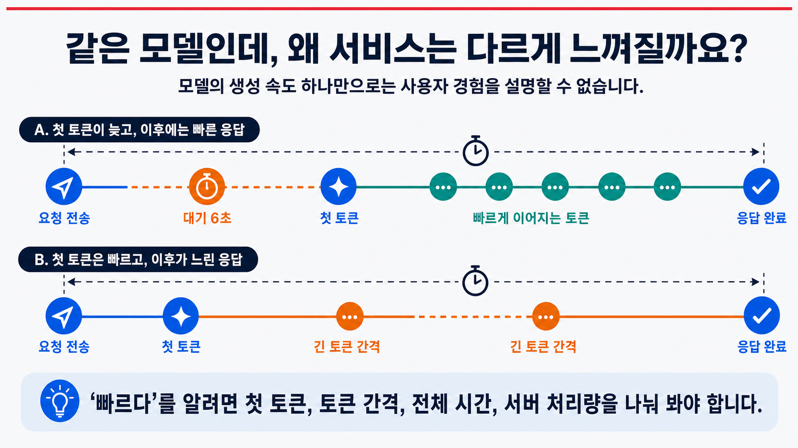
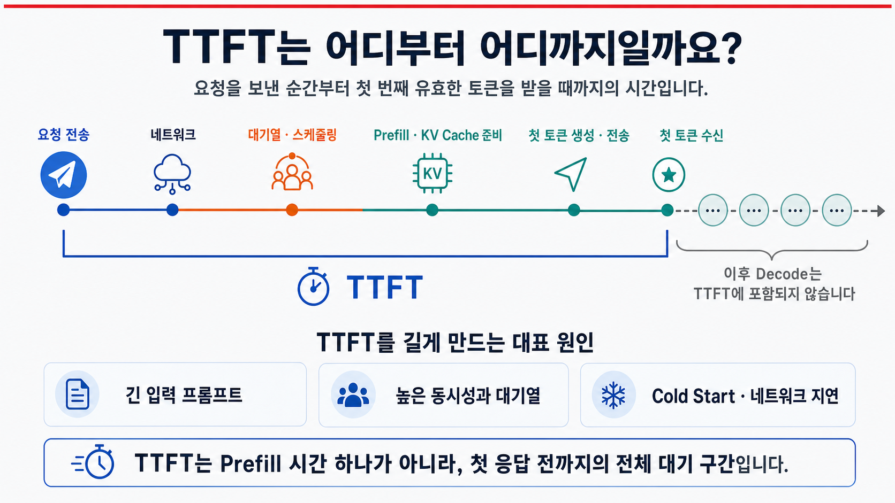
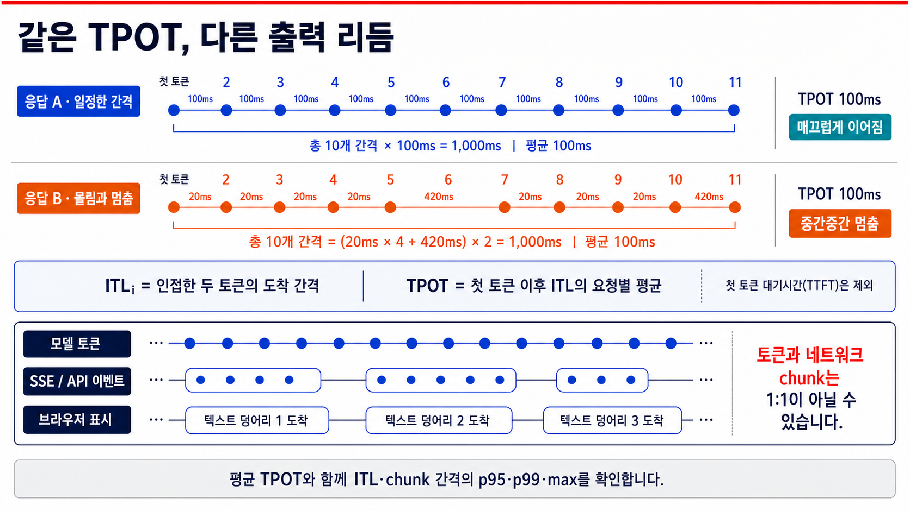
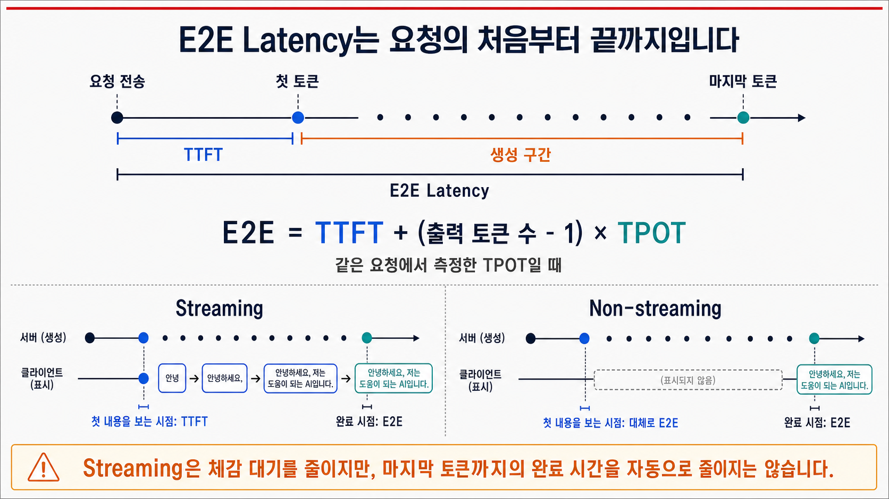
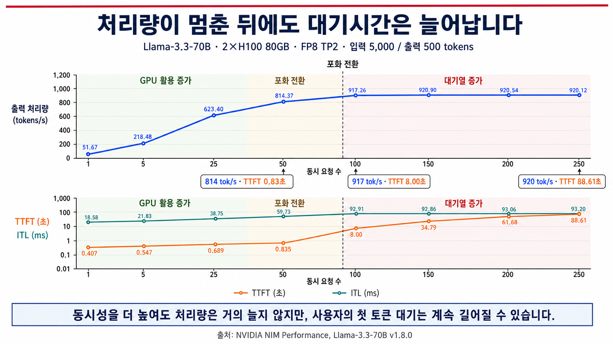
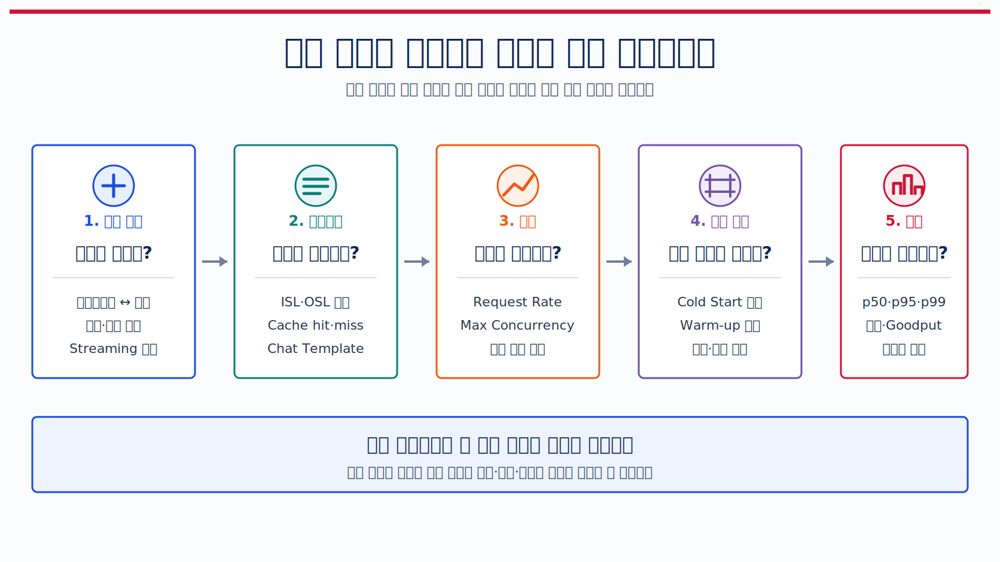
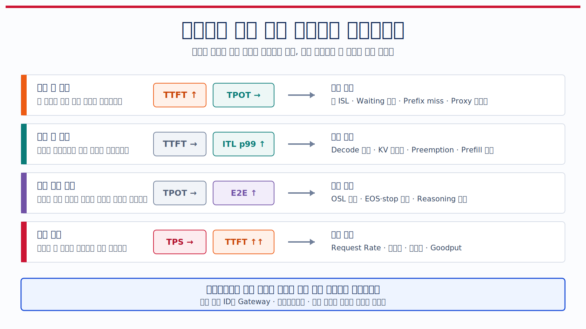
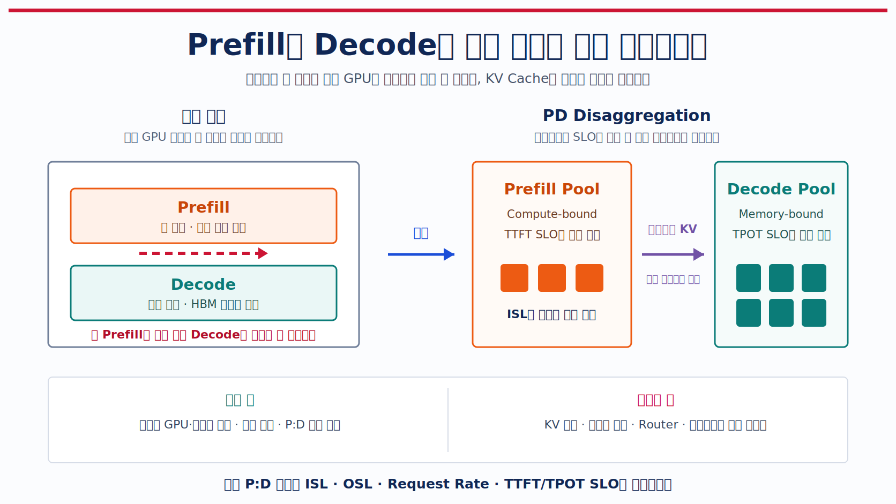
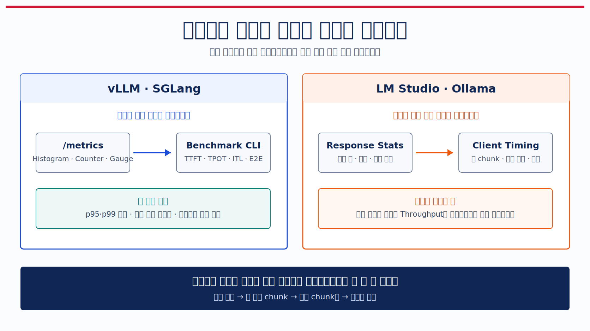

## 1. 빠른 모델과 쾌적한 서비스는 왜 다를까요?

[이전 글](/llm-kv-cache)에서는 LLM이 답변을 생성할 때 앞선 토큰의 Key와 Value를 KV Cache에 보관해 반복 계산을 줄이는 과정을 살펴봤습니다. 계산을 줄이면 토큰 생성은 빨라집니다. 그런데 빠른 모델을 서빙한다고 해서 사용자가 반드시 빠른 서비스를 경험하는 것은 아닙니다.

사내 문서를 찾아 답하는 AI 챗봇을 운영한다고 해보겠습니다. 개발 환경에서 한 명이 테스트했을 때는 답변이 빠르게 생성됐습니다. 운영팀은 모델의 토큰 생성 속도도 충분하다고 판단했습니다. 하지만 점심시간에 사용자가 몰리자 다음과 같은 상반된 반응이 들어왔습니다.

```text
사용자 A: "한참 기다려야 답변이 시작돼요. 시작하고 나면 빠르긴 합니다."
사용자 B: "답변은 바로 나오는데, 한두 단어씩 끊겨서 읽기 답답해요."
```

두 사용자 모두 서비스를 느리다고 말하지만 기다리는 구간은 서로 다릅니다.

설명을 위해 두 요청이 모두 10초 만에 끝났다고 가정해 보겠습니다. 아래 숫자는 특정 엔진의 측정 결과가 아니라 차이를 보여주기 위한 가상의 예시입니다.

| 요청 | 첫 토큰 도착 | 이후 출력 | 응답 완료 | 사용자가 느끼는 문제 |
| --- | ---: | --- | ---: | --- |
| A | 6초 | 남은 토큰이 4초 동안 빠르게 출력 | 10초 | 답변을 시작하기 전까지 오래 기다립니다. |
| B | 0.8초 | 토큰 사이가 길게 끊기며 9.2초 동안 출력 | 10초 | 답변은 바로 시작하지만 읽는 흐름이 자꾸 끊깁니다. |

완료 시간만 보면 두 요청은 똑같이 10초입니다. A는 빈 화면을 오래 바라봅니다. B는 답변이 시작된 뒤에도 문장이 더디게 이어집니다. 같은 `Latency 10초`라는 숫자만으로는 이 차이를 설명할 수 없습니다.



<!--truncate-->

여기에 사용자가 더 몰리면 또 다른 문제가 생깁니다. 실행 중인 요청의 토큰 생성 속도는 그대로여도 GPU에 들어가지 못한 요청이 생기면 대기열이 길어집니다. 사용자 한 명의 응답만 보면 괜찮아 보여도 서비스 전체의 시간당 요청 처리 능력이 충분한지는 별개의 문제입니다.

이제 `빠르다`라는 말을 세 관점에서 살펴보겠습니다.

| 관점 | 주로 묻는 질문 |
| --- | --- |
| 모델과 엔진의 생성 성능 | 토큰 하나를 얼마나 빠르게 계산하나요? |
| 사용자가 경험하는 서비스 성능 | 언제 답변이 시작되고, 얼마나 매끄럽게 이어지며, 언제 끝나나요? |
| 서버 전체의 처리 능력 | 사용자가 몰렸을 때도 단위 시간에 충분한 요청과 토큰을 처리하나요? |

모델의 단일 요청 벤치마크만으로는 운영 중인 서비스의 상태를 판단하기 어렵습니다. 실제 서비스에서는 요청마다 입력 길이와 출력 길이가 다르며 동시 사용자 수와 대기열도 계속 변합니다. Prefix Cache 적중 여부나 배칭 상태도 같은 모델의 실행 조건을 바꿉니다.

벤치마크와 모니터링의 역할도 조금 다릅니다. 벤치마크는 통제된 조건에서 시스템이 어느 정도 성능을 낼 수 있는지 비교하는 데 유용합니다. 모니터링은 실제 요청이 들어오는 동안 사용자가 어느 구간에서 기다리는지, 부하가 커질 때 어떤 값부터 나빠지는지 찾는 데 필요합니다.

LLM 서빙의 속도는 다음 네 가지 지표로 살펴봅니다.

1. **TTFT(Time To First Token):** 요청을 보낸 뒤 첫 토큰을 받을 때까지 얼마나 기다렸나요?
2. **TPOT(Time Per Output Token)와 ITL(Inter-Token Latency):** 첫 토큰 이후 답변이 얼마나 빠르고 매끄럽게 이어졌나요?
3. **E2E Latency(End-to-End Latency):** 요청을 보낸 시점부터 전체 응답이 끝날 때까지 얼마나 걸렸나요?
4. **Throughput:** 서버가 단위 시간에 요청이나 토큰을 얼마나 많이 처리했나요?

이 지표들은 서로 대신하지 못합니다. TTFT가 좋아도 TPOT가 나쁠 수 있으며 개별 요청이 빨라도 전체 Throughput이 낮아 사용자가 몰릴 때 대기열이 길어질 수 있습니다. 반대로 Throughput을 높이려고 많은 요청을 함께 처리하면 개별 사용자의 TTFT나 TPOT가 악화될 수도 있습니다.

그래서 LLM 서빙 모니터링의 목적은 단순히 `빠르다` 또는 `느리다`를 판정하는 것이 아닙니다. 사용자가 어느 구간에서 기다리는지, 그 원인이 개별 요청의 처리 과정에 있는지 서버 전체의 포화에 있는지 구분하는 일이 더 중요합니다.

## 2. TTFT: 첫 토큰은 얼마나 빨리 나오나요?

앞의 AI 챗봇 사례에서 사용자 A는 요청을 보낸 뒤 6초 동안 아무 답변도 받지 못했습니다. 이후 토큰은 빠르게 출력됐지만 사용자가 처음 마주한 것은 6초 동안 이어진 빈 화면이었습니다.

**TTFT**는 요청을 보낸 시점부터 첫 번째 유효한 출력 토큰을 받을 때까지 걸린 시간입니다. 수식으로는 간단합니다.

$$
\mathrm{TTFT}
= t_{\text{첫 유효 토큰 수신}}
- t_{\text{요청 전송}}
$$

[NVIDIA의 LLM 추론 메트릭 문서](https://docs.nvidia.com/nim/benchmarking/llm/latest/metrics.html)도 TTFT를 질의를 제출한 시점부터 비어 있지 않은 첫 토큰을 받을 때까지의 시간으로 정의합니다. 연결을 열었다는 신호나 내용이 없는 빈 스트림 조각은 첫 토큰으로 세지 않습니다.

TTFT는 특정 논문 한 편에서 처음 제안한 알고리즘 이름이라기보다, 스트리밍 LLM의 응답성을 측정하면서 업계 전반에 자리 잡은 지표입니다. [MLCommons의 MLPerf Client](https://mlcommons.org/benchmarks/client/)도 첫 출력까지의 기다림이 이후 토큰 간격과 성격이 다르기 때문에, 널리 쓰이는 관행에 따라 TTFT를 별도 지표로 보고한다고 설명합니다.

### 첫 토큰이 오기 전에는 어떤 일이 일어날까요?

TTFT를 `모델이 첫 토큰을 계산한 시간`이나 `Prefill 시간` 하나로 보기 쉽습니다. 실제 사용자가 측정하는 TTFT에는 첫 토큰을 받기 전까지 거치는 여러 구간이 함께 들어갑니다.



일반적인 OpenAI 호환 스트리밍 API 요청은 대체로 다음 순서로 흐릅니다.

1. **요청 전송과 네트워크:** 클라이언트가 프롬프트를 보내면 요청이 API Gateway나 Load Balancer를 거쳐 서빙 엔진에 도착합니다.
2. **대기열과 스케줄링:** 앞서 실행 중인 요청이 많다면 새 요청은 GPU 작업에 들어갈 차례를 기다립니다. 엔진은 배칭 조건과 사용 가능한 KV Cache 공간도 함께 확인합니다.
3. **입력 전처리:** Chat Template 적용과 토큰화 등을 거쳐 문자열을 모델 입력 토큰으로 바꿉니다. 엔진 구성에 따라 이 작업의 위치와 비용은 달라집니다.
4. **Prefill:** 모델이 입력 토큰을 처리해 Attention 계산에 다시 사용할 K/V를 KV Cache에 저장하고 첫 출력을 준비합니다.
5. **첫 토큰 생성과 전송:** 첫 토큰을 선택하고 문자열로 변환한 뒤 스트림으로 보냅니다. 클라이언트가 비어 있지 않은 첫 결과를 받으면 TTFT 측정이 끝납니다.

첫 토큰이 도착한 뒤 이어지는 Decode는 TTFT에 포함되지 않습니다. 다음 절에서는 이 구간의 속도와 끊김을 TPOT와 ITL로 살펴봅니다.

:::note 클라이언트 TTFT와 서버 TTFT는 같지 않을 수 있습니다

클라이언트에서 잰 TTFT에는 요청과 응답의 네트워크 지연뿐 아니라 Gateway나 Proxy의 대기, 스트리밍 버퍼링까지 들어갈 수 있습니다. 서빙 엔진 내부 지표는 엔진이 요청을 받은 시점부터 재기도 하고 외부 네트워크 구간을 제외하기도 합니다.

두 도구에 모두 `TTFT`라는 이름이 있더라도 먼저 확인할 것은 측정 시작점과 종료점입니다. 서버 TTFT는 정상인데 클라이언트 TTFT만 길다면 모델보다 앞단 네트워크, Gateway, 스트리밍 버퍼를 의심할 수 있습니다.

:::

스트리밍도 중요합니다. 서버가 토큰을 하나씩 생성하더라도 API가 전체 답변을 모아서 한 번에 반환하면 클라이언트는 첫 토큰이 언제 만들어졌는지 관찰할 수 없습니다. 이때 클라이언트가 처음 응답을 받는 시간은 사실상 E2E Latency와 같아집니다. TTFT를 사용자 관점에서 측정하려면 비어 있지 않은 응답 조각을 바로 전달하는 스트리밍 요청이 필요합니다.

### TTFT는 왜 길어질까요?

TTFT를 늘리는 원인은 대체로 세 가지입니다.

| 원인 | 무슨 일이 일어나나요? | 함께 확인할 조건 |
| --- | --- | --- |
| 긴 입력 프롬프트 | Prefill에서 처리할 입력 토큰이 많아집니다. 첫 KV Cache를 채우고 첫 출력을 준비하는 시간이 길어집니다. | 입력 토큰 수, 이미지 수·해상도, Prefix Cache 적중 여부 |
| 높은 동시성과 대기열 | GPU가 이미 다른 요청을 처리하고 있어 Prefill을 시작하기 전에 기다립니다. | waiting 요청 수, 동시 요청 수, 요청 도착률, KV Cache 여유 |
| Cold Start와 서비스 앞단 | 모델 로딩, 런타임 초기화, 첫 커널 실행, 네트워크와 Proxy 버퍼링이 첫 응답을 늦춥니다. | 첫 요청과 이후 요청의 차이, 서버 TTFT와 클라이언트 TTFT 차이 |

긴 입력은 일반적으로 Prefill 계산량을 늘립니다. [NVIDIA의 공식 설명](https://docs.nvidia.com/nim/benchmarking/llm/latest/metrics.html)도 모델이 생성 전에 전체 입력을 처리해 KV Cache를 만들기 때문에 긴 프롬프트가 TTFT를 키운다고 설명합니다. 다만 같은 prefix의 K/V가 남아 있고 Prefix Caching이 실제로 적중했다면, 공통 앞부분의 Prefill을 건너뛰어 TTFT를 줄일 수 있습니다.

입력이 짧아도 요청이 몰리면 TTFT는 길어질 수 있습니다. 이때 모델의 Prefill 계산이 느려진 것이 아니라 Prefill을 시작하기 전 대기 시간이 늘어난 것일 수 있습니다. TTFT만 보고 바로 `모델이 느리다`고 판단하면 원인을 잘못 짚기 쉽습니다.

Cold Start도 따로 살펴봐야 합니다. 서버를 시작한 직후 첫 요청만 느리고 다음 요청부터 정상이라면 모델 가중치 로딩, CUDA context와 커널 준비, 그래프 캡처 같은 초기화 비용이 섞였을 수 있습니다. 반대로 모든 요청에서 클라이언트 TTFT만 일정하게 길다면 네트워크 경로나 Proxy의 스트리밍 설정을 확인해야 합니다.

:::note Reasoning 모델에서는 TTFT와 TTFO가 달라질 수 있습니다

Reasoning 토큰을 별도 필드로 스트리밍하는 모델에서는 `첫 토큰`이 무엇인지 도구마다 다르게 해석할 수 있습니다. 최신 [NVIDIA AIPerf 메트릭 정의](https://docs.nvidia.com/aiperf/dev/reference/ai-perf-metrics-reference)는 reasoning 토큰을 포함해 어떤 종류든 첫 토큰이 도착한 시간을 TTFT로 보고 사용자가 읽을 최종 답변의 첫 토큰은 **TTFO(Time To First Output Token)**로 구분합니다.

Reasoning 토큰을 해석하지 않는 도구의 TTFT는 사실상 TTFO에 가까울 수 있습니다. Reasoning 모델의 결과를 비교할 때는 도구 이름만 보지 말고 첫 reasoning 토큰과 첫 최종 출력 중 어느 시점을 측정했는지 확인해야 합니다.

:::

### 평균 TTFT 하나만 보면 충분할까요?

TTFT에는 모든 요청마다 하나의 값이 생깁니다. 운영에서는 이 값을 전부 더해 평균만 보는 것보다 p50, p95, p99 같은 백분위수를 함께 보는 편이 좋습니다.

:::note 처음 만나는 용어: p50과 p95

TTFT를 짧은 순서대로 세우면 **p50**은 가운데 요청의 값입니다. **p95**는 전체 요청의 95%가 그 시간 안에 첫 토큰을 받았다는 뜻입니다. 평균이 낮아도 일부 사용자가 매우 오래 기다리면 p95와 p99가 높아질 수 있습니다.

:::

입력 길이가 100토큰인 질문과 20,000토큰인 문서 요약을 한 평균에 섞으면 해석하기 어렵습니다. 다음 조건을 나눠서 보는 편이 좋습니다.

- 입력 토큰 길이 구간
- 동시 요청 수나 요청 도착률
- Prefix Cache 적중 여부
- 서버 시작 직후와 충분히 warm-up된 상태
- 텍스트 모델과 이미지·영상 입력이 있는 멀티모달 모델

`좋은 TTFT는 몇 초인가요?`라는 질문에도 모든 서비스에 통하는 한 숫자는 없습니다. 짧은 대화형 챗봇과 긴 보고서 분석 서비스는 입력 길이와 사용자의 기대가 다릅니다. 동일한 요청 분포와 측정 위치를 고정한 뒤, 서비스가 허용할 p95 목표를 정하고 부하가 커질 때 어느 구간부터 무너지는지 보는 것이 더 현실적입니다.

TTFT가 짧으면 사용자는 서비스가 자신의 요청에 빠르게 반응한다고 느낍니다. 첫 토큰이 빨리 도착했다고 해서 나머지 답변까지 매끄럽다는 뜻은 아닙니다.

## 3. TPOT와 ITL: 답변은 얼마나 빠르고 매끄럽게 이어지나요?

앞의 사용자 B는 첫 토큰을 0.8초 만에 받았습니다. TTFT만 보면 서비스가 빠르게 반응한 셈입니다. 그런데 답변이 한두 단어씩 나오다가 멈추기를 반복해 문장을 따라 읽기 불편했습니다.

첫 토큰이 도착한 뒤에는 두 가지 질문이 남습니다.

- 답변을 이루는 토큰들은 평균적으로 얼마나 빠르게 생성되나요?
- 그 토큰들이 일정한 간격으로 도착하나요, 아니면 몰려 나오다가 멈추나요?

이 두 질문을 설명하는 지표가 **TPOT**와 **ITL**입니다.

출력 토큰이 $N$개이고 각 토큰이 클라이언트에 도착한 시각을 $t_1, t_2, \ldots, t_N$이라고 하겠습니다. 인접한 두 출력 토큰의 도착 간격은 다음과 같습니다.

$$
\mathrm{ITL}_i = t_i - t_{i-1}
\qquad (i=2, \ldots, N)
$$

첫 토큰 이후의 간격을 모두 평균 낸 값이 요청 하나의 TPOT입니다.

$$
\mathrm{TPOT}
= \frac{1}{N-1}\sum_{i=2}^{N}\mathrm{ITL}_i
= \frac{t_N-t_1}{N-1}
$$

첫 토큰을 기다린 시간은 TTFT에서 이미 측정했으므로 TPOT 계산에는 넣지 않습니다. 출력 토큰이 하나뿐이라면 비교할 다음 토큰이 없기 때문에 TPOT도 정의되지 않습니다.

[NVIDIA의 LLM 추론 메트릭 문서](https://docs.nvidia.com/nim/benchmarking/llm/latest/metrics.html)는 첫 토큰 이후 연속된 토큰 사이의 평균 시간을 ITL 또는 TPOT라고 설명합니다. [SGLang의 공식 벤치마크 문서](https://docs.sglang.io/developer_guide/bench_serving)는 요청별 TPOT와 개별 ITL 배열을 나누어 집계합니다. 이름을 사용하는 방식은 도구마다 조금씩 다릅니다. 이 글에서는 이해를 돕기 위해 **ITL**은 각각의 토큰 간격, **TPOT**는 한 요청에서 그 간격을 평균 낸 값으로 구분하겠습니다.

### 평균이 같아도 출력 리듬은 다를 수 있습니다

두 응답이 첫 토큰 이후 10개의 간격을 거쳐 같은 시간에 끝났다고 해보겠습니다.

- 응답 A는 토큰이 100ms마다 일정하게 도착합니다.
- 응답 B는 20ms 간격으로 네 토큰이 빠르게 도착한 뒤 420ms 동안 멈추는 패턴을 두 번 반복합니다.

두 응답 모두 10개 간격의 합은 1,000ms이고 TPOT는 100ms입니다. 평균값만 보면 같은 성능처럼 보입니다. 응답 B를 읽는 사용자는 420ms짜리 멈춤을 두 번 경험합니다.



TPOT는 답변의 **평균 생성 속도**를 간단히 비교하기 좋습니다. 중간중간 생기는 멈춤과 흔들림을 찾을 때는 개별 ITL의 p95, p99, 최댓값과 시간 순서를 함께 봐야 합니다. 평균 TPOT가 정상인데 `답변이 끊긴다`는 신고가 들어왔다면 평균값에 가려진 일부 긴 간격이 있는지 확인해야 합니다.

:::note 토큰과 스트리밍 응답 조각은 같은 단위가 아닙니다

모델의 토큰, SSE 이벤트, API의 `delta`, HTTP 전송 조각은 1:1로 대응하지 않을 수 있습니다. 서버가 토큰을 50ms마다 생성해도 Proxy가 네 토큰을 묶어 200ms마다 전달하면 엔진 안에서는 일정하게 생성된 답변이 브라우저에서는 덩어리로 보입니다.

[NVIDIA AIPerf](https://docs.nvidia.com/aiperf/dev/reference/ai-perf-metrics-reference)는 토큰 기준 평균인 ITL과 실제 응답 조각 사이의 간격인 <strong>ICL(Inter-Chunk Latency)</strong>을 따로 둡니다. 클라이언트가 받은 이벤트 간격을 곧바로 모델의 토큰 생성 간격이라고 단정하지 말고 서버 지표와 클라이언트 응답 조각 간격을 나누어 봐야 합니다.

:::

### TPOT와 ITL은 왜 나빠질까요?

TPOT와 ITL은 주로 첫 토큰 이후 Decode 구간의 상태를 보여줍니다. 값이 나빠졌다고 해서 원인이 하나로 정해지지는 않습니다.

| 관찰한 현상 | 가능한 원인 | 함께 확인할 값 |
| --- | --- | --- |
| 부하가 커질수록 TPOT가 서서히 증가 | 활성 Decode 요청과 배치가 커져 GPU 메모리 대역폭과 연산 자원을 더 많이 나눠 씁니다. | 동시 요청 수, 실행 중인 요청 수, 배치 크기 |
| 일부 ITL만 갑자기 크게 증가 | 긴 Prefill이 Decode와 자원을 다투거나 스케줄링이 중단됐을 수 있습니다. | 입력 길이, Prefill 실행 시점, ITL p95·p99·max |
| 긴 답변의 뒤쪽으로 갈수록 느려짐 | 표준 Full Attention 모델에서는 지금까지 쌓인 문맥과 KV Cache가 커져 Attention과 메모리 접근 비용이 늘어날 수 있습니다. | 현재 시퀀스 길이, KV Cache 사용률 |
| 서버 지표는 일정한데 브라우저만 끊김 | Gateway, Proxy, 네트워크 또는 UI가 여러 토큰을 묶어 전달할 수 있습니다. | 서버 TPOT, 클라이언트 응답 조각 간격, Proxy 버퍼링 |
| 드물게 매우 긴 멈춤이 발생 | KV Cache 부족으로 요청이 선점 해제되거나 재계산됐을 수 있습니다. | preemption 수, waiting 요청 수, KV Cache 여유 |

긴 Prefill이 진행 중인 Decode를 방해해 토큰 간격이 튀는 문제는 [Sarathi-Serve 논문](https://www.usenix.org/conference/osdi24/presentation/agrawal)이 Chunked Prefill로 줄이려는 대표적인 병목입니다. vLLM도 [공식 최적화 문서](https://docs.vllm.ai/en/stable/configuration/optimization/)에서 KV Cache 공간이 부족할 때 preemption과 recomputation이 발생할 수 있다고 설명합니다.

`좋은 TPOT는 몇 ms인가요?`라는 질문에도 하나의 공통 기준을 적용하기는 어렵습니다. 모델, GPU, 언어와 tokenizer, 출력 길이, 동시성에 따라 값이 달라집니다. 동일한 조건에서 요청별 TPOT의 p50·p95를 비교하되 끊김을 찾을 때는 ITL 또는 응답 조각 간격의 상위 백분위수와 최댓값을 함께 보는 편이 안전합니다.

TPOT와 ITL로 답변이 시작된 뒤의 속도와 리듬을 확인했습니다. 이제 첫 토큰을 기다린 시간부터 마지막 토큰을 받을 때까지를 하나로 합쳐 보겠습니다.

## 4. E2E Latency: 답변이 끝날 때까지 얼마나 걸리나요?

1절의 사용자 A와 B는 기다리는 방식이 달랐지만 두 요청 모두 10초 만에 끝났습니다. **E2E Latency**는 요청을 보낸 시점부터 마지막 유효 출력 토큰을 받을 때까지 걸린 전체 시간입니다.

$$
\mathrm{E2E\ Latency}
= t_{\text{마지막 유효 토큰 수신}}
- t_{\text{요청 전송}}
$$

[NVIDIA의 공식 정의](https://docs.nvidia.com/nim/benchmarking/llm/latest/metrics.html)에 따르면 이 구간에는 대기열, 배칭과 네트워크 지연도 포함됩니다. 내용이 없는 마지막 응답이나 `[DONE]` 신호는 마지막 토큰으로 세지 않습니다.

E2E Latency는 앞서 살펴본 지표들을 한 요청의 타임라인 위에서 합친 결과입니다.

$$
\mathrm{E2E}
= \mathrm{TTFT}
+ \sum_{i=2}^{N}\mathrm{ITL}_i
$$

같은 요청에서 계산한 TPOT를 사용하면 다음과 같이 씁니다.

$$
\mathrm{E2E}
= \mathrm{TTFT}
+ (N-1) \times \mathrm{TPOT}
$$

여기서 $N$은 실제로 생성된 출력 토큰 수입니다. 첫 토큰은 TTFT 구간 끝에 이미 도착했으므로 TPOT를 곱하는 간격은 $N$개가 아니라 $N-1$개입니다.



:::warning p95 TTFT와 p95 TPOT를 더해 p95 E2E를 만들 수는 없습니다

요청 하나의 TTFT, TPOT와 출력 토큰 수를 위 공식에 넣으면 그 요청의 E2E를 정확히 계산할 수 있습니다. 하지만 여러 요청을 모아 만든 p95끼리는 사정이 다릅니다. TTFT가 느린 요청과 TPOT가 느린 요청이 서로 다를 수 있기 때문입니다.

출력 길이가 모두 101토큰인 요청 100개를 가장 단순한 방식으로 나열해 보겠습니다.

| 요청 유형 | 요청 수 | TTFT | TPOT | 요청별 E2E |
| --- | ---: | ---: | ---: | ---: |
| 일반 요청 | 90개 | 1초 | 50ms | 6초 |
| 시작만 느린 요청 | 5개 | 6초 | 50ms | 11초 |
| 생성만 느린 요청 | 5개 | 1초 | 100ms | 11초 |

출력 토큰이 101개라면 첫 토큰 뒤에 남는 토큰 간격은 `101 - 1 = 100개`입니다. 작은 값부터 95번째 값을 고르는 방식으로 p95를 구하면 `p95 TTFT`는 1초, `p95 TPOT`는 50ms입니다. 이 둘을 공식에 넣으면 다음과 같이 6초가 나옵니다.

$$
1 + (101 - 1) \times 0.05 = 6\text{초}
$$

그러나 실제 요청별 E2E를 먼저 계산해 줄 세우면 뒤의 10개 요청이 모두 11초이므로 `p95 E2E`는 11초입니다.

부품별 p95는 각각 다른 요청에서 뽑힌 경계값입니다. 그래서 이를 한 요청의 TTFT와 TPOT처럼 조립하면 실제로 느렸던 요청의 조합이 사라질 수 있습니다. 데이터 분포에 따라 반대로 실제보다 크게 계산될 수도 있습니다.

운영 대시보드에서는 각 요청의 E2E를 먼저 구한 뒤 그 E2E 값들로 p95를 계산해야 합니다. 백분위수 계산 방식은 도구마다 보간법이 조금씩 다를 수 있지만 구성요소의 백분위수를 더해서 전체 지표의 백분위수를 만들 수 없다는 원칙은 같습니다.

:::

### 출력 길이가 달라지면 E2E도 크게 달라집니다

TTFT와 TPOT가 같아도 답변 길이가 다르면 E2E Latency는 달라집니다. TTFT가 0.5초이고 TPOT가 40ms인 두 요청을 예로 들어보겠습니다.

| 실제 출력 길이 | 계산 | E2E Latency |
| ---: | --- | ---: |
| 50 tokens | $0.5 + (50-1) \times 0.04$ | 2.46초 |
| 500 tokens | $0.5 + (500-1) \times 0.04$ | 20.46초 |

모델과 엔진의 생성 속도는 같지만 두 번째 요청은 열 배 긴 답변을 만들어 완료 시간도 훨씬 길어졌습니다. 이 때문에 E2E Latency를 비교할 때는 실제 출력 길이인 **OSL(Output Sequence Length)**도 함께 기록해야 합니다.

`max_tokens`는 실제 출력 길이가 아니라 상한입니다. 모델은 EOS token, stop 문자열이나 stop token, 최대 토큰 수 중 먼저 만난 조건에서 생성을 끝냅니다. 예를 들어 `ignore_eos`로 EOS를 무시하고 상한까지 생성한 벤치마크와, 자연스럽게 EOS에서 멈춘 실제 트래픽은 E2E를 그대로 비교하기 어렵습니다. 각 조건의 차이는 [vLLM SamplingParams 공식 문서](https://docs.vllm.ai/en/latest/api/vllm/sampling_params/)에서 확인할 수 있습니다.

### Streaming은 E2E를 없애지 않습니다

Streaming 응답에서는 사용자가 TTFT 시점부터 답변을 읽기 시작합니다. Non-streaming 응답은 서버가 내부에서 토큰을 생성하고 있어도 전체 결과를 모은 뒤 반환하므로, 사용자가 처음 내용을 보는 시점이 대체로 E2E와 같아집니다.

Streaming은 체감 대기시간을 줄이는 전달 방식입니다. 마지막 토큰까지 생성해야 하는 일 자체를 없애지는 않으므로 E2E Latency가 자동으로 짧아지는 것은 아닙니다. 오히려 측정 위치와 구현에 따라 반복적인 detokenization, 직렬화, SSE 전송 비용이 조금 더해질 수도 있습니다.

:::note LLM 요청의 E2E와 애플리케이션 E2E를 구분합니다

이 글의 E2E Latency는 모델 서빙 API 요청을 보낸 뒤 전체 응답을 받기까지의 시간입니다. 실제 RAG나 Agent 서비스에서는 검색, reranking, 도구 호출, 안전성 검사와 화면 렌더링이 앞뒤에 붙습니다.

서빙 엔진의 E2E가 정상인데 애플리케이션 응답이 느리다면 모델 바깥 단계를 포함한 별도의 전체 추적이 필요합니다. 두 지표를 모두 `E2E`라고 부를 수 있으므로 측정 시작점과 종료점을 이름이나 대시보드 설명에 적어두는 편이 좋습니다.

:::

E2E가 길어졌다면 먼저 TTFT, TPOT, 실제 출력 토큰 수 가운데 무엇이 변했는지 나누어 봅니다. 다만 이것은 요청 하나의 완료 시간을 보는 방법입니다. 사용자가 수십 명, 수백 명으로 늘었을 때 서버가 전체 요청을 감당할 수 있는지는 Throughput으로 확인해야 합니다.

## 5. Throughput: 서버 전체는 얼마나 많이 처리하나요?

사용자 한 명이 테스트했을 때 모델이 초당 50토큰을 생성했다고 해보겠습니다. 이 값만으로는 점심시간에 사용자 100명의 요청을 처리할 수 있는지 알 수 없습니다. 한 요청의 생성 속도와 서버 전체가 단위 시간에 끝낸 작업량은 서로 다른 문제이기 때문입니다.

**Throughput**은 일정 시간 동안 시스템 전체가 성공적으로 처리한 요청이나 토큰의 양입니다. LLM 서빙에서는 무엇을 분자로 세느냐에 따라 여러 단위를 사용합니다.

벤치마크 구간을 $T$, 성공한 요청 수를 $R$, 각 요청의 입력 토큰 수를 $I_i$, 출력 토큰 수를 $O_i$라고 하겠습니다.

### 먼저, 무엇을 초당 몇 개 처리했는지 적어야 합니다

| 지표 | 계산 | 무엇을 보여주나요? |
| --- | --- | --- |
| Request Throughput | $R / T$ | 초당 완료한 성공 요청 수입니다. 보통 `req/s`로 표시합니다. |
| Input Token Throughput | $\sum I_i / T$ | 초당 처리한 프롬프트 토큰 수입니다. |
| Output Token Throughput | $\sum O_i / T$ | 모든 동시 요청에서 초당 생성한 출력 토큰 수입니다. |
| Total Token Throughput | $(\sum I_i + \sum O_i) / T$ | 입력과 출력을 합친 토큰 처리량입니다. |

[SGLang의 공식 벤치마크](https://docs.sglang.io/developer_guide/bench_serving)는 위 네 값을 각각 출력합니다. [NVIDIA AIPerf](https://docs.nvidia.com/aiperf/dev/reference/ai-perf-metrics-reference)도 Output Token Throughput과 입력·출력을 합친 Total Token Throughput을 구분합니다.

:::warning `tokens/s`만 적으면 결과를 비교할 수 없습니다

어떤 도구에서는 `Total TPS`가 전체 <strong>출력 토큰 처리량</strong>을 뜻합니다. 다른 도구에서는 `Total Token Throughput`이 <strong>입력과 출력의 합</strong>을 뜻합니다. 결과에는 `output tok/s`, `input tok/s`, `total tok/s`처럼 분자를 명시해야 합니다.

입력 1토큰과 출력 1토큰의 비용도 같지 않습니다. Prefill은 여러 입력 토큰을 병렬로 처리하고 Decode는 요청마다 다음 토큰을 순차적으로 생성합니다. 그래서 Total Token Throughput은 전체 작업량을 요약하는 숫자이지, 서로 다른 입력·출력 비율의 시스템을 항상 공정하게 비교하는 단일 점수는 아닙니다.

:::

### 처리량이 높아져도 사용자 답변은 느려질 수 있습니다

TPOT의 역수를 계산하면 첫 토큰 이후 한 사용자가 체감하는 토큰 생성 속도를 얻습니다.

$$
\text{사용자별 생성 속도} \approx \frac{1}{\mathrm{TPOT}}
$$

Output Token Throughput은 실행 중인 모든 요청에서 나온 출력 토큰을 합칩니다. 요청 하나를 실행할 때 50 tok/s가 나왔다고 해서 요청 20개를 동시에 실행할 때도 사용자마다 50 tok/s를 받는 것은 아닙니다. GPU가 여러 요청을 한꺼번에 처리하면 서버 전체 출력량은 늘 수 있지만 각 요청은 자원을 나눠 쓰기 때문에 TPOT는 길어질 수 있습니다.

[NVIDIA의 공식 설명](https://docs.nvidia.com/nim/benchmarking/llm/latest/metrics.html)도 동시 요청이 늘면 시스템 전체 TPS는 포화점까지 증가하지만 개별 사용자의 TPS는 Latency 증가와 함께 낮아질 수 있다고 구분합니다. 서버 전체 Throughput이 높다는 말과 사용자 한 명의 답변이 빠르다는 말은 같은 뜻이 아닙니다.

### 요청을 더 넣어도 처리량이 늘지 않는 순간이 옵니다

요청이 적을 때는 GPU가 충분히 활용되지 않을 수 있습니다. 동시 요청을 늘리면 배치가 채워지고 한 번의 모델 실행에서 여러 요청을 함께 처리해 시스템 Throughput이 올라갑니다. GPU 연산, 메모리 대역폭이나 KV Cache가 한계에 가까워진 뒤에는 추가 요청이 처리량보다 대기열을 더 크게 만듭니다.



위 그림은 [NVIDIA가 공개한 Llama-3.3-70B NIM v1.8.0 측정값](https://docs.nvidia.com/nim/benchmarking/llm/latest/performance.html)을 그대로 시각화했습니다. 2개의 H100 80GB에서 FP8, Tensor Parallel 2, 입력 5,000토큰과 출력 500토큰 조건으로 측정했습니다.

- 동시 요청 수를 50에서 100으로 높이면 출력 처리량은 약 814 tok/s에서 917 tok/s로 늘어납니다. 같은 구간에서 TTFT는 약 0.83초에서 8.00초로 크게 증가합니다.
- 동시 요청 수가 150에서 250으로 늘어도 처리량은 약 921 tok/s 부근에 머뭅니다. 반면 TTFT는 약 34.79초에서 88.61초까지 계속 증가합니다.
- ITL은 동시 요청 수 100 부근에서 약 93ms에 도달한 뒤 비슷하게 유지됩니다. 엔진이 추가 요청을 실행 중인 배치에 계속 넣기보다 대기열에 남겨둔다면 실행 중인 요청의 ITL보다 기다리는 요청의 TTFT가 더 크게 악화될 수 있습니다.

이 수치는 해당 모델과 하드웨어, 입력·출력 길이에서 나온 결과입니다. 모든 시스템이 동시 요청 수 100에서 포화되는 것은 아닙니다. 운영자는 특정 숫자 100이 아니라 처리량 곡선이 평평해지고 TTFT와 TPOT가 계속 나빠지기 시작하는 지점을 찾아야 합니다.

:::note 보낸 요청 수와 끝낸 요청 수는 다릅니다

초당 100개 요청을 보냈다면 Request Rate는 100 req/s입니다. 서버가 실제로 초당 100개를 끝냈을 때 Request Throughput도 100 req/s가 됩니다. 들어오는 속도가 처리 능력을 넘으면 보낸 요청 수는 계속 늘어도 완료 처리량은 더 커지지 않고 대기열만 길어집니다.

고정된 동시 요청 수로 재는 closed-loop 테스트와 일정한 요청 도착률을 주는 open-loop 테스트는 대기열이 쌓이는 방식도 다릅니다.

:::

### 운영 용량은 최대 처리량보다 앞에서 정합니다

일부 벤치마크의 Throughput은 성공한 요청만 분자에 넣습니다. 서버가 과부하로 요청을 거절했거나 완료는 했지만 TTFT가 서비스 목표를 크게 넘긴 요청이 많아도 성공한 결과만 보면 숫자가 좋아 보일 수 있습니다. 그래서 시도한 요청 수·성공 수·오류율을 Throughput과 함께 기록해야 합니다.

서버가 낼 수 있는 최대 숫자만 보면 이 문제를 놓치기 쉽습니다. 그래서 **Goodput**을 함께 봅니다. Goodput은 성공한 요청 가운데 TTFT, TPOT 또는 E2E의 서비스 목표까지 지킨 요청만 세어 계산한 처리량입니다. 여기서 SLO(Service Level Objective)는 `p95 TTFT 2초 이하`처럼 서비스가 지키기로 정한 성능 목표입니다.

$$
\mathrm{Goodput}
= \frac{\text{모든 SLO를 만족한 요청 수}}{T}
$$

[NVIDIA AIPerf의 공식 정의](https://docs.nvidia.com/aiperf/dev/reference/ai-perf-metrics-reference)도 Goodput을 위와 같이 계산합니다. 함께 제공하는 `good request fraction`은 오류가 난 요청까지 전체 시도 수에 남겨둡니다. 서버가 과부하로 일부 요청을 떨어뜨리고 살아남은 요청만 빠르게 처리해도 전체 결과가 좋아 보이는 왜곡을 막기 위해서입니다.

운영 용량은 보통 처리량이 완전히 포화되는 지점보다 앞에서 정합니다. p95 TTFT와 TPOT 같은 사용자 목표를 지키며 꾸준히 처리할 수 있는 양이 실제 서비스가 감당할 수 있는 용량에 가깝습니다. 입력·출력 길이와 부하 방식이 같아야 이 값을 제대로 비교할 수 있습니다.

## 6. 성능 지표는 어떻게 측정해야 할까요?

측정 도구를 실행하면 TTFT, TPOT, E2E와 Throughput이 곧바로 출력됩니다. 그렇다고 서로 다른 두 결과를 바로 비교할 수 있는 것은 아닙니다. 한쪽은 128토큰짜리 질문에 64토큰을 답했고, 다른 쪽은 8,000토큰 문서를 읽고 1,000토큰을 생성했다면 숫자가 다른 이유부터 달라집니다.

벤치마크를 시작하기 전에 **측정 계약**을 적습니다. 무엇을 고정했고 어떤 변수만 바꿨으며 어디서 시간을 쟀는지 남기는 문서입니다.



### 먼저 측정 시작점과 끝점을 정합니다

같은 `TTFT`라는 이름도 클라이언트와 서버에서 범위가 다릅니다. 클라이언트 TTFT에는 요청 전송, Gateway, Load Balancer, Proxy 버퍼링과 응답 네트워크 시간이 들어갑니다. 서버 내부 TTFT는 보통 엔진이 요청을 받은 뒤의 대기열과 모델 실행 구간을 측정합니다.

사용자 경험을 확인하려면 클라이언트에서 스트리밍 응답을 재야 합니다. 엔진 병목을 확인하려면 서버 지표도 함께 봐야 합니다. 둘 중 하나를 고르는 문제가 아니라, **같은 요청의 바깥쪽 시간과 안쪽 시간을 나란히 놓는 것**에 가깝습니다.

:::note Non-streaming 응답에서는 TTFT를 비교하기 어렵습니다

서버가 토큰을 만들고 있어도 전체 답변을 모아 한 번에 보내면 클라이언트는 첫 토큰 생성 시점을 알 수 없습니다. 이때 클라이언트가 처음 응답을 본 시간은 E2E Latency에 가까워집니다. [SGLang의 공식 Bench Serving 문서](https://docs.sglang.io/developer_guide/bench_serving)도 스트리밍을 끄면 Chat Completions에서 TTFT와 전체 Latency가 같아진다고 설명합니다.

:::

### 입력과 출력 길이를 함께 고정합니다

LLM 서빙 성능은 입력 길이인 **ISL(Input Sequence Length)**과 출력 길이인 **OSL(Output Sequence Length)**에 크게 좌우됩니다. 입력이 길어지면 Prefill 부담이 커지고, 출력이 길어지면 Decode를 반복하는 시간과 KV Cache 점유 시간이 늘어납니다.

최소한 다음 조건을 결과와 함께 남겨야 합니다.

| 구분 | 기록할 내용 | 빠뜨리면 생기는 문제 |
| --- | --- | --- |
| 모델 | 정확한 모델 ID, revision, dtype과 양자화 | 같은 이름의 다른 체크포인트를 비교할 수 있습니다. |
| 엔진 | 엔진과 버전, 주요 서빙 옵션 | 스케줄러와 커널 차이가 모델 차이처럼 보일 수 있습니다. |
| 하드웨어 | GPU 종류와 수, TP·PP·EP 구성 | 병렬화와 통신 비용을 재현할 수 없습니다. |
| 입력 | ISL 분포, Chat Template, 이미지 수·해상도 | Prefill 조건이 달라집니다. |
| 출력 | OSL 분포, `max_tokens`, EOS·stop 처리 | E2E와 Throughput이 달라집니다. |
| 캐시 | Prefix Cache hit·miss를 분리했는지 | Prefill 재사용 효과가 모델 속도로 섞입니다. |
| 생성 설정 | temperature, top-p, speculative decoding 등 | 출력 길이와 Decode 경로가 달라질 수 있습니다. |

합성 입력은 길이를 정확하게 통제하기 좋고 실제 대화 데이터는 운영 요청의 분포를 반영하기 좋습니다. 어느 쪽이 더 우월하다기보다 목적이 다릅니다. 용량 상한을 비교할 때는 합성 입력이 편하고, 실제 서비스 계획에는 운영 로그를 익명화해 만든 길이 분포가 더 유용합니다.

[vLLM의 `vllm bench serve`](https://docs.vllm.ai/en/latest/api/vllm/benchmarks/serve/)와 [SGLang의 `bench_serving`](https://docs.sglang.io/developer_guide/bench_serving)은 입력·출력 길이, 요청 수, Request Rate를 지정할 수 있습니다. 어떤 도구를 쓰더라도 비교 대상에는 같은 tokenizer와 Chat Template을 적용해야 합니다.

### 동시 사용자 수와 요청 도착 속도를 구분합니다

**Concurrency**는 같은 시점에 처리 중인 요청 수이고, **Request Rate**는 새 요청이 들어오는 속도입니다. 동시 요청 수 32를 유지하는 테스트는 요청 하나가 끝나면 곧바로 다음 요청을 보내므로 서버가 느려질수록 요청 도착 속도도 함께 낮아집니다. 이를 보통 closed-loop 부하라고 부릅니다.

Request Rate를 20 req/s로 정한 테스트는 앞 요청의 완료를 기다리지 않고 정해진 속도로 새 요청을 보냅니다. 서버가 감당하지 못하면 대기열이 쌓입니다. 실제 API의 용량과 Tail Latency를 확인할 때 필요한 open-loop 부하입니다.

| 부하 방식 | 무엇을 고정하나요? | 잘 맞는 목적 |
| --- | --- | --- |
| Concurrency 중심 | 동시에 열린 요청 수 | 배치가 채워질 때의 최대 처리량 탐색 |
| Request Rate 중심 | 초당 들어오는 요청 수 | 운영 트래픽과 대기열 재현 |
| Request Rate + 최대 Concurrency | 도착 속도와 안전 상한 | 과부하를 통제한 용량 시험 |

[NVIDIA AIPerf의 Load Pattern 문서](https://docs.nvidia.com/aiperf/dev/tutorials/load-patterns-scheduling/request-rate-with-max-concurrency)는 Request Rate와 최대 Concurrency를 함께 설정하는 이유를 설명합니다. 실제 도착 간격을 흉내 내고 싶다면 Poisson 분포를, 같은 조건을 반복 비교하려면 일정한 간격과 고정 random seed를 사용할 수 있습니다.

### Cold Start와 본 측정을 섞지 않습니다

서버 시작 직후에는 모델 로딩, CUDA Context 생성, 커널 준비와 CUDA Graph Capture 같은 초기화 비용이 들어갈 수 있습니다. 이 첫 요청을 본 측정에 섞으면 p95와 p99가 초기화 상태에 따라 크게 흔들립니다.

Cold Start가 궁금하다면 별도 실험으로 측정하고 정상 운영 성능을 볼 때는 Warm-up 요청을 먼저 보냅니다. [MLPerf Client](https://mlcommons.org/benchmarks/client/)는 기본 구성에서 한 번의 Warm-up 뒤 세 번의 성능 측정을 수행합니다. [NVIDIA AIPerf](https://docs.nvidia.com/aiperf/tutorials/load-patterns-scheduling/warmup-phase-configuration)도 Warm-up 시간, 요청 수, Concurrency와 Request Rate를 본 측정과 따로 설정할 수 있습니다.

Warm-up을 했다는 사실만으로 충분하지는 않습니다. 몇 개의 요청을 어느 부하로 보냈는지, 본 측정은 몇 분 동안 진행했는지 적어야 다시 실행할 수 있습니다. 짧은 테스트는 우연한 Cache hit나 순간 부하의 영향을 크게 받으므로, 같은 조건을 여러 번 반복해 결과가 안정적인지도 확인합니다.

### 평균 대신 요청별 분포를 남깁니다

평균 TTFT가 1초라는 숫자만으로는 일부 요청이 10초를 기다렸는지 알 수 없습니다. 요청별 TTFT, ITL, E2E, ISL과 OSL을 원본으로 남긴 뒤 p50, p95와 p99를 계산하고 오류가 난 요청과 시간 제한을 넘긴 요청도 버리지 않습니다.

[NVIDIA AIPerf의 메트릭 문서](https://docs.nvidia.com/aiperf/reference/ai-perf-metrics-reference)는 `request_latency`, `time_to_first_token`, `inter_token_latency`, 입력·출력 토큰 수를 요청별 Record Metric으로 저장합니다. SGLang도 `--output-details`를 사용하면 요청별 `input_lens`, `output_lens`, `ttfts`, `itls`와 오류를 JSONL에 남깁니다.

측정을 마쳤다면 다음 질문에 답할 수 있어야 합니다.

1. 클라이언트와 서버 중 어디서 잰 값인가요?
2. ISL과 OSL의 분포는 어떻게 되나요?
3. Prefix Cache hit와 miss가 섞여 있나요?
4. Request Rate와 최대 Concurrency는 얼마인가요?
5. Warm-up, 측정 시간과 반복 횟수는 얼마인가요?
6. p50·p95·p99, 처리량, Goodput과 오류율을 함께 남겼나요?

이 조건을 갖춰야 다음 단계에서 지표 변화의 원인을 읽을 수 있습니다.

## 7. 네 지표를 함께 읽어 병목 찾기

운영 중에 `LLM이 느립니다`라는 알림이 왔다고 해보겠습니다. 이때 지표 하나만 골라 원인을 단정하면 쉽게 빗나갑니다. TTFT, TPOT·ITL, E2E와 Throughput을 같은 시간대에 놓고, 입력·출력 길이와 부하도 함께 봐야 합니다.

아래 그림은 첫 번째로 나눠볼 진단 경로입니다.



### 사례 1. 첫 토큰만 늦고 답변은 빠릅니다

점심시간 전후의 가상 측정값을 비교해 보겠습니다.

| 지표 | 평소 | 점심시간 |
| --- | ---: | ---: |
| p95 TTFT | 0.9초 | 7.4초 |
| p95 TPOT | 42ms | 44ms |
| Output Throughput | 820 tok/s | 825 tok/s |
| 평균 OSL | 210 tokens | 208 tokens |

TPOT와 처리량은 거의 그대로인데 TTFT만 늘었습니다. GPU가 토큰을 생성하는 속도보다 **요청이 실행을 시작하기 전 구간**을 먼저 의심해야 합니다. 긴 입력이 몰려 Prefill 시간이 늘었거나, 서버가 이미 포화돼 대기열에서 기다렸거나, Gateway가 스트림을 늦게 전달했을 수 있습니다.

입력 길이 구간별 TTFT를 나눴을 때 긴 입력만 느리면 Prefill 부담에 가깝습니다. 짧은 입력까지 모두 느리고 Waiting 요청이 쌓인다면 포화와 대기열 가능성이 큽니다. 서버 TTFT는 정상인데 클라이언트 TTFT만 길다면 Proxy와 네트워크를 확인합니다.

### 사례 2. 답변은 바로 시작하지만 중간중간 멈칫합니다

| 지표 | 평소 | 문제 시간대 |
| --- | ---: | ---: |
| p95 TTFT | 1.0초 | 1.2초 |
| 평균 TPOT | 45ms | 69ms |
| p99 ITL | 80ms | 410ms |
| Output Throughput | 790 tok/s | 805 tok/s |

TTFT는 비슷하지만 TPOT가 길어졌고 ITL Tail이 크게 튑니다. 서버 전체 출력량은 조금 늘었어도 사용자는 답변이 끊긴다고 느낍니다. Decode 배치가 커져 각 요청이 자원을 덜 자주 받거나, KV Cache 읽기가 메모리 대역폭을 압박하거나, Preemption과 재계산이 발생했을 수 있습니다.

긴 Prefill이 같은 GPU에서 실행 중인 Decode를 방해하는 경우도 있습니다. 긴 입력 요청이 들어온 시점과 ITL 스파이크가 겹치는지 확인하면 단서를 얻을 수 있습니다. 평균 TPOT만 보면 짧은 멈춤이 희석되므로 p95·p99 ITL도 함께 봐야 합니다.

### 사례 3. 생성 속도는 같은데 완료 시간만 길어졌습니다

| 지표 | 이전 배포 | 새 배포 |
| --- | ---: | ---: |
| p95 TTFT | 0.8초 | 0.8초 |
| 평균 TPOT | 40ms | 41ms |
| 평균 OSL | 180 tokens | 580 tokens |
| p95 E2E | 8.1초 | 24.6초 |

TTFT와 TPOT는 변하지 않았지만 출력이 세 배 넘게 길어졌습니다. 이 경우 엔진이 느려졌다고 보기 어렵습니다. Prompt 변경으로 답변이 장황해졌거나, EOS·stop 조건이 바뀌었거나, Reasoning 토큰이 늘었는지 확인해야 합니다.

E2E만 보고 GPU나 배치 설정부터 바꾸면 원인을 놓칩니다. E2E는 반드시 실제 OSL과 함께 읽어야 합니다.

### 사례 4. 서버는 정상인데 사용자 화면만 느립니다

| 측정 위치 | p95 TTFT |
| --- | ---: |
| 서빙 엔진 내부 | 0.7초 |
| 같은 클러스터의 벤치마크 클라이언트 | 0.9초 |
| 외부 사용자 브라우저 | 6.3초 |

서버 쪽 TTFT와 처리량이 정상인데 외부 클라이언트만 느립니다. 모델보다 앞뒤의 경로를 살펴볼 차례입니다. Ingress나 Proxy가 SSE 응답을 버퍼링하거나, TLS 연결과 네트워크 경로가 느리거나, 애플리케이션이 여러 토큰을 모은 뒤 화면에 그릴 수 있습니다.

이 사례에서는 모델을 교체해도 문제가 해결되지 않습니다. 동일한 요청 ID로 Gateway, 애플리케이션과 서빙 엔진의 시간을 이어서 추적해야 합니다.

### 병목은 한 번에 하나만 나타나지 않습니다

실제 장애에서는 여러 값이 함께 변합니다. 요청 도착률이 처리 능력을 넘으면 Throughput은 평평해지고 TTFT는 대기열 때문에 급격히 늘어납니다. KV Cache가 부족해 Preemption이 늘면 TPOT와 E2E도 뒤이어 나빠질 수 있습니다.

다음 순서로 범위를 좁히면 불필요한 튜닝을 줄일 수 있습니다.

1. 클라이언트와 서버의 TTFT·E2E를 비교합니다.
2. ISL, OSL, Cache hit·miss 구간으로 요청을 나눕니다.
3. Request Rate, Throughput과 대기열이 함께 변했는지 봅니다.
4. KV Cache 사용률, Running·Waiting 요청과 Preemption 같은 보조 지표를 확인합니다.
5. 의심한 변수 하나만 바꿔 같은 부하를 다시 실행합니다.

표에 나온 수치는 진단 흐름을 설명하기 위한 가상 값입니다. 절대적인 기준으로 사용하기보다, 평소 기준선과 같은 조건의 이전 배포를 비교해야 합니다.

## 8. Prefill과 Decode를 따로 운영하면 지표가 개선될까요?

앞에서 TTFT는 답변을 시작하기 전 구간을, TPOT와 ITL은 답변이 이어지는 구간을 살펴보는 지표라고 설명했습니다. 이 구분은 서버 구조를 설계할 때도 유용합니다. Prefill과 Decode가 GPU를 사용하는 방식이 다르기 때문입니다.

하나의 GPU가 두 단계를 함께 처리하면 긴 Prefill이 들어오는 동안 이미 답변을 생성하던 요청의 Decode가 영향을 받을 수 있습니다. 반대로 Decode 요청이 많이 쌓이면 새 요청의 Prefill이 제때 실행되지 못해 TTFT가 늘기도 합니다. 이 간섭을 줄이려고 Prefill과 Decode를 서로 다른 GPU 풀에 맡기는 구조를 **PD Disaggregation**이라고 부릅니다.

[Splitwise 연구](https://www.microsoft.com/en-us/research/publication/splitwise-efficient-generative-llm-inference-using-phase-splitting/)는 Prefill을 연산 집약적인 단계, Decode를 메모리 집약적인 단계로 분석했습니다. 같은 종류의 GPU와 같은 병렬화 구성을 두 단계에 그대로 적용하면 어느 한쪽에는 자원이 남거나 부족해질 수 있습니다.

[DistServe 논문](https://www.usenix.org/conference/osdi24/presentation/zhong-yinmin)은 Prefill과 Decode를 서로 다른 GPU에 배치하고 TTFT와 TPOT SLO에 맞춰 각 단계의 자원과 병렬화를 따로 결정합니다. 긴 문서 요약처럼 ISL이 큰 작업은 Prefill 풀이 더 필요할 수 있고, 짧은 질문에 긴 답변을 생성하는 서비스는 Decode 풀이 더 필요할 수 있습니다. 따라서 `Prefill:Decode = 1:1`이나 `1:10`처럼 모든 서비스에 통하는 고정 비율은 없습니다.



여기서도 TTFT를 Prefill 실행 시간 하나로, TPOT를 Decode 커널 시간 하나로 읽어서는 안 됩니다. TTFT에는 Prefill 대기열과 KV Cache 전송, 네트워크 시간이 들어갈 수 있습니다. TPOT도 Decode 배칭, 스케줄링과 메모리 대역폭의 영향을 받습니다. 두 지표는 각 단계의 목표에 가깝지만, 단계 하나만 재는 순수한 커널 지표는 아닙니다.

분리에는 대가가 있습니다. Prefill이 만든 레이어별 KV Cache를 Decode GPU로 옮겨야 하고, 두 풀에 모델 가중치를 각각 올려야 하며, 요청을 알맞은 풀로 보내는 Router와 고속 네트워크가 필요합니다. KV 전송이 느리면 Prefill을 빠르게 끝내고도 첫 토큰 전달이 늦어질 수 있습니다.

:::warning 멀티노드라고 자동으로 P/D가 분리되지는 않습니다

여러 노드의 GPU를 하나의 Tensor Parallel 또는 Pipeline Parallel 그룹으로 묶어도 같은 GPU 그룹이 Prefill과 Decode를 모두 처리한다면 통합 서빙입니다. P/D 분리는 Prefill 인스턴스와 Decode 인스턴스를 따로 두고, 같은 요청의 KV Cache를 두 인스턴스 사이에서 넘겨야 합니다.

[vLLM의 Disaggregated Prefilling](https://docs.vllm.ai/en/stable/features/disagg_prefill/)은 별도 인스턴스와 KV transfer connector를 제공하지만 아직 실험 기능입니다. 요청을 어느 Prefill과 Decode 인스턴스로 보낼지는 별도 오케스트레이터가 조율해야 합니다. RayCluster는 Ray 프로세스를 배포하는 기반이며, 요청 흐름과 KV 전달을 맡는 쪽은 [Ray Serve LLM](https://docs.ray.io/en/latest/serve/llm/user-guides/prefill-decode.html) 같은 서비스 계층입니다. [SGLang](https://docs.sglang.io/docs/advanced_features/pd_disaggregation)은 `prefill`·`decode` 실행 모드와 두 풀을 연결하는 Model Gateway를 함께 제공합니다.

분리가 **원시 토큰 처리량을 자동으로 높이는 것은 아닙니다.** vLLM 공식 문서도 이 점을 명시합니다. 주된 목적은 긴 Prefill이 Decode를 방해해 p95·p99 ITL이 튀는 현상을 줄이고, TTFT와 ITL 목표에 맞춰 두 풀을 따로 확장하는 데 있습니다. 통합 서빙에서는 먼저 [Chunked Prefill](https://docs.vllm.ai/en/stable/configuration/optimization/)과 token budget을 조정해 볼 수 있습니다. 긴 입력을 갑자기 넣었을 때도 꼬리 ITL 목표를 지키기 어렵다면 그때 P/D 분리를 비교하는 순서가 현실적입니다.

:::

그래서 작은 모델을 GPU 한두 장으로 서빙하거나 트래픽이 낮은 환경에서는 통합 서빙이 더 단순하고 효율적일 수 있습니다. Prefill과 Decode가 서로 간섭하고 두 단계의 부하 비율이 시간대나 요청 특성에 따라 크게 달라지는 규모에서 분리를 검토하는 편이 맞습니다.

분리 전후에는 같은 작업을 넣고 TTFT, TPOT와 Goodput을 다시 측정해야 합니다. TTFT만 줄고 TPOT가 나빠졌다면 Prefill 풀에 자원을 몰아준 결과일 수 있습니다. 두 값이 모두 좋아졌더라도 KV 전송과 유휴 GPU 때문에 요청당 비용이 커졌다면 운영 효율까지 나아졌다고 보기는 어렵습니다. 성능 지표와 비용을 함께 봐야 합니다.

PD Disaggregation의 국내 운영 사례와 구성을 그림으로 훑어보고 싶다면 [2026년 AI 추론 인프라 정리 글](https://www.cv-learn.com/efficient-ai-infrastructure/)도 참고할 수 있습니다. 이번 글에서는 이 구조가 TTFT·TPOT·Goodput을 어떻게 바라보게 하는지만 짚고, KV 전송 방식과 스케줄링은 이후 별도 글에서 자세히 다루겠습니다.

## 9. vLLM, SGLang, LM Studio, Ollama에서는 어떻게 확인할까요?

지표의 뜻을 알아도 엔진에서 값을 꺼내지 못하면 운영에 쓰기 어렵습니다. 다만 네 엔진이 성능 정보를 제공하는 방식은 같지 않습니다. vLLM과 SGLang은 여러 요청을 모아 보는 Prometheus 지표와 부하 테스트 도구를 제공하고 LM Studio와 Ollama는 요청이 끝날 때 응답 안에 통계를 담아주는 방식이 중심입니다.

아래 내용은 **2026년 7월 19일 KST에 확인한 최신 안정 릴리스**를 기준으로 합니다. RC, nightly와 beta 배포는 제외했습니다. 설치된 버전이 다르면 지표 이름과 옵션이 달라질 수 있으므로 해당 버전의 문서도 함께 확인해야 합니다.

| 엔진 | 기준 버전 | 버전 근거 |
| --- | --- | --- |
| vLLM | `v0.25.1` | [GitHub Release](https://github.com/vllm-project/vllm/releases/tag/v0.25.1), [PyPI](https://pypi.org/project/vllm/0.25.1/) |
| SGLang | `v0.5.15.post1` | [GitHub Release](https://github.com/sgl-project/sglang/releases/tag/v0.5.15.post1), [PyPI](https://pypi.org/project/sglang/0.5.15.post1/) |
| LM Studio | `0.4.19 Build 2` | [공식 Changelog](https://lmstudio.ai/changelog/lmstudio-v0.4.19) |
| Ollama | `v0.32.1` | [GitHub Release](https://github.com/ollama/ollama/releases/tag/v0.32.1) |



:::note 엔진 내부 지표와 사용자가 체감한 시간은 범위가 다릅니다

엔진마다 기록 범위는 조금씩 다르지만 엔진이 기록한 TTFT와 E2E에는 브라우저, Gateway, 외부 네트워크 시간이 들어가지 않을 수 있습니다. `/metrics`가 정상인데 사용자 화면이 느릴 수도 있다는 뜻입니다. 운영 지표로 엔진 병목을 찾되 사용자 경험은 스트리밍 클라이언트에서 따로 잽니다.

:::

### vLLM v0.25.1

vLLM에서는 요청 하나의 통계, 짧은 부하 테스트와 운영 집계 지표를 각각 확인할 수 있습니다.

#### 요청 하나의 통계 보기

서버를 시작할 때 `--enable-per-request-metrics`를 지정하면 Chat Completions와 Completions 응답에 `metrics` 객체가 추가됩니다. [공식 Per-Request Metrics 문서](https://docs.vllm.ai/en/v0.25.0/features/per_request_metrics/)

```bash
vllm serve <model_id> --enable-per-request-metrics
```

스트리밍을 끈 요청은 다음처럼 통계만 꺼내볼 수 있습니다.

```bash
curl -s http://localhost:8000/v1/chat/completions \
  -H "Content-Type: application/json" \
  -d '{
    "model": "<model_id>",
    "messages": [{"role": "user", "content": "KV Cache를 짧게 설명해 주세요."}],
    "max_tokens": 128
  }' | jq '{usage, metrics}'
```

| 응답 필드 | 무엇을 보여주나요? |
| --- | --- |
| `time_to_first_token_ms` | 스케줄러가 요청을 실행하기 시작한 뒤 첫 토큰을 만들 때까지의 시간입니다. |
| `queue_time_ms` | 실행 전 대기열에서 기다린 시간입니다. |
| `generation_time_ms` | 첫 토큰부터 마지막 토큰까지 Decode에 걸린 시간입니다. |
| `mean_itl_ms` | 해당 요청에서 연속한 출력 토큰 사이 간격의 평균입니다. |
| `tokens_per_second` | 스케줄링 이후 마지막 토큰까지 생성한 요청 단위 출력 속도입니다. Prefill은 포함하지만 대기열은 제외합니다. |

이 `time_to_first_token_ms`는 앞 절에서 정의한 클라이언트 TTFT보다 범위가 좁습니다. 대기 시간을 포함하려면 `queue_time_ms`도 함께 보고, 사용자 관점의 TTFT는 스트리밍 클라이언트에서 따로 재야 합니다. 스트리밍 응답에서 이 통계를 받으려면 요청에 `stream_options: {"include_usage": true}`를 넣어야 하며 통계는 마지막 usage chunk에 실립니다.

요청마다 통계를 계산하면 높은 동시성에서 CPU 부담이 생길 수 있습니다. 운영 전체 분포가 필요하다면 모든 API 응답에 통계를 붙이기보다 `/metrics`를 수집하는 편이 낫습니다.

#### 운영 지표와 부하 테스트 보기

OpenAI 호환 서버의 `/metrics`에는 별도 옵션 없이 Prometheus 형식의 지표가 노출됩니다. [vLLM Production Metrics 문서](https://docs.vllm.ai/en/stable/usage/metrics/)

```bash
curl -s http://localhost:8000/metrics | \
  rg 'vllm:(time_to_first_token|inter_token_latency|e2e_request_latency|generation_tokens|num_requests)'
```

| 보고 싶은 값 | vLLM 지표 |
| --- | --- |
| TTFT 분포 | `vllm:time_to_first_token_seconds` |
| ITL 분포 | `vllm:inter_token_latency_seconds` |
| 요청별 TPOT 분포 | `vllm:request_time_per_output_token_seconds` |
| E2E 분포 | `vllm:e2e_request_latency_seconds` |
| Output Throughput 계산 | `vllm:generation_tokens_total`의 초당 증가량 |
| 포화 상태 | `vllm:num_requests_running`, `vllm:num_requests_waiting` |

`/metrics`에서 보이는 히스토그램의 `_bucket`, `_sum`, `_count`는 누적 원본입니다. `_sum / _count`는 서버 시작 뒤의 평균에 가깝고 p95가 아닙니다. Prometheus에서는 다음처럼 최근 구간의 bucket 증가량으로 백분위수를 계산합니다.

```promql
# 최근 5분의 p95 TTFT
histogram_quantile(
  0.95,
  sum by (le) (rate(vllm:time_to_first_token_seconds_bucket[5m]))
)

# 최근 1분의 Output Token Throughput
sum(rate(vllm:generation_tokens_total[1m]))
```

운영 전에 같은 조건으로 부하를 넣어보고 싶다면 `vllm bench serve`를 사용합니다. TTFT, TPOT, ITL, E2E의 평균·중앙값·백분위수와 요청·토큰 처리량을 한 번에 출력합니다. [vLLM Benchmark CLI 문서](https://docs.vllm.ai/en/latest/benchmarking/cli/)

```bash
vllm bench serve \
  --backend openai-chat \
  --base-url http://127.0.0.1:8000 \
  --model <model_id> \
  --dataset-name random \
  --num-prompts 200 \
  --random-input-len 1024 \
  --random-output-len 256 \
  --request-rate 8 \
  --max-concurrency 32
```

### SGLang v0.5.15.post1

SGLang은 서버를 시작할 때 `--enable-metrics`를 넣어야 `/metrics`가 활성화됩니다. [공식 Production Metrics 문서](https://github.com/sgl-project/sglang/blob/v0.5.15.post1/docs/references/production_metrics.md)

```bash
python -m sglang.launch_server \
  --model-path <model_id> \
  --enable-metrics
```

서버 기본 포트가 `30000`이라면 다음처럼 확인합니다.

```bash
curl -s http://localhost:30000/metrics | \
  rg 'sglang:(time_to_first_token|inter_token_latency|e2e_request_latency|gen_throughput|num_.*reqs)'
```

| 보고 싶은 값 | SGLang 지표 |
| --- | --- |
| TTFT 분포 | `sglang:time_to_first_token_seconds` |
| ITL 분포 | `sglang:inter_token_latency_seconds` |
| E2E 분포 | `sglang:e2e_request_latency_seconds` |
| 현재 Output Throughput | `sglang:gen_throughput` |
| 누적 입력·출력 토큰 | `sglang:prompt_tokens_total`, `sglang:generation_tokens_total` |
| 포화 상태 | `sglang:num_running_reqs`, `sglang:num_queue_reqs` |

v0.5.15.post1의 현재 구현은 ITL 히스토그램을 `sglang:inter_token_latency_seconds`라는 이름으로 노출합니다. 오래된 예시에서 `sglang:time_per_output_token_seconds`가 보일 수 있으므로 설치한 버전의 실제 `/metrics` 출력과 [`metrics_collector.py`](https://github.com/sgl-project/sglang/blob/v0.5.15.post1/python/sglang/srt/observability/metrics_collector.py#L1614-L1634)를 기준으로 보는 편이 안전합니다.

SGLang의 `bench_serving`은 TTFT, TPOT, ITL, E2E와 네 종류의 Throughput을 출력합니다. `--output-details`를 사용하면 요청별 TTFT와 ITL 배열, 입력·출력 길이와 오류도 JSONL에 남길 수 있습니다. [SGLang Bench Serving 문서](https://github.com/sgl-project/sglang/blob/v0.5.15.post1/docs/developer_guide/bench_serving.md)

```bash
python -m sglang.bench_serving \
  --backend sglang-oai-chat \
  --base-url http://127.0.0.1:30000 \
  --model <model_id> \
  --dataset-name random \
  --num-prompts 200 \
  --random-input-len 1024 \
  --random-output-len 256 \
  --request-rate 8 \
  --max-concurrency 32 \
  --output-file sglang-metrics.jsonl \
  --output-details
```

### LM Studio 0.4.19 Build 2

LM Studio의 자체 v1 REST API는 응답의 `stats` 객체에 요청 단위 통계를 담습니다. 앱의 Developer 화면이나 `lms server start`로 서버를 켠 뒤 `/api/v1/chat`을 호출합니다. [공식 Chat API 문서](https://lmstudio.ai/docs/developer/rest/chat)

```bash
curl -s http://localhost:1234/api/v1/chat \
  -H "Authorization: Bearer $LM_API_TOKEN" \
  -H "Content-Type: application/json" \
  -d '{
    "model": "<model_id>",
    "input": "KV Cache를 짧게 설명해 주세요.",
    "store": false
  }' | jq '.stats'
```

| 응답 필드 | 무엇을 보여주나요? |
| --- | --- |
| `input_tokens` | Chat Template과 이전 대화를 포함해 처리한 입력 토큰 수입니다. |
| `total_output_tokens` | Reasoning과 최종 답변을 포함해 생성한 전체 출력 토큰 수입니다. |
| `reasoning_output_tokens` | 출력 가운데 Reasoning에 사용한 토큰 수입니다. |
| `time_to_first_token_seconds` | LM Studio 내부에서 첫 토큰을 생성하기까지 걸린 시간입니다. |
| `tokens_per_second` | 해당 요청 하나의 토큰 생성 속도입니다. 서버 전체 Output Throughput은 아닙니다. |
| `model_load_time_seconds` | 이 요청 때문에 모델을 새로 불러왔을 때만 나타나는 로딩 시간입니다. |

자체 v1 API는 TTFT와 요청 단위 생성 속도를 바로 보여주지만 개별 ITL 배열이나 여러 요청을 합친 Throughput은 제공하지 않습니다. 클라이언트 E2E는 HTTP 요청 전체 시간을 함께 재면 됩니다.

```bash
curl -s -o lmstudio-response.json \
  -w 'client_e2e=%{time_total}s\n' \
  http://localhost:1234/api/v1/chat \
  -H "Authorization: Bearer $LM_API_TOKEN" \
  -H "Content-Type: application/json" \
  -d '{"model":"<model_id>","input":"안녕하세요.","store":false}'

jq '.stats' lmstudio-response.json
```

앱이나 API에서 발생한 요청의 통계를 터미널에서 계속 보고 싶다면 다음 명령을 사용할 수 있습니다. `--json`을 붙이면 후처리하기 쉬운 JSONL로 출력됩니다. [공식 `lms log stream` 문서](https://lmstudio.ai/docs/cli/serve/log-stream)

```bash
lms log stream --source model --filter output --stats --json
```

공식 문서에는 vLLM이나 SGLang과 같은 LLM 성능 지표용 Prometheus `/metrics`가 안내되어 있지 않습니다. 여러 요청의 p95와 처리량이 필요하다면 6절에서 살펴본 외부 부하 도구나 클라이언트 계측으로 요청별 값을 모아야 합니다.

### Ollama v0.32.1

Ollama는 `/api/generate`와 `/api/chat` 응답의 마지막 chunk에 사용량과 시간 정보를 넣습니다. 시간 단위는 모두 nanoseconds입니다. [공식 API Usage 문서](https://docs.ollama.com/api/usage)

스트리밍을 끈 요청의 마지막 응답을 `jq`로 계산하면 E2E에 가까운 전체 시간과 입력·출력 처리 속도를 한 번에 볼 수 있습니다.

```bash
curl -s http://localhost:11434/api/generate \
  -d '{
    "model": "<model_id>",
    "prompt": "KV Cache를 짧게 설명해 주세요.",
    "stream": false
  }' | jq '{
    e2e_seconds: (.total_duration / 1000000000),
    load_seconds: (.load_duration / 1000000000),
    input_tokens: .prompt_eval_count,
    prefill_tokens_per_second: (.prompt_eval_count / (.prompt_eval_duration / 1000000000)),
    output_tokens: .eval_count,
    output_tokens_per_second: (.eval_count / (.eval_duration / 1000000000))
  }'
```

| 응답 필드 | 무엇을 보여주나요? |
| --- | --- |
| `total_duration` | 요청 전체에 걸린 서버 내부 시간입니다. |
| `load_duration` | 모델을 메모리에 불러오는 데 걸린 시간입니다. |
| `prompt_eval_count`, `prompt_eval_duration` | 입력 토큰 수와 Prefill에 사용한 시간입니다. |
| `eval_count`, `eval_duration` | 출력 토큰 수와 생성에 사용한 시간입니다. |

`prompt_eval_duration`을 TTFT로 읽으면 안 됩니다. TTFT에는 모델 로딩, 대기열, 첫 Decode token과 전달 시간이 더 들어갈 수 있기 때문입니다. Ollama의 공식 응답에는 TTFT와 개별 ITL이 별도 필드로 제공되지 않습니다. 정확한 TTFT와 ITL이 필요하다면 Streaming 응답에서 요청 전송 시각, 첫 번째 내용 chunk와 이후 chunk의 도착 시각을 클라이언트가 기록해야 합니다.

`eval_count / eval_duration`으로 구한 값도 요청 하나의 Decode 속도입니다. 동시 요청 전체의 Output Throughput을 알고 싶다면 여러 요청의 `eval_count`를 같은 측정 구간에 모으거나 외부 부하 테스트를 사용해야 합니다. 공식 문서에는 LLM 성능 지표용 Prometheus endpoint가 안내되어 있지 않습니다.

### 네 엔진의 지표를 같은 기준으로 놓으면

| 확인할 항목 | vLLM | SGLang | LM Studio | Ollama |
| --- | --- | --- | --- | --- |
| 요청 하나의 TTFT | 응답 `metrics`와 클라이언트 | 클라이언트 또는 벤치마크 | 응답 `stats`와 클라이언트 | 클라이언트에서 Streaming 측정 |
| TPOT·ITL | 응답, `/metrics`, 벤치마크 | `/metrics`, 벤치마크 | 직접 제공하지 않음 | 직접 제공하지 않음 |
| E2E | `/metrics`, 벤치마크, 클라이언트 | `/metrics`, 벤치마크, 클라이언트 | 클라이언트 측정 | `total_duration`과 클라이언트 측정 |
| 서버 전체 Throughput | Counter의 증가량, 벤치마크 | `gen_throughput`, Counter, 벤치마크 | 외부 부하 테스트 | 외부 부하 테스트 |
| 대기열·포화 보조 지표 | Running·Waiting 요청 | Running·Queue 요청 | 공개된 LLM 집계 지표 없음 | 공개된 LLM 집계 지표 없음 |

서버가 직접 주는 값이 많다고 해서 클라이언트 측정을 생략할 수는 없습니다. 반대로 Prometheus endpoint가 없는 엔진도 요청별 시각과 토큰 수를 남기면 TTFT, ITL, E2E와 Throughput을 계산할 수 있습니다. 중요한 것은 대시보드 이름을 맞추는 일이 아니라 측정 시작점과 분모·분자를 같은 기준으로 맞추는 일입니다.

## 마치며

LLM 서빙에서 `빠르다`는 하나의 숫자로 끝나지 않습니다. 첫 토큰이 늦다면 TTFT를, 답변이 끊긴다면 TPOT와 ITL을, 완료가 늦다면 E2E와 실제 출력 길이를 봐야 합니다. 요청이 몰릴 때는 Throughput, Goodput, 오류율과 대기열을 함께 놓아야 비로소 서버가 감당하는 부하를 알 수 있습니다.

이 지표들은 병목의 위치를 좁혀주지만 왜 동시 요청을 늘리면 처리량이 오르다가 어느 순간 TTFT가 급격히 나빠지는지까지 설명하지는 않습니다. 이 변화의 한가운데에는 여러 요청을 GPU에 묶어 넣는 **Batching**과, 요청이 끝나기를 기다리지 않고 배치를 계속 채우는 **Continuous Batching**이 있습니다.

다음 글에서는 Static, Dynamic과 Continuous Batching이 무엇이 다른지 살펴보고, 배치 크기와 스케줄링이 이번 글의 TTFT·TPOT·Throughput을 어떻게 바꾸는지 이어서 알아보겠습니다.
