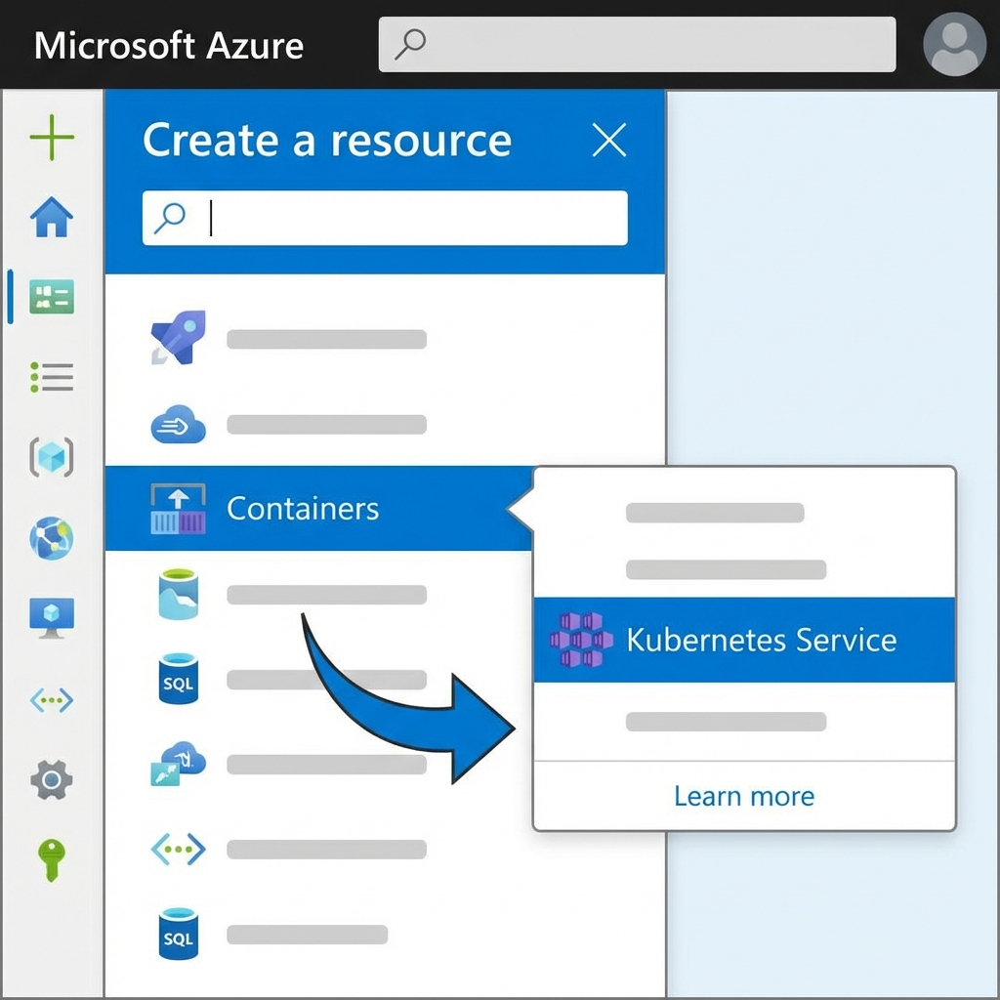
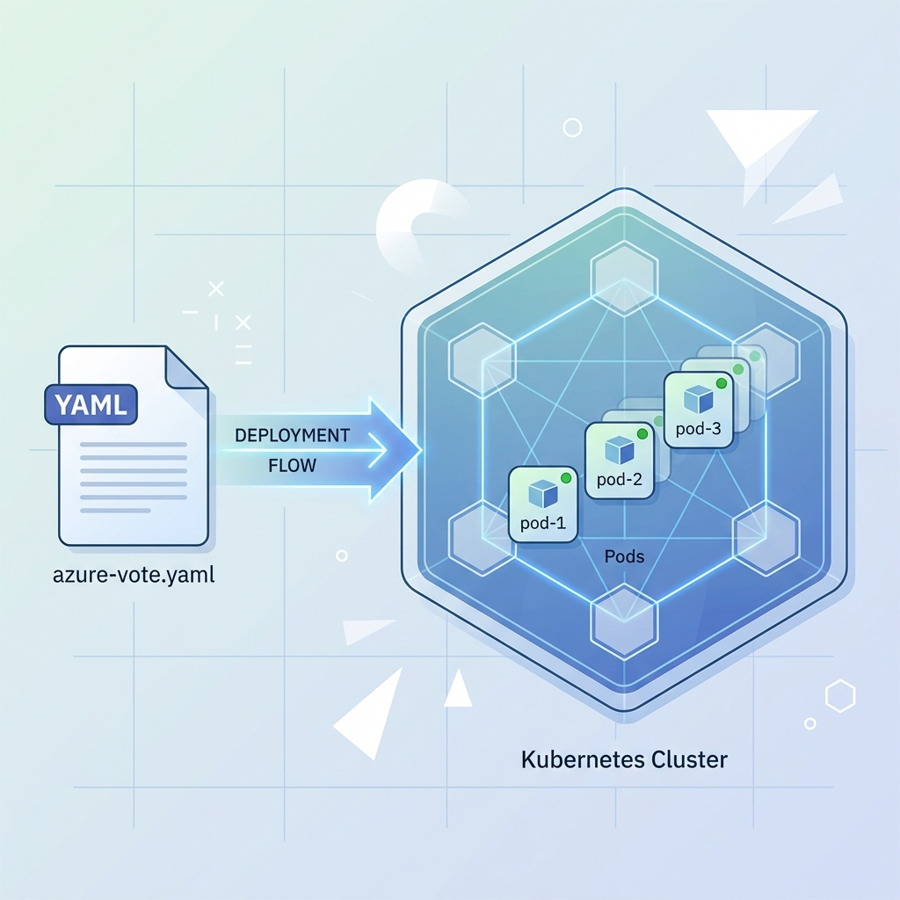
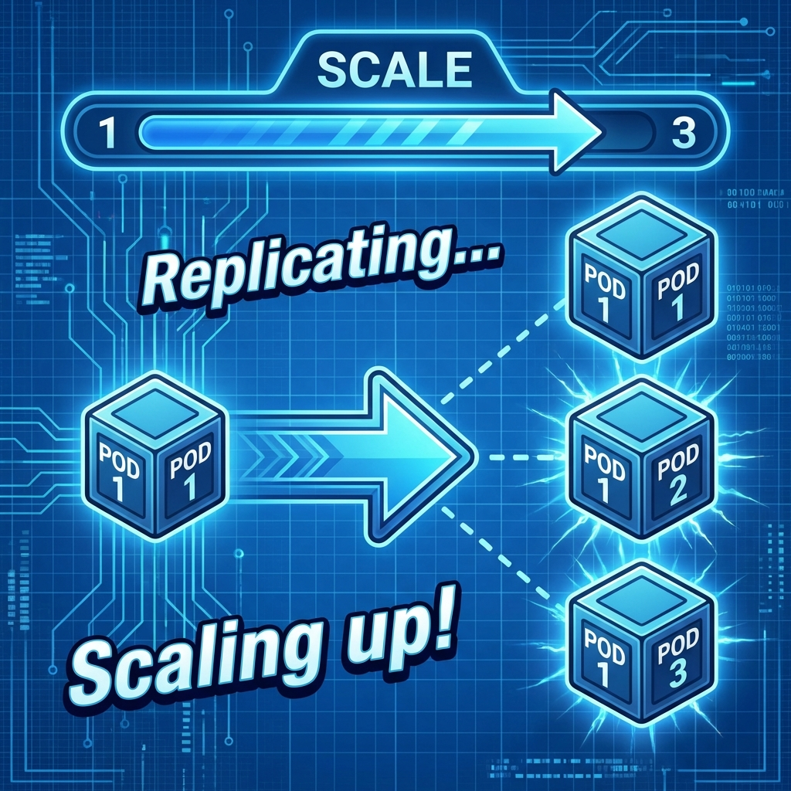

안녕하세요! 지난 [AKS 입문을 위한 용어 정리](../2026-01-11-AKS%20시작을%20위한%20용어%20이해/index.md) 포스팅에서 AKS의 기본 개념들을 익히셨나요?
이번 시간에는 이론으로 배운 내용을 바탕으로, 실제 **Microsft Azure Portal**에서 AKS 클러스터를 만들고 간단한 애플리케이션을 배포해 보는 실습을 진행해 보겠습니다.

복잡한 설치 과정 없이 Azure Portal 웹사이트에서 바로 따라 하실 수 있도록 구성했습니다. 자, 시작해 볼까요?

<!-- truncate -->


---

## 1. AKS 클러스터 만들기

가장 먼저 컨테이너들이 뛰놀 수 있는 운동장, AKS 클러스터를 만들어야 합니다.

:::info AKS 클러스터란?
**AKS(Azure Kubernetes Service)**는 Azure에서 제공하는 **관리형 쿠버네티스**입니다.
여러 대의 컴퓨터(노드)를 하나의 거대한 컴퓨터처럼 묶어서 관리해 주는 **'선장'** 역할을 합니다. 우리는 이 선장에게 "컨테이너 3개 띄워줘!"라고 명령만 내리면 됩니다.
:::



1. **Azure Portal** (portal.azure.com)에 로그인합니다.
2. 메인 화면에서 **[리소스 만들기]** 버튼을 클릭합니다.
3. 검색창에 **Kubernetes Service**를 검색하거나, **[컨테이너] > [Kubernetes Service]**를 선택합니다.
4. **[만들기]** 버튼을 눌러 생성 화면으로 진입합니다.
5. **기본 사항** 탭에서 필수 정보를 입력합니다:
   - **리소스 그룹**: `myResourceGroup` (새로 만들기)
   - **클러스터 사전 설정 구성**: `Dev/Test` ($) (비용 절약을 위해 테스트용 선택)
   - **Kubernetes 클러스터 이름**: `myAKSCluster`
   - **지역**: `Korea Central` (또는 가까운 리전)
6. 나머지 설정은 기본값으로 두고, 하단의 **[검토 + 만들기]** 버튼을 클릭합니다.
7. 유효성 검사가 통과되면 **[만들기]** 버튼을 클릭합니다. (배포에 몇 분 정도 소요됩니다.)

---

## 2. 클러스터에 연결하기 (Cloud Shell)

클러스터가 다 만들어졌다면, 이제 명령을 내릴 수 있도록 연결해야 합니다. 내 컴퓨터에 도구를 설치할 필요 없이, 포털에서 제공하는 **Cloud Shell**을 사용하면 편리합니다.

1. 배포가 완료되면 **[리소스로 이동]** 을 클릭합니다.
2. 상단 메뉴바의 **[연결(Connect)]** 버튼을 누릅니다.
3. 오른쪽에 뜨는 창에서 **[Cloud Shell 열기]** 를 클릭합니다. (처음 실행 시 스토리지 생성 팝업이 뜨면 '스토리지 만들기'를 클릭해 주세요.)
4. 터미널이 열리면 아래 명령어를 복사/붙여넣기 하여 클러스터 자격 증명을 가져옵니다.

```bash
# AKS 클러스터에 접속하기 위한 자격 증명 다운로드
az aks get-credentials --resource-group myResourceGroup --name myAKSCluster
```

이제 `kubectl get nodes` 명령어를 입력해 보세요. `Ready` 상태인 노드(일꾼 컴퓨터)들이 보인다면 연결 성공입니다!

---

## 3. 애플리케이션 배포하기

이제 우리만의 애플리케이션을 배포해 봅시다. 실습용으로 자주 쓰이는 Azure Vote 앱(파이썬 기반)을 배포하겠습니다.

:::note Azure Vote 앱이란?
마이크로소프트에서 쿠버네티스 실습용으로 제공하는 간단한 **투표 애플리케이션**입니다.
- **Front (Python)**: 사용자가 보는 웹 화면 (고양이/강아지 투표 버튼)
- **Back (Redis)**: 투표 수를 저장하는 메모리 저장소
이 두 가지 컨테이너가 서로 통신하며 동작하는 구조입니다.
:::



Cloud Shell에서 `azure-vote.yaml` 파일을 생성하고 아래 내용을 붙여넣습니다. (`code azure-vote.yaml` 명령어로 편집기를 열 수 있습니다.)

```yaml
apiVersion: apps/v1
kind: Deployment
metadata:
  name: azure-vote-front
spec:
  replicas: 1
  selector:
    matchLabels:
      app: azure-vote-front
  template:
    metadata:
      labels:
        app: azure-vote-front
    spec:
      containers:
      - name: azure-vote-front
        image: mcr.microsoft.com/azuredocs/azure-vote-front:v1
        resources:
          requests:
            cpu: 100m
            memory: 128Mi
          limits:
            cpu: 250m
            memory: 256Mi
        ports:
        - containerPort: 80
        env:
        - name: REDIS
          value: "azure-vote-back"
---
apiVersion: v1
kind: Service
metadata:
  name: azure-vote-front
spec:
  type: LoadBalancer
  ports:
  - port: 80
  selector:
    app: azure-vote-front
```

**[코드 상세 설명]**
- `apiVersion`, `kind`: 무엇을 만들지 정의합니다. 여기서는 **Deployment**(앱 배포)와 **Service**(네트워크 연결) 두 가지를 만듭니다.
- `metadata`: 리소스에 이름표를 붙입니다. `name: azure-vote-front`라고 이름을 지었습니다.
- `spec` (Deployment):
  - `replicas: 1`: 파드(컨테이너)를 **1개**만 생성하겠다는 의미입니다.
  - `image`: 사용할 도커 이미지를 지정합니다. (`mcr.microsoft.com/...`)
  - `resources`: 이 컨테이너가 사용할 CPU와 메모리 양을 정합니다.
- `spec` (Service):
  - `type: LoadBalancer`: 외부에서 접속할 수 있도록 **공인 IP**를 할당받겠다는 중요한 설정입니다.
  - `port: 80`: 80번 포트로 접속을 허용합니다.

저장 후, 아래 명령어로 배포를 진행합니다.

```bash
# YAML 파일을 통해 애플리케이션 배포 (파드 생성)
kubectl apply -f azure-vote.yaml
```

이 명령어 하나로 **파드(Pod)** 가 생성되고, 그 안에 컨테이너가 실행됩니다.

---

## 4. 서비스 확인하기 (웹 접속)

배포한 앱을 외부에서 접속해 볼까요? 우리가 YAML 파일에서 `type: LoadBalancer`로 설정했기 때문에, Azure가 자동으로 외부 접속용 주소(Public IP)를 만들어 줍니다.


```bash
# 서비스 상태 확인 (External-IP가 나올 때까지 기다리세요)
kubectl get service azure-vote-front --watch
```

처음에는 `EXTERNAL-IP`가 `<pending>`으로 나오지만, 잠시 기다리면 실제 IP 주소(예: `20.xxx.xxx.xxx`)가 뜹니다.

이제 웹 브라우저를 열고 그 IP 주소로 접속해 보세요! "Azure Voting App" 투표 화면이 보인다면 성공입니다.

---

## 5. 파드 스케일링 (확장하기)

갑자기 사용자가 몰린다면 어떻게 해야 할까요? 쿠버네티스에서는 명령어 한 줄로 서버(파드) 개수를 늘릴 수 있습니다.



```bash
# 프론트엔드 파드를 1개에서 3개로 늘리기
kubectl scale --replicas=3 deployment/azure-vote-front
```

확인해 볼까요?

```bash
kubectl get pods
```

방금 전까지 1개였던 파드가 3개로 늘어난 것을 볼 수 있습니다. 이제 트래픽이 3개의 파드로 분산되어 처리됩니다.

---

## 6. 정리하기

실습이 끝났다면 비용 발생을 막기 위해 리소스를 삭제하는 것이 좋습니다.

```bash
# 리소스 그룹 전체 삭제 (AKS 포함 모든 리소스 제거)
az group delete --name myResourceGroup --yes --no-wait
```

---

### 마치며

축하드립니다! 🎉 직접 AKS 클러스터를 만들고, 앱을 배포하고, 확장까지 해보셨습니다.

