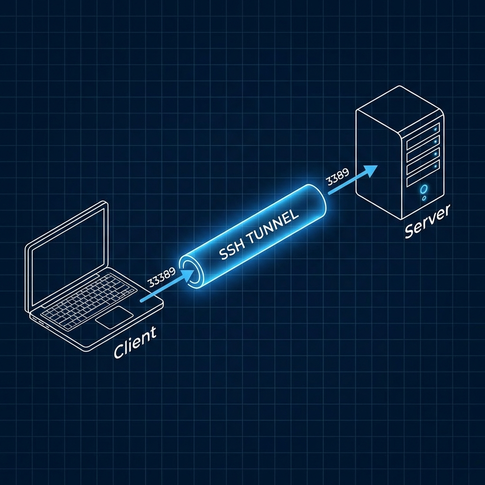
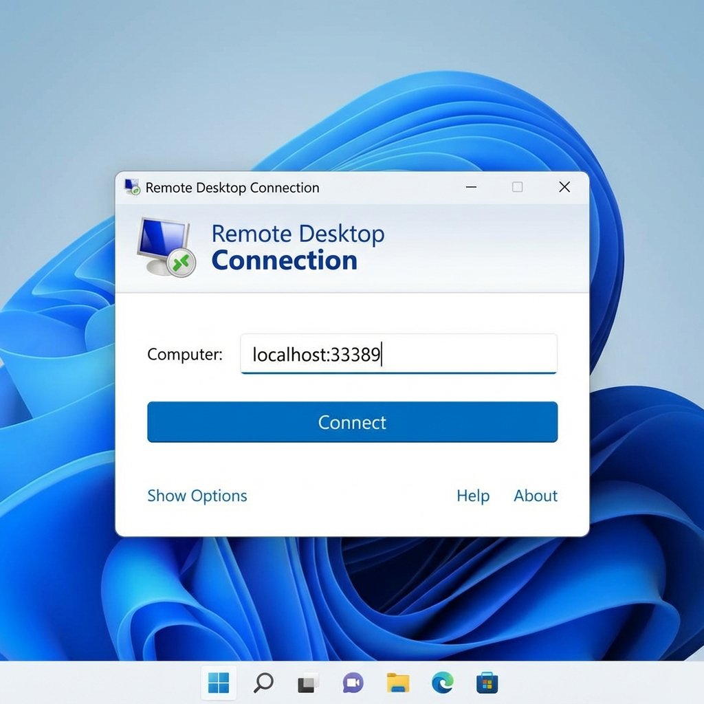
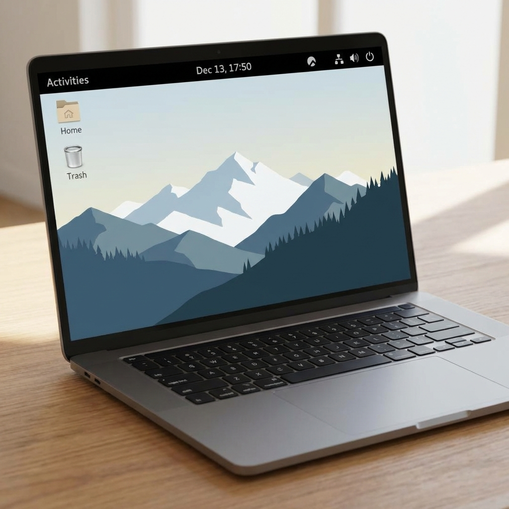

> **들어가며:**
> 22번 포트(SSH)만 열려 있는 Rocky Linux 서버에 GUI 환경을 구축하고 윈도우 원격 데스크톱(RDP)으로 접속하는 방법을 정리했습니다.
> GNOME 데스크톱 설치부터 XRDP, 그리고 SSH 터널링을 통한 보안 접속까지의 과정을 다룹니다.

<!-- truncate -->


---

## 1. 개요

* **목표:** 22번 포트(SSH)만 열려 있는 Rocky Linux 서버에 GUI 환경을 구축하고 윈도우 원격 데스크톱(RDP)으로 접속.
* **방식:** GNOME 데스크톱 설치 + XRDP(RDP 서버) 구동 + SSH 터널링.
* **필요 리소스:** 최소 4GB RAM, 10GB 디스크 여유 공간 권장.

---

## 2. 서버 측 설정 (Server-side)


SSH로 서버에 접속하여 다음 명령어들을 순차적으로 실행합니다.

### 2.1 시스템 업데이트 및 GUI 패키지 설치

```bash
# 패키지 업데이트
sudo dnf update -y

# GNOME 데스크톱 환경 설치 (다소 시간이 소요됩니다)
sudo dnf groupinstall "Server with GUI" -y

# 부팅 시 그래픽 모드로 시작하도록 설정
sudo systemctl set-default graphical
```

### 2.2 XRDP (Remote Desktop Protocol) 설치

Rocky Linux 9에서는 `epel-release` 저장소 추가가 필요합니다.

```bash
# EPEL 저장소 활성화
sudo dnf install epel-release -y

# XRDP 및 TigerVNC 서버(의존성) 설치
sudo dnf install xrdp tigervnc-server -y

# XRDP 서비스 시작 및 부팅 시 자동 실행 등록
sudo systemctl enable --now xrdp

# (선택) 방화벽 설정: SSH 터널링을 이용하므로 외부에 3389를 개방할 필요는 없으나,
# 로컬 인터페이스 간 통신을 위해 허용해 두는 것이 좋습니다.
sudo firewall-cmd --permanent --add-port=3389/tcp
sudo firewall-cmd --reload
```

---

## 3. 클라이언트 측 접속 (Client-side)



로컬 PC(Windows 등)에서 SSH 터널을 생성하여 접속합니다.

### 3.1 SSH 터널링 연결

로컬 PC의 터미널(PowerShell, CMD, Git Bash 등)에서 아래 명령어를 실행합니다.
*(주의: 원격 데스크톱을 사용하는 동안 이 터미널 창은 계속 켜두어야 합니다.)*

```bash
# 문법: ssh -L [로컬포트]:localhost:[서버RDP포트] [사용자ID]@[서버IP]
ssh -L 33389:localhost:3389 user@remote-server.com
```

* **설명:** 내 PC의 `33389` 포트로 들어오는 신호를 SSH(22번)를 통해 서버로 보낸 뒤, 서버 내부의 `3389`(XRDP) 포트로 전달합니다.

### 3.2 원격 데스크톱(RDP) 실행



1. Windows **'원격 데스크톱 연결(mstsc)'** 앱을 실행합니다.
2. 컴퓨터(PC) 입력란에 다음 주소를 입력하고 [연결]을 클릭합니다.
   * 주소: **`localhost:33389`**
3. XRDP 로그인 창이 뜨면 리눅스 계정의 ID와 Password를 입력하여 접속합니다.

접속에 성공하면 아래와 같은 GNOME 데스크톱 환경을 볼 수 있습니다.



---

## 4. 트러블슈팅 및 팁

* **검은 화면 이슈:** 접속 후 화면이 검게 나오거나 바로 끊긴다면, 해당 사용자가 이미 다른 세션(SSH 등)에서 로그인을 유지하고 있는지 확인하고 로그아웃해 보세요.
* **한글 입력:** GUI 설치 후 설정(Settings) > Region & Language에서 한국어 입력기(Hangul)를 추가해야 한글 입력이 가능합니다.
* **MobaXterm 사용 시:** 터미널 명령 대신 MobaXterm의 'Tunneling' 메뉴를 사용하면 GUI 방식으로 더 쉽게 터널을 구성할 수 있습니다.

---

## 5. 추가 설정: 바탕화면 아이콘 활성화

GNOME 환경에서 바탕화면 아이콘을 사용하기 위한 추가 설정 가이드입니다.

### 5.1 확장 프로그램 패키지 설치
(Rocky Linux 8/9 공통, 관리자 권한 필요)

```bash
sudo dnf install gnome-shell-extension-desktop-icons -y
```

> **중요:** 설치 후 적용을 위해 GNOME Shell을 다시 읽어야 합니다.
> * **방법 A:** 현재 사용자 계정 로그아웃 -> 다시 로그인 (가장 확실)
> * **방법 B:** `Alt` + `F2` 키 입력 -> `r` 입력 -> `Enter` (X11 세션인 경우만 동작)

### 5.2 확장 프로그램 활성화

로그인 다시 한 후 실행하세요. 목록에서 정확한 ID를 찾아야 합니다.

```bash
# 1. 설치된 확장 프로그램 ID 확인
gnome-extensions list

# 2. 확장 프로그램 활성화
# 위 'list' 명령어로 나온 ID를 복사해서 enable 뒤에 넣으세요.
# 보통 아래 두 가지 중 하나입니다.

# [Case A: Rocky Linux 8 등 구버전 스타일]
gnome-extensions enable desktop-icons@csoriano

# [Case B: Rocky Linux 9 등 최신 DING 버전]
# gnome-extensions enable ding@rastersoft.com
```

### 5.3 (선택사항) GUI 설정 도구 설치

마우스로 아이콘 크기 등을 조절하고 싶을 때 사용합니다.

```bash
sudo dnf install gnome-tweaks -y
```
