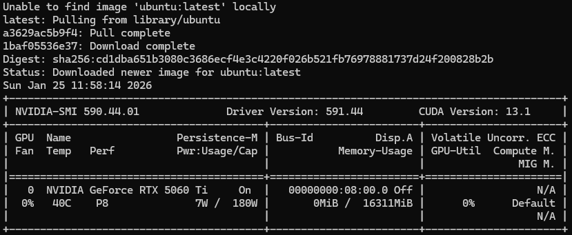

대규모 언어 모델(LLM)을 로컬 서버에 띄우려고 할 때 가장 먼저 부딪히는 벽이 무엇일까요? 바로 **환경 설정**입니다.
`pip install vllm`만 하면 될 줄 알았는데, CUDA 버전이 안 맞고, 패키지 충돌나고... 정말 지옥이 따로 없죠.

그래서 오늘은 **Docker**를 활용해 아주 깔끔하고 우아하게 vLLM 서버를 구축하는 방법을 소개합니다.
마지막에는 가볍지만 성능이 뛰어난 모델인 `Qwen/Qwen3-8B`를 띄우고, **Open WebUI**에서 연동해 보겠습니다.

<!--truncate-->

## 1. 들어가며: 왜 Docker인가?

현업에서 서버에 직접 `pip`으로 라이브러리를 설치하는 것은 나중에 재앙이 될 수 있습니다.
- "어제는 됐는데 오늘은 안 돼요."
- "이 서버랑 저 서버랑 CUDA 버전이 달라요."

이런 문제를 해결하기 위해 **Docker**를 사용합니다. 컨테이너 안에 vLLM과 필요한 모든 환경을 가둬버리는 것이죠.
우리는 `docker-compose.yml` 파일 하나만 잘 관리하면 됩니다.

### 잠깐! Docker와 Docker Compose는 뭐가 다른가요?
- **Docker**: 커맨드라인(CLI)에서 컨테이너를 하나씩 실행하고 관리하는 도구입니다. 매번 긴 옵션을 기억해서 입력해야 하는 불편함이 있습니다.
- **Docker Compose**: 여러 컨테이너의 실행 옵션(포트, 볼륨, 환경변수 등)을 `YAML` 파일 하나로 정의하여 한 번에 실행하고 관리하는 도구입니다.

vLLM처럼 설정해야 할 옵션이 많고 복잡한 경우, **Docker Compose**를 사용하면 설정을 코드로 기록(IaC)하고 재사용할 수 있어 훨씬 효율적입니다.

## 2. 필수 준비물 (Prerequisites)

Docker만 있으면 될 것 같지만, GPU를 쓰려면 중요한 친구들이 더 필요합니다.

1. **Linux OS**: WSL2도 가능하나, 가급적 Native Linux 권장.
2. **NVIDIA Driver**: `nvidia-smi`를 입력했을 때 535.xx 이상 버전이 권장됩니다.
3. **Docker & Docker Compose**
   - 설치 확인: `docker -v`, `docker-compose -v`
   - 미설치 시: [Docker 공식 설치 가이드](https://docs.docker.com/engine/install/)
4. **NVIDIA Container Toolkit**: 이게 없으면 도커가 GPU를 인식하지 못합니다.
   - 미설치 시: [NVIDIA Toolkit 설치 가이드](https://docs.nvidia.com/datacenter/cloud-native/container-toolkit/latest/install-guide.html)
   - 설치 확인: `docker run --rm --gpus all ubuntu nvidia-smi` 명령어가 성공해야 합니다.
   

## 3. Dockerfile 작성하기

vLLM 공식 이미지를 그대로 써도 되지만, 한국 시간(KST) 설정이나 편의성을 위해 우리만의 이미지를 살짝 만들어보겠습니다.

프로젝트 폴더에 `Dockerfile`이라는 이름으로 파일을 만들고 아래 내용을 붙여넣으세요.

```dockerfile title="Dockerfile"
# vLLM 공식 이미지를 베이스로 사용
FROM vllm/vllm-openai:latest

# 한국 시간(Timezone) 설정 (로그 볼 때 필수!)
ENV TZ=Asia/Seoul
RUN ln -snf /usr/share/zoneinfo/$TZ /etc/localtime && echo $TZ > /etc/timezone

# 필요하다면 추가 패키지 설치 (예: git)
# RUN apt-get update && apt-get install -y git
```

> **참고**: "Open WebUI는 왜 Dockerfile에 없나요?"
> vLLM은 한국 시간 설정 등을 위해 커스텀 이미지를 만들었지만, Open WebUI는 공식 이미지를 그대로 가져다 쓸 것이기 때문에 `Dockerfile`에 정의하지 않고 `docker-compose.yml`에서 바로 호출합니다.

## 4. docker-compose.yml 작성

이제 서버의 설계도인 `docker-compose.yml`을 작성합니다.
이번 실습에서는 **Qwen의 Qwen3-8B** 모델을 사용할 것이므로, 모델 경로를 정확히 지정해 주는 것이 중요합니다.

```yaml title="docker-compose.yml"
version: '3.8' # GPU 지원 기능(deploy/resources)을 사용하기 위해 3.8 이상 버전을 사용합니다.

services:
  vllm:
    build:
      context: .
      dockerfile: Dockerfile
    
    # GPU 사용 설정 (필수!)
    runtime: nvidia
    deploy:
      resources:
        reservations:
          devices:
            - driver: nvidia
              count: all          # 모든 GPU 사용
              capabilities: [gpu]
    
    # 공유 메모리 설정 (Pytorch 병렬 처리에 필수)
    ipc: host
    
    # 모델 캐시 공유 (Host의 캐시 경로를 매핑하여 다운로드 시간 절약)
    volumes:
      - ~/.cache/huggingface:/root/.cache/huggingface
    
    # 포트 설정 (외부 8000번 -> 내부 8000번)
    ports:
      - "8000:8000"
    
    environment:
      # HuggingFace 토큰 (모델에 접근 동의가 필요하다면 입력)
      - HUGGING_FACE_HUB_TOKEN=<여러분의_HF_토큰을_입력하세요>
    
    # 실행 명령어
    command: >
      --model Qwen/Qwen3-8B
      --host 0.0.0.0
      --port 8000
      --gpu-memory-utilization 0.9
      --max-model-len 8192

  # (추가) vLLM과 찰떡궁합인 Chat UI 서비스
  open-webui:
    image: ghcr.io/open-webui/open-webui:main
    ports:
      - "3000:8080"
    environment:
      # 'vllm'은 위에서 정의한 서비스 이름입니다. 도커 내부 DNS가 알아서 찾아줍니다.
      - OPENAI_API_BASE_URL=http://vllm:8000/v1
      - OPENAI_API_KEY=EMPTY
    volumes:
      - open-webui-data:/app/backend/data
    depends_on:
      - vllm

volumes:
  open-webui-data:
```

### docker-compose.yml 상세 설명

각 설정 항목의 의미를 표로 정리해 드립니다.

| 항목 | 설명 |
| :--- | :--- |
| **version** | Docker Compose 파일의 규격 버전입니다. GPU 설정을 위해 `'3.8'` 이상이 필요합니다. |
| **services** | 실행할 컨테이너들의 목록입니다. (`vllm`, `open-webui`) |
| **build** | `Dockerfile`을 이용해 이미지를 직접 빌드합니다. (vllm) |
| **image** | 미리 만들어진 공식 이미지를 다운로드하여 사용합니다. (open-webui) |
| **runtime** | `nvidia`로 설정하여 컨테이너가 GPU를 사용할 수 있게 합니다. |
| **deploy** | 리소스 할당 설정입니다. GPU를 `count: all`로 설정했습니다. |
| **ipc** | `host`로 설정하여 공유 메모리(Shared Memory)를 사용합니다. (필수) |
| **volumes** | `[로컬 경로]:[컨테이너 경로]` 형태로 파일을 공유합니다. |
| **ports** | `"[외부 포트]:[내부 포트]"` 형태로 접속을 연결합니다. |
| **environment** | 토큰이나 API URL 등 환경 변수를 설정합니다. |
| **depends_on** | `vllm`이 먼저 켜진 후 `open-webui`가 실행되도록 순서를 맞춥니다. |


> **주의**: 일부 모델은 HuggingFace에서 사용 동의(Gated Model)를 해야 합니다. 그런 경우 토큰을 꼭 넣어주세요!

## 5. 서버 실행 및 확인

준비는 끝났습니다. 프로젝트 폴더로 이동한 뒤 터미널에서 다음 명령어로 서버를 띄워봅시다.

```bash
docker-compose up -d
```

> **참고**: 처음 실행할 때 로컬에 모델이 없다면 자동으로 다운로드를 시작합니다. 모델 크기에 따라 시간이 다소 걸릴 수 있으며, 완료되면 위에서 설정한 볼륨 경로에 저장되어 다음부터는 즉시 실행됩니다.

서버가 실행되면 다음 주소로 접속해 보세요!
- **vLLM API**: `http://localhost:8000/docs` (Swagger UI)
- **Open WebUI**: `http://localhost:3000` (회원가입 후 바로 채팅 가능)

서버가 잘 뜨는지 로그를 확인해 봅니다.
```bash
docker-compose logs -f
```
또는
```bash
docker logs docker_translategemma_vllm-vllm-1
```


로그에 `Uvicorn running on http://0.0.0.0:8000`가 뜨고 모델 로딩이 완료되면 준비 끝입니다!

실습 이후 서버를 종료하려면 아래 명령을 입력하세요.

```bash
docker-compose down
```

## 6. 실습하기 1: Open WebUI로 연결하기

1. **접속하기**: 웹 브라우저를 열고 `http://localhost:3000`으로 접속합니다.
2. **회원가입**: 처음 접속하면 로그인 화면이 뜹니다. 로컬에서 실행되는 나만의 서버이므로, 아무 이메일/비밀번호나 입력하여 관리자 계정을 생성합니다.
3. **모델 선택**: 채팅 화면 상단에서 `Qwen/Qwen3-8B` 모델을 선택합니다.
4. **대화하기**: 문장을 입력하면 답변을 확인할 수 있습니다.


*(실행 예시 이미지가 들어갈 자리)*

## 7. (심화) 실습하기 2: Python API로 직접 호출하기

Open WebUI도 좋지만, 개발자라면 코드로 API를 호출하고 싶을 때가 있죠.
우리는 `uv`를 사용해 환경을 관리하고 있으니, Python 스크립트로 vLLM API(`localhost:8000`)에 직접 번역 요청을 보내보겠습니다.

### 7.1 클라이언트 환경 설정
먼저 로컬 컴퓨터(컨테이너 밖)에 필요한 라이브러리를 설치합니다.

```bash
uv pip install openai
```

### 7.2 번역 스크립트 작성 (`translator.py`)

```python title="translator.py"
from openai import OpenAI

# vLLM 서버 주소 설정 (로컬 도커 컨테이너)
client = OpenAI(
    api_key="EMPTY", # vLLM은 로컬이라 키가 필요 없습니다
    base_url="http://localhost:8000/v1",
)

def translate_ko_to_en(text):
    print(f"🔤 입력 문장: {text}")
    
    try:
        completion = client.chat.completions.create(
            model="google/translategemma-12b-it",
            messages=[
                # Gemma 모델에게 번역 역할을 부여하는 시스템 프롬프트
                {"role": "user", "content": f"Translate the following Korean text to English:\n\n{text}"}
            ],
            temperature=0.3,
        )
        
        translated_text = completion.choices[0].message.content
        print(f"✨ 번역 결과: {translated_text}")
        
    except Exception as e:
        print(f"❌ 오류 발생: {e}")

if __name__ == "__main__":
    korean_sentence = "안녕하세요, 저는 인공지능 개발자가 되고 싶은 주니어 개발자입니다. Docker는 정말 편리하네요!"
    translate_ko_to_en(korean_sentence)
```

### 7.3 실행 결과

```bash
python translator.py
```

**예상 출력:**
```
🔤 입력 문장: 안녕하세요, 저는 인공지능 개발자가 되고 싶은 주니어 개발자입니다. Docker는 정말 편리하네요!
✨ 번역 결과: Hello, I am a junior developer who wants to become an AI developer. Docker is really convenient!
```

---

## 마치며

이렇게 도커를 사용하면 내 로컬 컴퓨터의 환경을 더럽히지 않고도 깔끔하게 LLM 서버를 구축할 수 있습니다.
또한 `docker-compose.yml` 파일만 공유하면 팀원 누구라도 똑같은 환경에서 모델을 실행할 수 있죠.

이제 여러분만의 번역 API 서버가 생겼습니다! 이를 활용해 다양한 애플리케이션을 만들어보세요.
