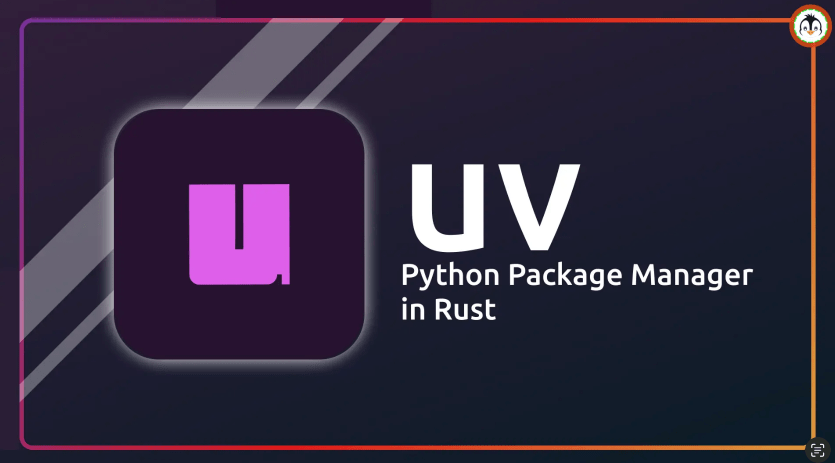
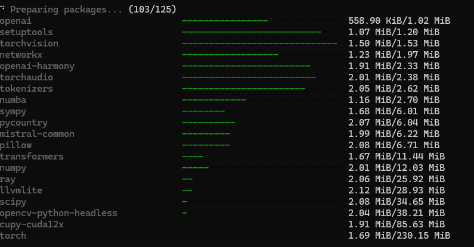

Python 개발자라면 꼭 알아야 할 도구, **uv**에 대해 알아보겠습니다.

"pip가 있는데 굳이 왜?"라고 생각하실 수 있지만, 강력하고 빠른 속도가 강점인 uv를 사용하면 개발 생산성을 크게 향상시킬 수 있습니다.



<!--truncate-->

### 들어가기 앞서
- 본 글은 [SK DEVOCEAN - PIP를 대체하는 UV 사용법 가이드][1] 를 참고하여 작성되었습니다.

## 1. UV란 무엇인가요?
**uv**는 Rust 프로그래밍 언어로 작성된 매우 빠른 Python 패키지 및 프로젝트 관리자입니다. 
 `pip`, `pip-tools`, `pipx`, `poetry`, `pyenv`, `virtualenv` 등을 하나로 통합하는 것을 목표로 합니다.

### 왜 UV인가요?
- **압도적인 속도**: pip보다 10배에서 100배까지 빠릅니다. (진짜 빠릅니다!)
- **통합 관리**: Python 버전 관리부터 가상환경, 패키지 의존성까지 한 번에 해결합니다.
- **디스크 효율성**: 전역 캐시를 사용하여 중복 파일을 줄이고 디스크 공간을 아껴줍니다.
- **크로스 플랫폼**: Windows, macOS, Linux 어디서든 동일하게 동작합니다.

## 2. PIP vs UV 비교

개발자가 체감할 수 있는 가장 큰 차이점들을 표로 정리해 보았습니다.

| 기능 | pip + venv | uv |
| :--- | :--- | :--- |
| **속도** | 느림 | **매우 빠름** (Rust 기반) |
| **가상환경 생성** | `python -m venv .venv` | **자동 생성** (`uv init`, `uv venv`) |
| **패키지 설치** | `pip install requests` | `uv pip install requests` 또는 `uv add requests` |
| **의존성 관리** | `requirements.txt` 수동 관리 | `pyproject.toml` + `uv.lock` 자동 관리 |
| **Python 버전** | `pyenv` 등 별도 도구 필요 | `uv python install` 내장 지원 |

가장 편리한 점은 **파이썬 버전을 관리하고 가상환경을 만들고 활성화하는 과정이 uv 하나로 거의 자동화된다는 점**입니다.

## 3. 설치 방법

설치도 아주 간단합니다. 운영체제별로 아래 명령어를 입력해 주세요.

### Windows
PowerShell에서 아래 명령어를 실행합니다.
```powershell
powershell -ExecutionPolicy ByPass -c "irm https://astral.sh/uv/install.ps1 | iex"
```

### macOS / Linux
터미널에서 아래 명령어를 실행합니다.
```bash
curl -lsSf https://astral.sh/uv/install.sh | sh
```

### pip를 통한 설치 (공통)
이미 pip가 설치되어 있다면 pip로도 설치 가능합니다.
```bash
pip install uv
```

## 4. 기본 사용법

설치가 끝났으니 가장 기본적인 기능부터 써볼까요?
uv를 사용하는 방식은 크게 두 가지입니다.
1. **프로젝트 기반 관리** (`uv init`, `uv add` 사용) - *권장*
2. **단순 도구로서의 사용** (`uv pip ...` 사용)

여기서는 먼저 프로젝트를 시작하고 가상환경을 다루는 법을 알아봅니다.

### 4.1 프로젝트 초기화 (`uv init`)
새로운 프로젝트를 시작할 때, 폴더를 만들고 초기 설정을 해주는 명령어입니다.

```bash
# 새로운 프로젝트 폴더 생성 및 초기화
uv init my-project
cd my-project
```

이 명령어를 실행하면 다음과 같은 파일들이 자동으로 생성됩니다.
- `pyproject.toml`: 프로젝트 설정 및 의존성 관리 파일
- `.python-version`: 사용할 Python 버전 명시
- `README.md`: 프로젝트 설명 파일
- `hello.py`: 간단한 예제 코드

> **Caution**: 프로젝트 이름(`pyproject.toml`의 `name`)이 설치하려는 패키지 이름과 같으면 에러가 발생합니다.
> 예: 프로젝트 이름이 `vllm`인데 `uv add vllm`을 하면, 자기 자신을 의존성으로 추가하는 것으로 오인하여 에러가 납니다. 이럴 땐 `pyproject.toml`에서 `name`을 `vllm-practice` 등으로 변경해 주세요.

### 4.2 가상환경 생성 (`uv venv`)
uv는 프로젝트 폴더 내에 `.venv` 가상환경을 아주 빠르게 생성해 줍니다.

```bash
uv venv
```

여기서 **uv의 강력한 점**이 나옵니다.
기존처럼 `source .venv/bin/activate`로 가상환경을 활성화해도 되지만, **uv 명령어를 사용할 때는 활성화 절차가 필요 없습니다.**

`uv`가 현재 디렉토리의 `.venv`를 자동으로 인식해서 패키지를 설치하거나 스크립트를 실행해 주기 때문입니다. 따라서 가상환경 활성화를 깜빡해서 전역 공간에 패키지를 까는 실수를 원천 차단할 수 있습니다.

### 4.3 패키지 설치 (`uv pip install`)
가상환경을 굳이 활성화하지 않아도, 프로젝트 폴더 안에서라면 `uv`가 알아서 가상환경에 설치해 줍니다. 아래 예제는 vLLM을 uv로 설치하는 스크립트입니다.

```bash
# vLLM 설치 (가상환경 활성화 불필요!)
uv pip install vllm
```
pip install은 하나씩 순차적으로 의존성 설치를 하기 때문에 시간이 다소 소요되지만, uv는 병렬로 설치하기 때문에 훨씬 빠릅니다. 


> **Tip**: 프로젝트 기반으로 관리할 때는 `uv pip install` 대신, 아래 5번에서 소개할 `uv add`를 사용하는 것이 좋습니다.

## 5. 프로젝트 및 의존성 관리

### 5.1 패키지 추가 (`uv add`)
프로젝트에 라이브러리를 추가할 때는 `uv add`를 사용하는 것이 좋습니다. 이 명령어는 패키지를 설치함과 동시에 `pyproject.toml`에도 자동으로 기록해 줍니다.

```bash
uv add requests
```

개발용으로만 쓰는 패키지(예: 테스트 도구)는 `--dev` 옵션을 붙여주세요.
```bash
uv add --dev pytest
```

> **Tip**: 만약 `uv pip install`로 이미 설치한 패키지가 있다면, `uv add <패키지명>`을 입력하세요. 
> uv가 이미 설치된 버전을 인식하여 재설치 없이 `pyproject.toml`에 등록해 줍니다.

### 5.2 동기화 (`uv sync`)
팀원과 협업하거나 다른 컴퓨터에서 작업을 시작할 때, `pyproject.toml`에 적힌 대로 모든 환경을 똑같이 맞추고 싶다면 단 한 줄이면 됩니다.

```bash
uv sync
```
이 명령어는 필요한 모든 패키지를 설치하고, 가상환경까지 알아서 세팅해 줍니다. 정말 편리하죠?

## 6. Python 버전 관리

예전에는 `pyenv`나 `conda`를 써서 Python 버전을 바꿨지만, 이제는 uv가 다 해줍니다.

```bash
# Python 3.11 버전 설치
uv python install 3.11

# 특정 버전으로 스크립트 실행
uv run --python 3.11 main.py
```

## 7. 실습 튜토리얼: 나만의 프로젝트 만들어보기

이제 배운 내용을 바탕으로 간단한 프로젝트를 처음부터 끝까지 만들어 보겠습니다.
GitHub API를 호출해서 내 정보를 가져오는 간단한 프로그램을 만들어 보겠습니다.

### 1단계: 프로젝트 생성
```bash
uv init github-profile-viewer
cd github-profile-viewer
```

### 2단계: 가상환경 생성 및 활성화
uv는 프로젝트 폴더 안에 `.venv` 폴더를 자동으로 관리해 주지만, 명시적으로 생성해 보겠습니다.
```bash
uv venv
# Windows의 경우
.venv\Scripts\activate
# Mac/Linux의 경우
source .venv/bin/activate
```

### 3단계: 필요한 패키지 설치
HTTP 요청을 보내기 위해 유명한 `requests` 라이브러리를 추가합니다.
```bash
uv add requests
```

### 4단계: 코드 작성
`hello.py` 파일을 열고(또는 새로 만들고) 아래 내용을 작성해 주세요. Github 아이디 부분에 본인의 아이디를 넣으세요.

```python title="hello.py"
import requests

def get_github_user(username):
    url = f"https://api.github.com/users/{username}"
    response = requests.get(url)
    
    if response.status_code == 200:
        user_data = response.json()
        print(f"=== {username} 님의 프로필 ===")
        print(f"이름: {user_data.get('name')}")
        print(f"Bio: {user_data.get('bio')}")
        print(f"팔로워 수: {user_data.get('followers')}명")
    else:
        print("사용자를 찾을 수 없습니다.")

if __name__ == "__main__":
    get_github_user("TakeaimK") # 여기에 본인의 깃허브 아이디를 넣어보세요!
```

### 5단계: 실행
이제 실행해 봅시다. `uv run`을 사용하면 굳이 가상환경을 활성화하지 않아도, uv가 알아서 가상환경 내의 파이썬으로 실행해 줍니다!

```bash
uv run hello.py
```

**결과 예시:**
```
=== TakeaimK 님의 프로필 ===
이름: Tech Blogger
Bio: AI & Infra Engineer
팔로워 수: 150명
```

---

## 마치며

오늘은 Python 생태계를 뒤흔들고 있는 **uv**에 대해 알아봤습니다. 속도도 속도지만, 복잡했던 Python 개발 환경 설정을 통합해 준다는 점이 가장 큰 매력인 것 같습니다.

이제 막 Python을 시작하시는 분들도, 기존에 `pip`로 고생하시던 분들도 **uv**로 갈아타셔서 쾌적한 개발 환경을 경험해 보시길 강력 추천합니다!

[1]: https://devocean.sk.com/blog/techBoardDetail.do?ID=167420&boardType=techBlog
